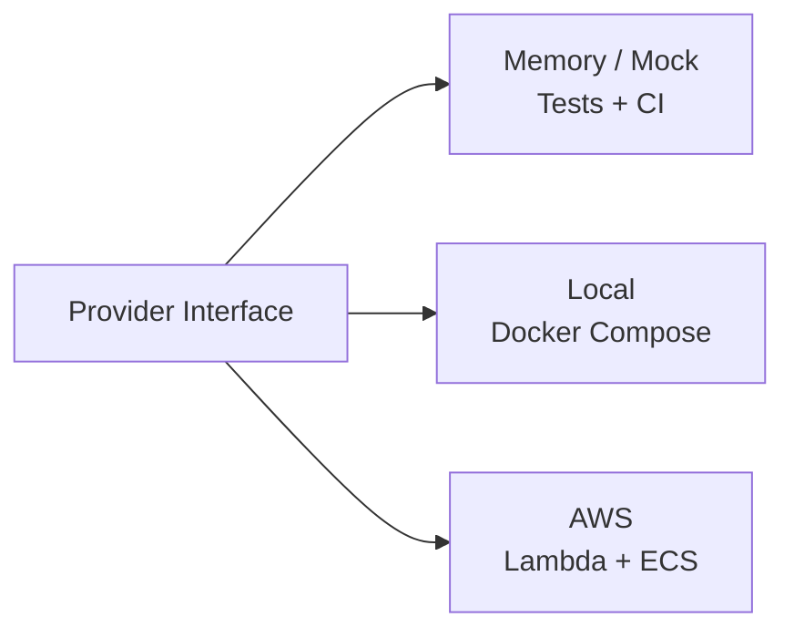
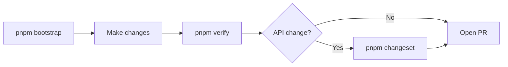

# Ripple Next

AI-agent-first government digital platform built with Nuxt 3, Ripple UI, and TypeScript.
Port of the Victorian government [Ripple design system](https://github.com/dpc-sdp/ripple) to a modern, full-stack architecture optimized for AI coding agents.

## For AI Agents

> **Primary reference:** [AGENTS.md](AGENTS.md) — architecture, conventions, task routing.

```bash
pnpm bootstrap              # zero-to-ready (install + doctor + validate)
pnpm doctor -- --json       # environment check with taxonomy codes
pnpm verify -- --json       # all quality gates (lint, typecheck, test)
```

- **Error codes:** Look up `RPL-*` taxonomy codes in [`docs/error-taxonomy.json`](docs/error-taxonomy.json).
- **What to build:** [Product Roadmap](docs/product-roadmap/README.md) — follow the AI Agent Suggestions format. Do not self-triage.

## Pick Your Path

| You are... | Start here |
| --- | --- |
| **AI agent** | [AGENTS.md](AGENTS.md) then `pnpm bootstrap` and `pnpm verify` |
| **Platform developer** | [Platform Developer Guide](docs/platform-developer-guide.md) — contributing to ripple-next internals |
| **Consumer app developer** | [Consumer App Guide](docs/consumer-app-guide.md) — building apps with `@ripple-next/*` packages |
| **Downstream team lead / governance** | [Downstream Adoption Guide](docs/downstream-adoption-guide.md) — mandatory documentation standards and conformance |
| **Architect / reviewer** | [Platform Capabilities](docs/platform-capabilities.md) and [Critique Evaluation](docs/critique-evaluation.md) |
| **Curious contributor** | [Contributing](#contributing) — safe zones, workflow, and expectations |

## Quick Start

> This quick start is for **platform development** (the ripple-next monorepo).
> For consumer app setup, see the [Consumer App Guide](docs/consumer-app-guide.md).

```bash
# One-command setup (install + doctor + validate)
pnpm bootstrap

# Start local services (Postgres, Redis, MinIO, Mailpit, MeiliSearch)
docker compose up -d

# Copy env template and run migrations
cp .env.example .env
pnpm db:migrate && pnpm db:seed

# Start development server
pnpm dev
```

## Stack

| Layer    | Technology                    |
| -------- | ----------------------------- |
| Frontend | Nuxt 3 + Vue 3 + TypeScript   |
| UI       | Ripple UI Core + Storybook 10 |
| API      | Nitro server routes + oRPC (OpenAPI 3.1.1) |
| Database | PostgreSQL (Drizzle ORM)      |
| CMS      | Drupal/Tide (JSON:API) / Mock |
| Queue    | SQS / BullMQ / Memory         |
| Auth     | OIDC/OAuth (oauth4webapi)     |
| Infra    | SST v3 (Pulumi)               |
| Compute  | Lambda + ECS Fargate          |
| Testing  | Vitest + Playwright           |

## Provider Pattern

Every infrastructure concern has an interface with swappable implementations.
Tests always use memory/mock providers — never cloud services.
See [full docs](docs/provider-pattern.md) and [ADR-003](docs/adr/003-provider-pattern.md).



## Commands

| Command                | Description                    |
| ---------------------- | ------------------------------ |
| `pnpm bootstrap`       | First-time setup (all-in-one)  |
| `pnpm doctor`          | Validate environment readiness |
| `pnpm dev`             | Start dev server               |
| `pnpm build`           | Build all packages             |
| `pnpm test`            | Run all tests                  |
| `pnpm test:e2e`        | Run E2E tests                  |
| `pnpm lint`            | Lint all code                  |
| `pnpm typecheck`       | Type check                     |
| `pnpm db:generate`     | Generate migration             |
| `pnpm db:migrate`      | Run migrations                 |
| `pnpm db:seed`         | Seed dev data                  |
| `pnpm storybook`       | Start Storybook                |
| `pnpm storybook:build` | Build Storybook                |
| `pnpm generate:scaffold <dir>` | Scaffold a downstream repo with full DX infrastructure |
| `pnpm conform`         | Score a repo against the golden-path conformance rubric |

## Documentation

| Document                                           | Description                                           |
| -------------------------------------------------- | ----------------------------------------------------- |
| [Platform Developer Guide](docs/platform-developer-guide.md) | Platform internals — bare Mac to deployment  |
| [Consumer App Guide](docs/consumer-app-guide.md)   | Building apps with `@ripple-next/*` packages          |
| [Architecture](docs/architecture.md)               | System overview, stack, and high-level design         |
| [Provider Pattern](docs/provider-pattern.md)       | Core pattern for environment-swappable infrastructure |
| [Data Model](docs/data-model.md)                   | PostgreSQL schema and entity relationships            |
| [API Contracts](docs/api-contracts.md)             | oRPC routers and REST endpoints                       |
| [Deployment Guide](docs/deployment.md)             | Local dev, preview, staging, and production           |
| [Testing Guide](docs/testing-guide.md)             | Test pyramid, examples, and mock providers            |
| [Lambda vs ECS](docs/lambda-vs-ecs.md)             | Compute decision framework                            |
| [Critique Evaluation](docs/critique-evaluation.md) | Architecture review decisions                         |
| [Downstream Workflows](docs/downstream-workflows.md) | Consuming reusable CI composite actions               |
| [Downstream Adoption Guide](docs/downstream-adoption-guide.md) | Mandatory documentation standards for downstream repos |
| [AI Adoption Prompts](docs/ai-adoption-prompts.md) | Copy-paste prompts for AI agents (greenfield, migration, add-feature) |
| [Platform Capabilities](docs/platform-capabilities.md) | What ripple-next provides to consumers            |
| [Runbooks](docs/runbooks/)                         | Machine-readable procedures (deploy, rollback, scaffold, adopt, migrate) |
| [Product Roadmap](docs/product-roadmap/)           | Platform roadmap, priorities, and archive             |
| [AGENTS.md](AGENTS.md)                             | AI agent conventions and code guidelines              |

### Architecture Decision Records

| ADR                                                  | Decision                             |
| ---------------------------------------------------- | ------------------------------------ |
| [ADR-001](docs/adr/001-nuxt-over-next.md)            | Nuxt 3 over Next.js                  |
| [ADR-002](docs/adr/002-drizzle-over-prisma.md)       | Drizzle ORM over Prisma              |
| [ADR-003](docs/adr/003-provider-pattern.md)          | Provider pattern for infrastructure  |
| [ADR-004](docs/adr/004-sst-over-cdk.md)              | SST v3 over CDK/CloudFormation       |
| [ADR-005](docs/adr/005-lambda-default-ecs-escape.md) | Lambda default, ECS escape hatch     |
| [ADR-006](docs/adr/006-no-kubernetes.md)             | No Kubernetes                        |
| [ADR-007](docs/adr/007-library-vs-monorepo.md)       | Hybrid monorepo + published packages |
| [ADR-008](docs/adr/008-oidc-over-lucia.md)           | OIDC/OAuth over deprecated Lucia     |
| [ADR-009](docs/adr/009-cms-provider-drupal.md)       | CMS provider pattern for Drupal/Tide |
| [ADR-010](docs/adr/010-ci-observability-supply-chain.md) | CI observability + supply chain  |
| [ADR-011](docs/adr/011-cms-decoupling-pull-out-drupal.md) | CMS decoupling — pull out Drupal |
| [ADR-012](docs/adr/012-env-schema-validation.md)         | Env schema validation gate       |
| [ADR-013](docs/adr/013-flaky-test-containment.md)        | Flaky test containment policy    |
| [ADR-014](docs/adr/014-preview-deploy-guardrails.md)     | Preview deploy guardrails        |
| [ADR-015](docs/adr/015-localstack-assessment.md)         | LocalStack — provider pattern preferred |
| [ADR-016](docs/adr/016-roadmap-reorganisation.md)        | Roadmap reorganisation — AI-first priority tiers |
| [ADR-017](docs/adr/017-upstream-ripple-component-strategy.md) | Upstream Ripple — port, own, selectively sync |
| [ADR-018](docs/adr/018-ai-first-workflow-strategy.md) | AI-first workflow — runbooks, generators, error taxonomy |
| [ADR-019](docs/adr/019-fleet-governance.md) | Fleet governance — drift detection + sync automation |
| [ADR-020](docs/adr/020-context-file-minimalism.md) | Context file minimalism — evidence-based line limits |
| [ADR-021](docs/adr/021-api-contract-strategy.md) | API contract strategy — oRPC + OpenAPI-first |
| [ADR-022](docs/adr/022-bidirectional-fleet-communication.md) | Bidirectional fleet communication |
| [ADR-023](docs/adr/023-downstream-adoption-standards.md) | Downstream adoption standards — documentation governance |

## Repository Structure

```
apps/web/            — Nuxt 3 application
packages/ui/         — Ripple UI component library
packages/db/         — Database (Drizzle ORM)
packages/cms/        — CMS abstraction (Drupal/Tide + Mock)
packages/queue/      — Queue abstraction
packages/auth/       — Authentication
packages/storage/    — File storage
packages/email/      — Email
packages/events/     — Domain events
packages/validation/ — Zod schemas
packages/shared/     — Shared types/utils
packages/testing/    — Test infrastructure
services/worker/     — Queue consumers
services/websocket/  — WebSocket service
services/cron/       — Cron jobs
services/events/     — Event handlers
```

## Contributing

Ripple Next is the AI-augmented golden path for Victorian government digital platforms.
Every contribution — from a typo fix to a new provider — improves the platform for all consumers.

### Safe Contribution Zones

- **Documentation** — improve guides, fix typos, add examples (`docs/`)
- **Tests** — increase coverage toward thresholds (`packages/*/tests/`)
- **Provider implementations** — add a new provider for an existing interface (`packages/*/providers/`)
- **Mermaid diagrams** — add or improve architecture visuals in docs
- **CI improvements** — improve pipeline reliability (`.github/workflows/`)

### Workflow



### What to Expect

- PRs receive a first response within 48 hours on business days
- All feedback is constructive — we explain the *why* behind requests
- `pnpm verify` passing is the primary bar for merge-readiness

See [CONTRIBUTING.md](CONTRIBUTING.md) for the full workflow and upstream Ripple sync procedures.

## License

This project is licensed under the [PolyForm Noncommercial License 1.0.0](LICENSE).

Free to use for personal, academic, research, and other noncommercial purposes. Commercial use requires a separate license — contact the maintainers for details.
