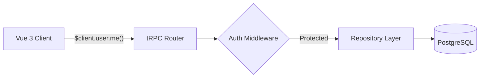

# API Contracts

## tRPC Router

The main API is served via tRPC at `/api/trpc/[trpc]`.

### user router

| Procedure     | Type     | Auth      | Input             | Output       |
| ------------- | -------- | --------- | ----------------- | ------------ |
| `user.me`     | query    | protected | -                 | User \| null |
| `user.create` | mutation | protected | `{ email, name }` | User         |
| `user.list`   | query    | protected | -                 | User[]       |

### REST Endpoints

| Method | Path          | Description  |
| ------ | ------------- | ------------ |
| GET    | `/api/health` | Health check |

### CMS Endpoints

Content management routes that proxy to the configured CMS provider (Drupal/Tide or Mock).

| Method | Path                          | Description                              |
| ------ | ----------------------------- | ---------------------------------------- |
| GET    | `/api/cms/page/[...slug]`     | Get a page by slug                       |
| GET    | `/api/cms/pages`              | List pages (filter by contentType, status, taxonomy; pagination, sort) |
| GET    | `/api/cms/menu/[name]`        | Get a menu by name                       |
| GET    | `/api/cms/search`             | Search content (query param `q`)         |
| GET    | `/api/cms/route`              | Resolve a URL path to a CMS route        |
| GET    | `/api/cms/taxonomy/[vocabulary]` | Get taxonomy terms for a vocabulary   |

## Validation Schemas

Shared validation schemas are in `packages/validation/`:

- `createUserSchema` — email, name, role
- `updateUserSchema` — partial user updates
- `loginSchema` — email, password
- `createProjectSchema` — name, description, slug
- `updateProjectSchema` — partial project updates

### CMS Schemas (in `packages/validation/schemas/cms.ts`)

- `cmsPageSchema` — page entity with sections, metadata, taxonomy
- `pageSectionSchema` — discriminated union of 8 section types (wysiwyg, accordion, card-collection, timeline, call-to-action, key-dates, image, embedded-video)
- `cmsMenuSchema` / `cmsMenuItemSchema` — menu structure with recursive children
- `cmsSearchQuerySchema` / `cmsSearchResultSchema` — search request/response
- `cmsListOptionsSchema` / `cmsListResultSchema` — paginated list request/response
- `cmsTaxonomyVocabularySchema` / `cmsTaxonomyTermSchema` — taxonomy entities
- `cmsRouteSchema` — URL-to-content route resolution
- `cmsImageSchema` / `cmsFileSchema` / `cmsLinkSchema` — media and link entities

## Related Documentation

- [Architecture](./architecture.md) — system overview
- [Data Model](./data-model.md) — database schema these APIs operate on
- [Testing Guide](./testing-guide.md) — testing API endpoints
