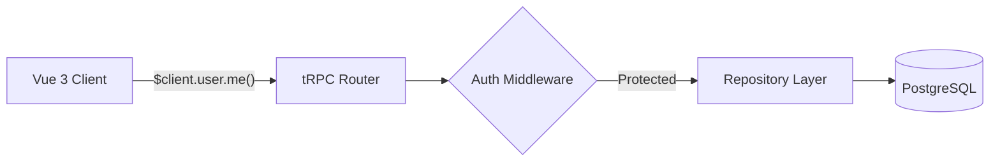

# API Contracts

## tRPC Router

The main API is served via tRPC at `/api/trpc/[trpc]`.

### user router

| Procedure     | Type     | Auth      | Input             | Output       |
| ------------- | -------- | --------- | ----------------- | ------------ |
| `user.me`     | query    | protected | -                 | User \| null |
| `user.create` | mutation | protected | `{ email, name }` | User         |
| `user.list`   | query    | protected | -                 | User[]       |

### REST Endpoints

| Method | Path          | Description  |
| ------ | ------------- | ------------ |
| GET    | `/api/health` | Health check |

## Validation Schemas

Shared validation schemas are in `packages/validation/`:

- `createUserSchema` — email, name, role
- `updateUserSchema` — partial user updates
- `loginSchema` — email, password
- `createProjectSchema` — name, description, slug
- `updateProjectSchema` — partial project updates

## Related Documentation

- [Architecture](./architecture.md) — system overview
- [Data Model](./data-model.md) — database schema these APIs operate on
- [Testing Guide](./testing-guide.md) — testing API endpoints
