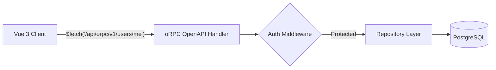

# API Contracts

## oRPC Router (ADR-021)

The main API is served via oRPC at `/api/orpc/*` with OpenAPI 3.1.1 as the
first-class contract format. The generated spec is committed at `docs/api/openapi.json`.



### user router

| Procedure      | Method | Path              | Visibility | Auth      | Input             | Output       |
| -------------- | ------ | ----------------- | ---------- | --------- | ----------------- | ------------ |
| `user.me`      | GET    | `/v1/users/me`    | public     | protected | -                 | SessionUser  |
| `user.getById` | GET    | `/v1/users/{id}`  | public     | protected | `{ id: uuid }`    | User         |
| `user.create`  | POST   | `/v1/users`       | public     | protected | `{ email, name }` | User         |
| `user.list`    | GET    | `/v1/users`       | public     | protected | -                 | User[]       |

### Health endpoint

| Procedure | Method | Path      | Visibility | Auth   |
| --------- | ------ | --------- | ---------- | ------ |
| `health`  | GET    | `/health` | internal   | public |

### OpenAPI Contract Pipeline

```
oRPC router definition (apps/web/server/orpc/router.ts)
  → pnpm generate:openapi           → docs/api/openapi.json
  → pnpm check:api-contract         → CI drift gate (wired into pnpm verify)
```

### REST Endpoints (H3 file-based)

| Method | Path          | Description  |
| ------ | ------------- | ------------ |
| GET    | `/api/health` | Full health check with dependency probes (DB, Redis) |

### CMS Endpoints

Content management routes that proxy to the configured CMS provider via `createCmsProvider()`.
Provider is auto-selected based on `NUXT_CMS_BASE_URL` env var (Drupal when set, Mock when empty).
CMS provider code is loaded via dynamic imports — Drupal-specific code is tree-shakeable.
See [ADR-011](./adr/011-cms-decoupling-pull-out-drupal.md) for decoupling details.

| Method | Path                          | Description                              |
| ------ | ----------------------------- | ---------------------------------------- |
| GET    | `/api/cms/page/[...slug]`     | Get a page by slug                       |
| GET    | `/api/cms/pages`              | List pages (filter by contentType, status, taxonomy; pagination, sort) |
| GET    | `/api/cms/menu/[name]`        | Get a menu by name                       |
| GET    | `/api/cms/search`             | Search content (query param `q`)         |
| GET    | `/api/cms/route`              | Resolve a URL path to a CMS route        |
| GET    | `/api/cms/taxonomy/[vocabulary]` | Get taxonomy terms for a vocabulary   |

### Page Template Selection

The `contentType` field from `GET /api/cms/page/[...slug]` determines which page
template renders the content. Mapping (`apps/web/pages/content/[...slug].vue`):

| contentType | Template | Layout |
|-------------|----------|--------|
| `landing_page` | `PageTemplateLanding` | Full-width, hero background, alternating sections |
| `campaign` | `PageTemplateCampaign` | Featured sections (CTA/key-dates) + body |
| (default) | `PageTemplateContent` | 960px readable width, taxonomy tags |

## Validation Schemas

Shared validation schemas are in `packages/validation/`:

- `createUserSchema` — email, name, role
- `updateUserSchema` — partial user updates
- `loginSchema` — email, password
- `createProjectSchema` — name, description, slug
- `updateProjectSchema` — partial project updates

### CMS Schemas (in `packages/validation/schemas/cms.ts`)

- `cmsPageSchema` — page entity with sections, metadata, taxonomy
- `pageSectionSchema` — discriminated union of 8 section types (wysiwyg, accordion, card-collection, timeline, call-to-action, key-dates, image, embedded-video)
- `cmsMenuSchema` / `cmsMenuItemSchema` — menu structure with recursive children
- `cmsSearchQuerySchema` / `cmsSearchResultSchema` — search request/response
- `cmsListOptionsSchema` / `cmsListResultSchema` — paginated list request/response
- `cmsTaxonomyVocabularySchema` / `cmsTaxonomyTermSchema` — taxonomy entities
- `cmsRouteSchema` — URL-to-content route resolution
- `cmsImageSchema` / `cmsFileSchema` / `cmsLinkSchema` — media and link entities

## Related Documentation

- [Architecture](./architecture.md) — system overview
- [Data Model](./data-model.md) — database schema these APIs operate on
- [Testing Guide](./testing-guide.md) — testing API endpoints
- [ADR-021](./adr/021-api-contract-strategy.md) — API contract strategy (oRPC + OpenAPI-first)
