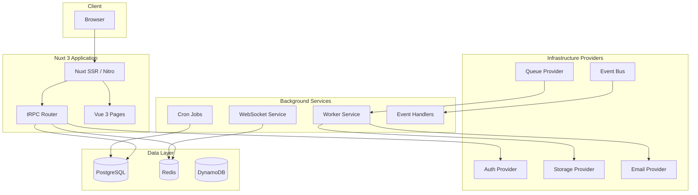
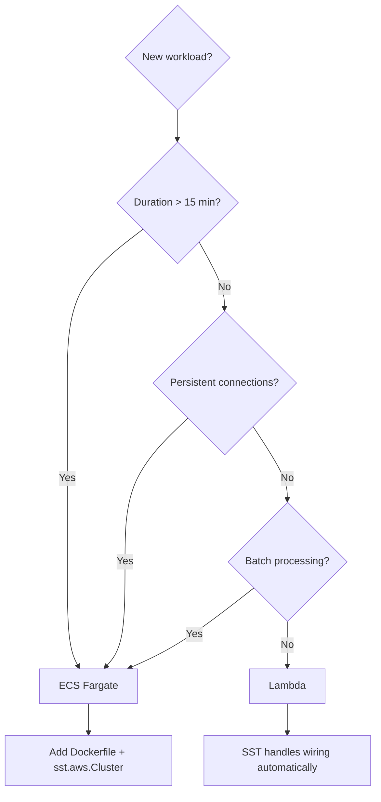

# Architecture

## System Overview

Ripple Next is a full-stack government digital platform built with an AI-agent-first
architecture. Every technology choice maximizes autonomous agent effectiveness.

## Stack

| Layer          | Technology                                              |
| -------------- | ------------------------------------------------------- |
| Frontend       | Nuxt 3 + Vue 3 (Composition API) + TypeScript           |
| UI Components  | Ripple UI Core + Storybook 10                           |
| API            | Nitro server routes + tRPC-nuxt                         |
| Database       | PostgreSQL (Drizzle ORM) + DynamoDB (ElectroDB) + Redis |
| Queue          | SQS (prod) / BullMQ (local) / Memory (test)             |
| Auth           | OIDC/OAuth (oauth4webapi) — provider-agnostic           |
| File Storage   | S3 (prod) / MinIO (local) / fs (test)                   |
| Infrastructure | SST v3 (Pulumi/Terraform)                               |
| Compute        | Lambda (default) + ECS Fargate (long-running)           |
| Testing        | Vitest + Vue Test Utils + Playwright + Testcontainers   |

## Provider Pattern

Every infrastructure concern uses a provider interface with at least three
implementations: one for tests (memory/mock), one for local dev, one for production.

See [Provider Pattern](./provider-pattern.md) for details, and [ADR-003](./adr/003-provider-pattern.md) for the rationale.

## Compute Decision Framework

- **Lambda** (default): Request-response, <15 min, auto-scales to zero
- **ECS Fargate**: Long-running processes, WebSockets, batch jobs
- **Never EKS**: Too complex for agent-first development

See [Lambda vs ECS](./lambda-vs-ecs.md) for the full decision guide, and [ADR-005](./adr/005-lambda-default-ecs-escape.md) / [ADR-006](./adr/006-no-kubernetes.md) for the rationale.

## Deployment

- Preview per PR: `npx sst deploy --stage pr-123`
- Staging: auto-deploy on main merge
- Production: manual approval gate

See [Deployment Guide](./deployment.md) for details, and [ADR-004](./adr/004-sst-over-cdk.md) for why SST.

## Related Documentation

- [Provider Pattern](./provider-pattern.md) — core architecture pattern
- [Data Model](./data-model.md) — PostgreSQL schema
- [API Contracts](./api-contracts.md) — tRPC routers and REST endpoints
- [Deployment Guide](./deployment.md) — local dev, staging, production
- [Testing Guide](./testing-guide.md) — test pyramid and examples
- [Lambda vs ECS](./lambda-vs-ecs.md) — compute decision framework
- [Critique Evaluation](./critique-evaluation.md) — architecture review decisions
- [ADR Index](./adr/) — all Architecture Decision Records
