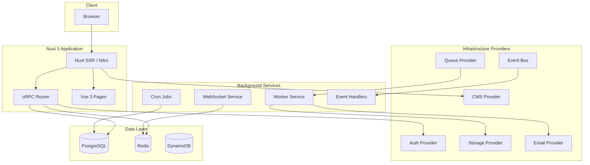
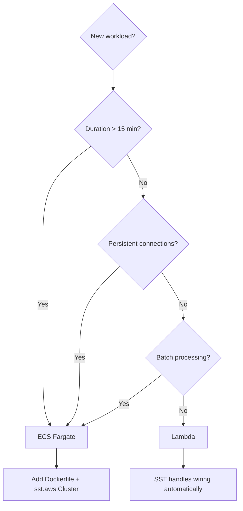

# Architecture

## System Overview

Ripple Next is a full-stack government digital platform built with an AI-agent-first
architecture. Every technology choice maximizes autonomous agent effectiveness.

## Stack

| Layer          | Technology                                              | ADR |
| -------------- | ------------------------------------------------------- | --- |
| Frontend       | Nuxt 3 + Vue 3 (Composition API) + TypeScript           | [ADR-001](./adr/001-nuxt-over-next.md) |
| UI Components  | Ripple UI Core + Storybook 10                           | — |
| Page Templates | Landing, Content, Campaign (contentType-driven)         | [RN-023](./product-roadmap/ARCHIVE.md#rn-023-landing-page--content-templates) |
| API            | Nitro server routes + oRPC (OpenAPI 3.1.1)              | [ADR-021](./adr/021-api-contract-strategy.md) |
| Database       | PostgreSQL (Drizzle ORM) + DynamoDB (ElectroDB) + Redis | [ADR-002](./adr/002-drizzle-over-prisma.md) |
| Queue          | SQS (prod) / BullMQ (local) / Memory (test)             | [ADR-003](./adr/003-provider-pattern.md) |
| Auth           | OIDC/OAuth (oauth4webapi) — provider-agnostic           | [ADR-008](./adr/008-oidc-over-lucia.md) |
| CMS            | Drupal/Tide JSON:API (prod) / Mock (test) — decoupled   | [ADR-009](./adr/009-cms-provider-drupal.md), [ADR-011](./adr/011-cms-decoupling-pull-out-drupal.md) |
| Search         | MeiliSearch (local) / CMS fallback (mock/test)           | — |
| File Storage   | S3 (prod) / MinIO (local) / fs (test)                   | [ADR-003](./adr/003-provider-pattern.md) |
| Infrastructure | SST v3 (Pulumi/Terraform)                               | [ADR-004](./adr/004-sst-over-cdk.md) |
| Compute        | Lambda (default) + ECS Fargate (long-running)           | [ADR-005](./adr/005-lambda-default-ecs-escape.md), [ADR-006](./adr/006-no-kubernetes.md) |
| Local Dev      | Provider pattern (no LocalStack required)                | [ADR-015](./adr/015-localstack-assessment.md) |
| Testing        | Vitest + Vue Test Utils + Playwright + Testcontainers   | [ADR-013](./adr/013-flaky-test-containment.md) |

## Provider Pattern

Every infrastructure concern uses a provider interface with at least three
implementations: one for tests (memory/mock), one for local dev, one for production.

The CMS provider has an explicit **decoupling architecture**: Drupal-specific code
is isolated to exactly 2 files (`drupal.ts` + `tide-paragraph-mapper.ts`), making
Drupal removable without affecting frontend, tests, or API layer. A provider factory
with dynamic imports ensures Drupal code is tree-shakeable and only loaded when needed.

See [Provider Pattern](./provider-pattern.md) for details, [ADR-003](./adr/003-provider-pattern.md) for the rationale, and [ADR-011](./adr/011-cms-decoupling-pull-out-drupal.md) for CMS decoupling.

## Compute Decision Framework

- **Lambda** (default): Request-response, <15 min, auto-scales to zero
- **ECS Fargate**: Long-running processes, WebSockets, batch jobs
- **Never EKS**: Too complex for agent-first development

See [Lambda vs ECS](./lambda-vs-ecs.md) for the full decision guide, and [ADR-005](./adr/005-lambda-default-ecs-escape.md) / [ADR-006](./adr/006-no-kubernetes.md) for the rationale.

## Deployment

- Preview per PR: `npx sst deploy --stage pr-123`
- Staging: auto-deploy on main merge
- Production: manual approval gate

See [Deployment Guide](./deployment.md) for details, and [ADR-004](./adr/004-sst-over-cdk.md) for why SST.

## CI Observability and Supply-Chain Security

The CI pipeline provides structured observability and supply-chain security:

- **Test artifacts** — JUnit XML reports uploaded on every CI run (30-day retention)
- **Coverage reports** — Available as downloadable artifacts
- **Playwright traces** — Uploaded on E2E failure (7-day retention)
- **SBOM** — CycloneDX SBOM mandatory (fail-fast) on every release (90-day retention)
- **Build provenance** — Attestations via `actions/attest-build-provenance`
- **Reusable actions** — `.github/actions/{setup,quality,test}` for fleet consistency, with [downstream consumption guide](./downstream-workflows.md)
- **Env schema validation** — Zod-based validation of required/optional env vars in CI quality gate
- **Flaky test containment** — Quarantine policy with `pnpm check:quarantine` CI gate, 14-day time box, 5% budget cap
- **Preview deploy guardrails** — GitHub environment protection, label-gated deploys, infra change auto-deploy

See [ADR-010](./adr/010-ci-observability-supply-chain.md), [ADR-012](./adr/012-env-schema-validation.md), [ADR-013](./adr/013-flaky-test-containment.md), and [ADR-014](./adr/014-preview-deploy-guardrails.md) for the rationale.

## AI-First Workflow Strategy

Beyond parseable outputs and fast test loops, the platform provides agent-native
workflow tooling ([ADR-018](./adr/018-ai-first-workflow-strategy.md)):

| Pillar | Status | Roadmap Item | Description |
|--------|--------|-------------|-------------|
| Runbook automation | Done | [RN-039](./product-roadmap/ARCHIVE.md#rn-039-agent-runbook-automation) | Codified procedures for deploy, rollback, scaffold |
| Error taxonomy | Done | [RN-040](./product-roadmap/ARCHIVE.md#rn-040-structured-error-taxonomy) | Machine-parseable error codes with remediation |
| Code generators | Done | [RN-041](./product-roadmap/ARCHIVE.md#rn-041-code-generation-templates) | `pnpm generate:*` scaffolders for components, providers, endpoints, packages, and downstream repos |
| Context file minimalism | Done | [RN-044](./product-roadmap/ARCHIVE.md#rn-044-context-file-minimalism-adr-020) | Evidence-based trimming of CLAUDE.md/AGENTS.md with line-count gate ([ADR-020](./adr/020-context-file-minimalism.md)) |

These complement the existing agent ergonomics: `pnpm doctor --json`,
`pnpm bootstrap`, `pnpm validate:env`, provider conformance suites, and
structured CI artifacts.

## Downstream Architecture Standards

Downstream repos consuming `@ripple-next/*` packages must document their architecture
following the [Downstream Adoption Guide](./downstream-adoption-guide.md). At minimum,
each downstream repo's `docs/architecture.md` should include:

- **System overview diagram** — Mermaid graph showing the application topology
- **Stack table** — layer, technology, ripple-next package, and ADR reference
- **Provider pattern decisions** — which providers are used for test, local, and production
- **Compute choices** — Lambda vs ECS with rationale per route/function
- **Deviations from golden path** — any areas where the repo diverges from conventions, with ADR links

The scaffold generator (`pnpm generate:scaffold`) creates a starter architecture document
with editable templates for all sections above. See [Platform Capabilities](./platform-capabilities.md)
for the full inventory of what ripple-next provides.

## Related Documentation

- [Developer Guide](./developer-guide.md) — **start here** for setup and onboarding
- [Provider Pattern](./provider-pattern.md) — core architecture pattern
- [Data Model](./data-model.md) — PostgreSQL schema
- [API Contracts](./api-contracts.md) — oRPC routers and REST endpoints
- [Deployment Guide](./deployment.md) — local dev, staging, production
- [Testing Guide](./testing-guide.md) — test pyramid and examples
- [Lambda vs ECS](./lambda-vs-ecs.md) — compute decision framework
- [Critique Evaluation](./critique-evaluation.md) — architecture review decisions
- [ADR Index](./adr/README.md) — all Architecture Decision Records (23 total)
- [Downstream Workflows](./downstream-workflows.md) — consuming reusable composite actions
- [Downstream Adoption Guide](./downstream-adoption-guide.md) — documentation standards for downstream repos
- [Platform Capabilities](./platform-capabilities.md) — what ripple-next provides to consumers

### Key ADRs

| ADR | Decision | Category |
|-----|----------|----------|
| [ADR-001](./adr/001-nuxt-over-next.md) | Nuxt 3 over Next.js | Frontend |
| [ADR-002](./adr/002-drizzle-over-prisma.md) | Drizzle ORM over Prisma | Database |
| [ADR-003](./adr/003-provider-pattern.md) | Provider pattern for all infra concerns | Architecture |
| [ADR-004](./adr/004-sst-over-cdk.md) | SST v3 over CDK/CloudFormation | Infrastructure |
| [ADR-005](./adr/005-lambda-default-ecs-escape.md) | Lambda default, ECS escape hatch | Compute |
| [ADR-006](./adr/006-no-kubernetes.md) | No Kubernetes (EKS) | Compute |
| [ADR-007](./adr/007-library-vs-monorepo.md) | Hybrid monorepo, publish as libraries | Architecture |
| [ADR-008](./adr/008-oidc-over-lucia.md) | OIDC/OAuth via oauth4webapi | Auth |
| [ADR-009](./adr/009-cms-provider-drupal.md) | CMS provider for Drupal/Tide | CMS |
| [ADR-010](./adr/010-ci-observability-supply-chain.md) | CI observability + supply chain | CI/CD |
| [ADR-011](./adr/011-cms-decoupling-pull-out-drupal.md) | CMS decoupling — pull-out-Drupal | CMS |
| [ADR-012](./adr/012-env-schema-validation.md) | Env schema validation gate | CI/CD |
| [ADR-013](./adr/013-flaky-test-containment.md) | Flaky test containment policy | Testing |
| [ADR-014](./adr/014-preview-deploy-guardrails.md) | Preview deploy guardrails | Deployment |
| [ADR-015](./adr/015-localstack-assessment.md) | LocalStack — provider pattern preferred | Infrastructure |
| [ADR-016](./adr/016-roadmap-reorganisation.md) | Roadmap reorganisation — AI-first tiers | Process |
| [ADR-017](./adr/017-upstream-ripple-component-strategy.md) | Upstream Ripple — port, own, sync | Frontend |
| [ADR-018](./adr/018-ai-first-workflow-strategy.md) | AI-first workflow strategy | Process |
| [ADR-019](./adr/019-fleet-governance.md) | Fleet governance — drift detection + sync | Process |
