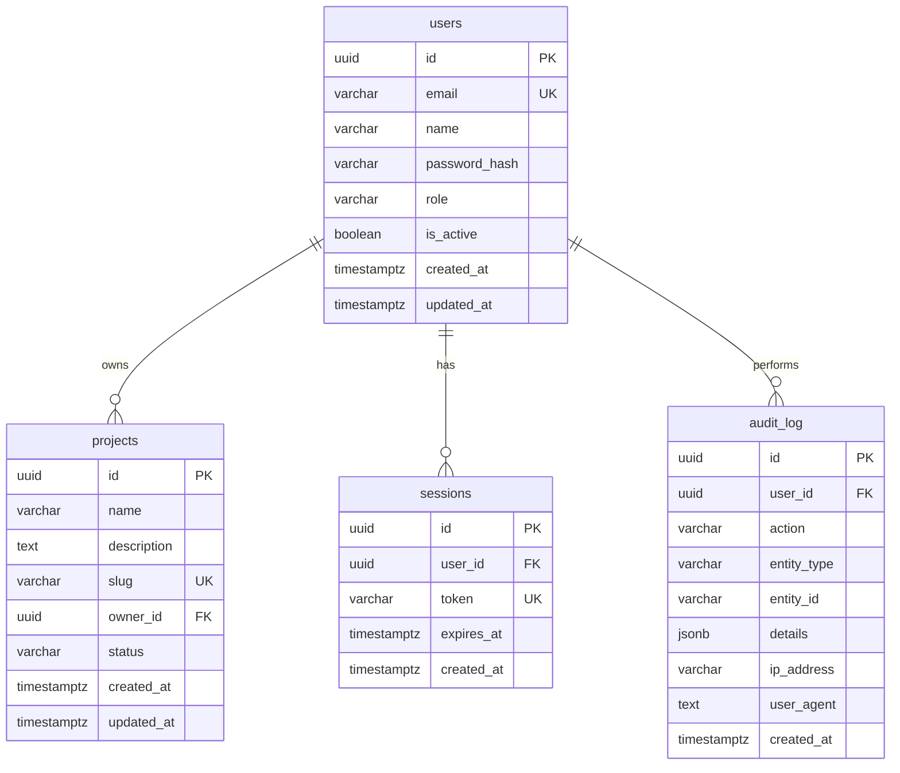

# Data Model

## Entity Relationship Diagram

## PostgreSQL Schema

### users

| Column        | Type         | Constraints               |
| ------------- | ------------ | ------------------------- |
| id            | UUID         | PK, auto-generated        |
| email         | VARCHAR(255) | UNIQUE, NOT NULL          |
| name          | VARCHAR(255) | NOT NULL                  |
| password_hash | VARCHAR(255) |                           |
| role          | VARCHAR(50)  | NOT NULL, default: 'user' |
| is_active     | BOOLEAN      | NOT NULL, default: true   |
| created_at    | TIMESTAMPTZ  | NOT NULL, default: now()  |
| updated_at    | TIMESTAMPTZ  | NOT NULL, default: now()  |

### projects

| Column      | Type         | Constraints                |
| ----------- | ------------ | -------------------------- |
| id          | UUID         | PK, auto-generated         |
| name        | VARCHAR(255) | NOT NULL                   |
| description | TEXT         |                            |
| slug        | VARCHAR(255) | UNIQUE, NOT NULL           |
| owner_id    | UUID         | FK → users.id, NOT NULL    |
| status      | VARCHAR(50)  | NOT NULL, default: 'draft' |
| created_at  | TIMESTAMPTZ  | NOT NULL, default: now()   |
| updated_at  | TIMESTAMPTZ  | NOT NULL, default: now()   |

### sessions

| Column     | Type         | Constraints                          |
| ---------- | ------------ | ------------------------------------ |
| id         | UUID         | PK, auto-generated                   |
| user_id    | UUID         | FK → users.id (cascade), NOT NULL    |
| token      | VARCHAR(255) | UNIQUE, NOT NULL                     |
| expires_at | TIMESTAMPTZ  | NOT NULL                             |
| created_at | TIMESTAMPTZ  | NOT NULL, default: now()             |

### audit_log

| Column      | Type         | Constraints              |
| ----------- | ------------ | ------------------------ |
| id          | UUID         | PK, auto-generated       |
| user_id     | UUID         | FK → users.id            |
| action      | VARCHAR(100) | NOT NULL                 |
| entity_type | VARCHAR(100) | NOT NULL                 |
| entity_id   | VARCHAR(255) |                          |
| details     | JSONB        |                          |
| ip_address  | VARCHAR(45)  |                          |
| user_agent  | TEXT         |                          |
| created_at  | TIMESTAMPTZ  | NOT NULL, default: now() |

## CMS Content Model

CMS content (pages, taxonomies, menus, media) is managed externally by
Drupal/Tide and accessed via the `@ripple/cms` provider pattern. It is NOT
stored in the PostgreSQL database above — it lives in the CMS backend.

The CMS content model is defined in `packages/cms/types.ts` and validated
by Zod schemas in `packages/validation/schemas/cms.ts`. Key entities:

- **CmsPage** — content page with sections, metadata, taxonomy terms
- **PageSection** — discriminated union (wysiwyg, accordion, card-collection, timeline, call-to-action, key-dates, image, embedded-video)
- **CmsMenu / CmsMenuItem** — hierarchical navigation menus
- **CmsTaxonomyVocabulary / CmsTaxonomyTerm** — content classification
- **CmsRoute** — URL path to content resolution
- **CmsImage / CmsFile / CmsLink** — media and link references

See [Provider Pattern](./provider-pattern.md) for how `MockCmsProvider` and
`DrupalCmsProvider` implement the `CmsProvider` interface.

## Schema Files

All schemas are defined as TypeScript using Drizzle ORM in `packages/db/schema/`.
Access is via the repository pattern in `packages/db/repositories/`.

## Related Documentation

- [Architecture](./architecture.md) — system overview
- [API Contracts](./api-contracts.md) — endpoints that use these models
- [ADR-002: Drizzle over Prisma](./adr/002-drizzle-over-prisma.md) — ORM choice rationale
