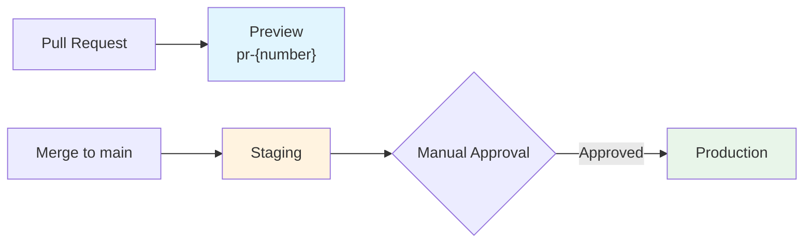

# Deployment Guide

## Deployment Pipeline



## Prerequisites

- AWS account with appropriate IAM role
- SST v3 installed (`npx sst`)
- pnpm installed

## Local Development

```bash
# Start local services (Postgres, Redis, MinIO, Mailpit, MeiliSearch)
docker compose up -d

# Install dependencies
pnpm install

# Run migrations
pnpm db:migrate

# Seed development data
pnpm db:seed

# Start dev server
pnpm dev
```

Local development uses the [Provider Pattern](./provider-pattern.md) to swap AWS services for local equivalents (BullMQ, MinIO, Mailpit).

## Preview Environments

Each PR gets its own isolated environment:

```bash
npx sst deploy --stage pr-123
```

Cleanup when PR is closed:

```bash
npx sst remove --stage pr-123
```

## Staging

Automatically deployed on merge to `main` via GitHub Actions.

```bash
npx sst deploy --stage staging
```

## Production

Deployed via GitHub Actions with manual approval gate.

```bash
npx sst deploy --stage production
```

Production uses:

- `removal: "retain"` — resources are NOT deleted on stack removal
- `protect: true` — prevents accidental deletion

## SST Live Dev

For developing with real AWS resources locally:

```bash
npx sst dev
```

This deploys infrastructure to AWS but proxies Lambda invocations to your local machine.

## Related Documentation

- [Architecture](./architecture.md) — system overview
- [Provider Pattern](./provider-pattern.md) — local dev service swapping
- [Lambda vs ECS](./lambda-vs-ecs.md) — compute decision framework
- [ADR-004: SST over CDK](./adr/004-sst-over-cdk.md) — infrastructure tool choice
- [ADR-005: Lambda Default](./adr/005-lambda-default-ecs-escape.md) — compute strategy
