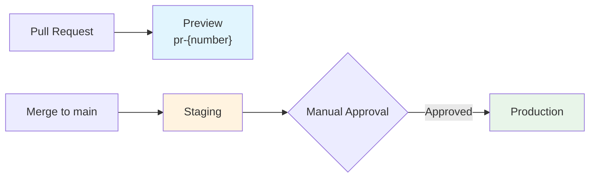

# Deployment Guide

## Deployment Pipeline



## Prerequisites

- AWS account with appropriate IAM role
- SST v3 installed (`npx sst`)
- pnpm installed

## Local Development

```bash
# Start local services (Postgres, Redis, MinIO, Mailpit, MeiliSearch)
docker compose up -d

# Install dependencies
pnpm install

# Run migrations
pnpm db:migrate

# Seed development data
pnpm db:seed

# Start dev server
pnpm dev
```

Local development uses the [Provider Pattern](./provider-pattern.md) to swap AWS services for local equivalents (BullMQ, MinIO, Mailpit).

## Preview Environments

Each PR gets its own isolated environment:

```bash
npx sst deploy --stage pr-123
```

Cleanup when PR is closed:

```bash
npx sst remove --stage pr-123
```

### Credential Guardrails

Both `deploy-preview` and `cleanup-preview` workflows include a `check-secrets`
gate. When `AWS_ROLE_ARN` is not configured (forks, new repos, local-only
workflows), the workflow:

1. Emits a `::notice::` annotation explaining the skip reason
2. Skips the deploy/cleanup job entirely (no failure, no noise)
3. Marks the overall workflow as successful

This means PRs in repos without AWS credentials still get a green CI status.
See [ADR-014](./adr/014-preview-deploy-guardrails.md) for the full guardrails
design.

## Staging

Automatically deployed on merge to `main` via GitHub Actions.

```bash
npx sst deploy --stage staging
```

## Production

Deployed via GitHub Actions with manual approval gate.

```bash
npx sst deploy --stage production
```

Production uses:

- `removal: "retain"` — resources are NOT deleted on stack removal
- `protect: true` — prevents accidental deletion

## SST Live Dev

For developing with real AWS resources locally:

```bash
npx sst dev
```

This deploys infrastructure to AWS but proxies Lambda invocations to your local machine.

## IaC Policy Scanning

Infrastructure changes to `sst.config.ts` are validated against a defined policy
set before deployment. The scanner runs automatically in CI when `sst.config.ts`
or policy definitions change, and is also included in `pnpm verify`.

```bash
pnpm check:iac                  # human-readable output
pnpm check:iac -- --json        # JSON report to stdout
pnpm check:iac -- --ci          # write iac-policy-report.json for CI
```

### Baseline Policy Set

| Policy | Severity | What It Checks |
|--------|----------|----------------|
| IAC-001 | error | Production stage must have `removal: 'retain'` and `protect: true` |
| IAC-002 | warning | S3 buckets should not use wildcard CORS origins (`'*'`) |
| IAC-003 | error | Public-facing services must use HTTPS (port 443) only |
| IAC-004 | warning | ECS/database scaling must have bounded maximums |
| IAC-005 | warning | Lambda timeouts must not exceed 15 minutes |
| IAC-006 | error | No hardcoded AWS ARNs or account IDs |
| IAC-007 | error | Database and cache resources must be in a VPC |

Error-severity violations block the CI pipeline. Warnings are reported but
non-blocking. Full policy definitions are in `docs/iac-policies.json`.

### Exception Workflow

When a policy violation is intentional and safe, add an exception comment on the
line immediately before the flagged code:

```typescript
// iac-policy-exception: IAC-002 — presigned upload URLs require open CORS during beta
const uploads = new sst.aws.Bucket('Uploads', {
  cors: { allowOrigins: ['*'], ... }
})
```

Exception requirements:
1. Comment must use the exact format: `// iac-policy-exception: <POLICY-ID> — <justification>`
2. Justification must explain why the exception is safe
3. Exceptions are tracked in the IaC policy scan report (visible in CI artifacts)
4. Exceptions should be reviewed during quarterly security reviews

### CI Artifacts

| Artifact | Contents | Retention |
|----------|----------|-----------|
| `iac-policy-report` | IaC policy scan JSON (`ripple-iac-report/v1`) | 30 days |

## Rollback and Recovery

### Rollback Trigger Criteria

A rollback should be initiated when **any** of the following are true after deployment:

| Condition | Detection | Taxonomy Code |
|-----------|-----------|---------------|
| Health endpoint returns `unhealthy` | Post-deploy health check (automatic) | RPL-DEPLOY-001 |
| Health endpoint unreachable after retries | Post-deploy health check (automatic) | RPL-DEPLOY-001 |
| Database connectivity lost | Health check `checks.database.status` | RPL-DEPLOY-001 |
| Redis connectivity lost | Health check `checks.redis.status` | RPL-DEPLOY-001 |
| Error rate spike >5% in first 5 minutes | CloudWatch monitoring | — |

### Post-Deploy Health Validation

Every deployment (staging and production) runs an automated health check:

```bash
# Manual health check
node scripts/deploy-health-check.mjs https://staging.example.com --retries=5 --interval=10

# With JSON output and report file
node scripts/deploy-health-check.mjs https://staging.example.com --json --output=health-report.json
```

The health check:
1. Polls `/api/health` with configurable retries (default: 3, interval: 5s)
2. Validates that status is `ok` or `degraded` (both are acceptable)
3. Reports `unhealthy` or unreachable as failure with RPL-DEPLOY-001 taxonomy code
4. Outputs a structured `ripple-health-report/v1` JSON report
5. Captures deployment metadata (commit, stage, workflow, run ID)
6. CI uploads the report as a `health-report-{stage}` artifact (30-day retention)

### Rollback Procedure

For complete step-by-step instructions:

```bash
pnpm runbook rollback-production        # human-readable
pnpm runbook rollback-production --json  # machine-readable
```

Quick reference:
```bash
# 1. Identify the last known-good commit
git log --oneline -10

# 2. Checkout and rebuild at that commit
git checkout <known-good-commit>
pnpm install --frozen-lockfile
pnpm build

# 3. Redeploy the known-good version
npx sst deploy --stage production  # or staging

# 4. Verify health
node scripts/deploy-health-check.mjs https://production.example.com --retries=5 --interval=10

# 5. Return to main for investigation
git checkout main
```

### Rollback Evidence

CI captures structured evidence for every deployment:

| Artifact | Contents | Retention |
|----------|----------|-----------|
| `health-report-staging` | Post-deploy health check JSON | 30 days |
| `health-report-production` | Post-deploy health check JSON | 30 days |

Health reports conform to the `ripple-health-report/v1` schema and include:
- URL, timestamps, pass/fail status
- Per-attempt details (reachable, latency, response body)
- Dependency check results (DB, Redis)
- Rollback trigger reason and remediation steps (on failure)
- Deployment metadata (commit SHA, stage, workflow run ID)

## Related Documentation

- [Developer Guide](./developer-guide.md) — full setup from bare Mac to deployment
- [Architecture](./architecture.md) — system overview
- [Provider Pattern](./provider-pattern.md) — local dev service swapping
- [Lambda vs ECS](./lambda-vs-ecs.md) — compute decision framework
- [ADR-004: SST over CDK](./adr/004-sst-over-cdk.md) — infrastructure tool choice
- [ADR-005: Lambda Default](./adr/005-lambda-default-ecs-escape.md) — compute strategy
