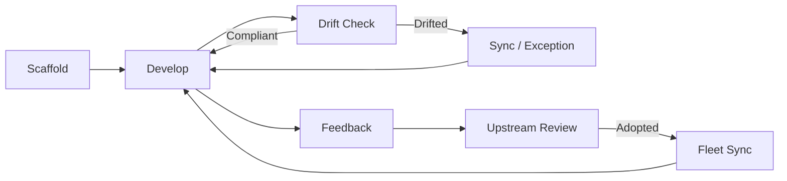

# Fleet Management Guide

> Comprehensive reference for fleet governance operations — both upstream (golden path)
> and downstream (consumer repos). AI agents and developers use this guide to manage
> the fleet lifecycle: scaffold, sync, drift detection, feedback, and compliance.
>
> **Quick links:** [Fleet Policy](./fleet-policy.json) | [ADR-019](./adr/019-fleet-governance.md) | [ADR-022](./adr/022-bidirectional-fleet-communication.md) | [Downstream Workflows](./downstream-workflows.md)

---

## Command Reference

### Upstream Commands (run from ripple-next)

| Task | Command |
|------|---------|
| Bootstrap a downstream repo | `pnpm generate:scaffold /path/to/repo --name=<name> --org=<org>` |
| Preview scaffold (dry run) | `pnpm generate:scaffold /path/to/repo --name=<name> --org=<org> --dry-run` |
| Check drift on a downstream repo | `pnpm check:fleet-drift -- --target=/path/to/repo` |
| Preview sync changes | `pnpm fleet:sync -- --target=/path/to/repo --dry-run` |
| Apply sync to downstream repo | `pnpm fleet:sync -- --target=/path/to/repo` |
| View fleet compliance (multi-repo) | `pnpm fleet:compliance -- --reports=./reports` |
| View fleet changelog | `pnpm fleet:changelog` |
| Validate changelog structure | `pnpm fleet:changelog -- --validate` |

### Downstream Commands (run from a consumer repo)

| Task | Command |
|------|---------|
| Run all quality gates | `pnpm verify` |
| Run quality gates + fleet drift | `pnpm verify -- --fleet` |
| Check drift against golden path | `pnpm check:fleet-drift` |
| Check drift (JSON output) | `pnpm check:fleet-drift -- --json` |
| Submit feedback upstream | `pnpm fleet:feedback -- --type=<type> --title="..." --description="..." --submit` |
| Preview feedback (dry run) | `pnpm fleet:feedback -- --type=<type> --title="..." --dry-run --json` |
| Share local improvement upstream | `pnpm fleet:feedback -- --type=improvement-share --surface=<SURF-ID> --file=<path> --submit` |
| Request policy exception | `pnpm fleet:feedback -- --type=policy-exception --surface=<SURF-ID> --title="..." --submit` |
| Request fleet sync from upstream | `pnpm fleet:sync` |
| Run fleet drift check runbook | `pnpm runbook fleet-drift-check` |
| Run fleet feedback submit runbook | `pnpm runbook fleet-feedback-submit` |

### pnpm Script Aliases (downstream `package.json`)

Downstream repos scaffolded by ripple-next include these scripts:

```json
{
  "scripts": {
    "check:fleet-drift": "node scripts/check-fleet-drift.mjs",
    "fleet:feedback": "node scripts/fleet-feedback.mjs",
    "fleet:sync": "node scripts/fleet-sync.mjs",
    "verify": "node scripts/verify.mjs"
  }
}
```

---

## Fleet Lifecycle



### 1. Scaffold

Create a new downstream repo with the full golden-path DX infrastructure:

```bash
pnpm generate:scaffold /path/to/repo \
  --name=my-project \
  --org=my-org \
  --description="My downstream project"
```

This generates ~40 files across 6 categories:

| Category | Key Files |
|----------|-----------|
| AI / Agent DX | `CLAUDE.md`, `AGENTS.md`, `.github/agents/` (5 agents), `.github/instructions/` (6 topics), `.github/prompts/` (4 prompts) |
| Documentation | `docs/readiness.json`, `docs/error-taxonomy.json`, `docs/fleet-management.md`, ADRs, runbooks, product roadmap |
| Quality Gates | `scripts/verify.mjs`, `scripts/doctor.sh`, `scripts/check-readiness.mjs` |
| Fleet Governance | `.fleet.json`, `scripts/check-fleet-drift.mjs`, `scripts/fleet-feedback.mjs`, `scripts/fleet-sync.mjs` |
| CI / CD | `.github/workflows/ci.yml`, `security.yml`, `fleet-feedback.yml`, `fleet-update.yml`, composite actions, CODEOWNERS |
| Config | `.env.example`, `.nvmrc`, `eslint.config.js`, `.gitignore` |

### 2. Drift Detection

Fleet drift detection compares downstream files against the golden-path source.
Run locally or in CI:

```bash
# Local check
pnpm check:fleet-drift

# JSON output for CI or agent consumption
pnpm check:fleet-drift -- --json

# Output includes compliance score and per-surface findings
```

The drift report follows the `ripple-fleet-drift/v1` schema:

```json
{
  "schema": "ripple-fleet-drift/v1",
  "complianceScore": 85,
  "findings": [
    {
      "surfaceId": "FLEET-SURF-003",
      "name": "toolchain-pinning",
      "severity": "security-critical",
      "status": "compliant"
    },
    {
      "surfaceId": "FLEET-SURF-005",
      "name": "eslint-config",
      "severity": "standards-required",
      "status": "drifted",
      "details": "Local additions detected (merge strategy)"
    }
  ]
}
```

### 3. Fleet Sync

When drift is detected, sync governed surfaces from the golden path:

**From upstream (push sync):**
```bash
pnpm fleet:sync -- --target=/path/to/downstream --dry-run  # preview
pnpm fleet:sync -- --target=/path/to/downstream             # apply
```

**From downstream (pull sync):**
```bash
pnpm fleet:sync              # pull latest governed surfaces from golden path
pnpm fleet:sync --dry-run    # preview what would change
```

Sync respects the strategy per surface:
- **`sync`** — exact file copy (security-critical, standards-required)
- **`merge`** — safe text merge preserving local additions (ESLint config)
- **`advisory`** — report only, no changes applied

### 4. Fleet Feedback

Submit structured feedback from downstream to the golden path:

```bash
# Feature request
pnpm fleet:feedback -- \
  --type=feature-request \
  --title="Add Vue a11y ESLint rules" \
  --description="Our team added accessibility linting rules that could benefit the fleet" \
  --submit

# Bug report
pnpm fleet:feedback -- \
  --type=bug-report \
  --title="Fleet drift false positive on SURF-005" \
  --description="ESLint merge strategy reports drift for additive rules" \
  --submit

# Share local improvement (bidirectional sync)
pnpm fleet:feedback -- \
  --type=improvement-share \
  --surface=FLEET-SURF-005 \
  --file=eslint.config.js \
  --submit

# Policy exception request
pnpm fleet:feedback -- \
  --type=policy-exception \
  --surface=FLEET-SURF-007 \
  --title="No IaC config — stateless API service" \
  --description="This service has no SST configuration; IaC policy scan is not applicable" \
  --submit
```

**Feedback types:**

| Type | Use Case | Auto-Action |
|------|----------|-------------|
| `feature-request` | Request a new golden-path capability | Label + priority score |
| `bug-report` | Report an issue with a governed surface | Label + attach drift data |
| `policy-exception` | Request formal exception to a governance policy | Label + link to surface |
| `improvement-share` | Share a local improvement for fleet-wide adoption | Auto-create draft PR |
| `pain-point` | Report friction with a governed surface | Label + aggregate frequency |

### 5. Policy Exceptions

When a governed surface legitimately doesn't apply to your repo, request an exception:

```bash
# Submit exception request to upstream
pnpm fleet:feedback -- \
  --type=policy-exception \
  --surface=FLEET-SURF-007 \
  --title="No IaC — stateless API" \
  --submit
```

Or add an inline exception comment in the relevant file:

```javascript
// fleet-policy-exception: FLEET-SURF-007 — No SST IaC config; stateless API service
```

**Exception rules:**
- Comment must be in a file within the governed surface scope
- Must include justification
- Tracked in drift reports
- Expires after 90 days and must be renewed

---

## Governed Surfaces

13 governed surfaces across 3 severity levels:

### Security-Critical (must fix within 7 days)

| ID | Name | Strategy | What It Governs |
|----|------|----------|-----------------|
| FLEET-SURF-002 | composite-actions | sync | `.github/actions/setup/`, `quality/`, `test/` |
| FLEET-SURF-003 | toolchain-pinning | sync | `.nvmrc`, `package.json` engines/packageManager |
| FLEET-SURF-006 | security-config | sync | `security.yml`, `CODEOWNERS` |
| FLEET-SURF-007 | iac-policies | sync | `docs/iac-policies.json`, `scripts/iac-policy-scan.mjs` |

### Standards-Required (must fix within 30 days)

| ID | Name | Strategy | What It Governs |
|----|------|----------|-----------------|
| FLEET-SURF-001 | ci-workflows | sync | `ci.yml`, `security.yml`, reusable workflows |
| FLEET-SURF-004 | quality-scripts | sync | `check-readiness.mjs`, `check-quarantine.mjs`, `verify.mjs` |
| FLEET-SURF-005 | eslint-config | merge | `eslint.config.js` |
| FLEET-SURF-008 | error-taxonomy | sync | `docs/error-taxonomy.json` |
| FLEET-SURF-011 | fleet-governance-tooling | sync | `check-fleet-drift.mjs`, `fleet-policy.json` |

### Recommended (advisory, no SLA)

| ID | Name | Strategy | What It Governs |
|----|------|----------|-----------------|
| FLEET-SURF-009 | action-version-pinning | advisory | Workflow action refs (no `@main`) |
| FLEET-SURF-010 | ai-agent-instructions | advisory | `CLAUDE.md`, `AGENTS.md`, instructions, agents, prompts |
| FLEET-SURF-012 | downstream-documentation | advisory | Roadmap, architecture, readiness |
| FLEET-SURF-013 | api-contract-documentation | advisory | `api-contracts.md`, `openapi.json` |

---

## Version Tracking (`.fleet.json`)

Every downstream repo has a `.fleet.json` file that tracks its relationship to the golden path:

```json
{
  "schema": "ripple-fleet-version/v1",
  "goldenPathRepo": "org/ripple-next",
  "goldenPathVersion": "abc1234...",
  "scaffoldedAt": "2026-03-01T00:00:00Z",
  "lastSyncedAt": "2026-03-01T00:00:00Z",
  "fleetPolicyVersion": "1.3.0"
}
```

AI agents read `.fleet.json` to understand how far behind the golden path the repo is.
The `fleet:sync` command updates this file automatically after each sync.

---

## CI Automation

### Downstream CI Workflows (scaffolded)

| Workflow | Trigger | Purpose |
|----------|---------|---------|
| `fleet-feedback.yml` | Manual dispatch / monthly schedule | Submit feedback or auto-scan for drift |
| `fleet-update.yml` | `repository_dispatch` from golden path | Receive update notifications, create awareness issue |

### Upstream CI Workflows

| Workflow | Trigger | Purpose |
|----------|---------|---------|
| `fleet-drift.yml` | Weekly / manual dispatch | Detect drift across all downstream repos |
| `fleet-sync.yml` | After drift detection / manual | Generate sync PRs for downstream repos |
| `fleet-feedback-submit.yml` | Called by downstream repos | Reusable workflow for feedback submission |
| `fleet-update-notify.yml` | After golden-path release | Notify downstream repos of updates |
| `fleet-feedback-intake.yml` | On issue creation with fleet label | Process incoming feedback, auto-create PRs |

---

## Runbooks

Machine-readable runbooks for fleet operations:

| Runbook | Command | Purpose |
|---------|---------|---------|
| `fleet-drift-check` | `pnpm runbook fleet-drift-check` | Check drift, display compliance score |
| `fleet-feedback-submit` | `pnpm runbook fleet-feedback-submit` | Submit feedback with dry-run preview |
| `fleet-sync` | `pnpm runbook fleet-sync` | Sync downstream repo with golden path |

All runbooks support `--json` for machine-readable output that AI agents can execute step-by-step.

---

## Error Codes

Fleet-related error codes from the error taxonomy:

| Code | Meaning | Severity |
|------|---------|----------|
| `RPL-FLEET-001` | Security-critical drift detected | error |
| `RPL-FLEET-002` | Standards-required drift detected | warning |
| `RPL-FLEET-003` | Advisory drift detected | info |
| `RPL-FEEDBACK-001` | Feedback envelope validation failed | error |
| `RPL-FEEDBACK-002` | Duplicate feedback detected | warning |
| `RPL-FEEDBACK-003` | Feedback submitted successfully | info |
| `RPL-FEEDBACK-004` | Feedback submission failed | error |

---

## Downstream Repo Checklist

After scaffolding, verify your repo has these fleet management files:

- [ ] `.fleet.json` — version tracking (auto-generated by scaffold)
- [ ] `scripts/check-fleet-drift.mjs` — drift detection
- [ ] `scripts/fleet-feedback.mjs` — feedback submission
- [ ] `scripts/fleet-sync.mjs` — pull sync from golden path
- [ ] `.github/workflows/fleet-feedback.yml` — manual + monthly auto-scan
- [ ] `.github/workflows/fleet-update.yml` — receive update notifications
- [ ] `docs/runbooks/fleet-drift-check.json` — drift check runbook
- [ ] `docs/runbooks/fleet-feedback-submit.json` — feedback runbook
- [ ] `docs/fleet-management.md` — this guide (downstream copy)
- [ ] `pnpm check:fleet-drift` script in `package.json`
- [ ] `pnpm fleet:feedback` script in `package.json`
- [ ] `pnpm fleet:sync` script in `package.json`

---

## Compliance Targets

| Metric | Target |
|--------|--------|
| Minimum compliance score | 80% |
| Security-critical drifts allowed | 0 |
| Standards-required drifts allowed | max 2 |

---

## Related Documentation

- [Fleet Policy Contract](./fleet-policy.json) — machine-readable governance rules
- [Fleet Feedback Schema](./fleet-feedback-schema.json) — feedback payload format
- [Fleet Changelog](./fleet-changelog.json) — version history
- [ADR-019: Fleet Governance](./adr/019-fleet-governance.md) — design rationale
- [ADR-022: Bidirectional Fleet Communication](./adr/022-bidirectional-fleet-communication.md) — feedback system
- [ADR-023: Downstream Adoption Standards](./adr/023-downstream-adoption-standards.md) — documentation requirements
- [Downstream Workflows](./downstream-workflows.md) — CI consumption guide
- [Platform Capabilities](./platform-capabilities.md) — full capability inventory
