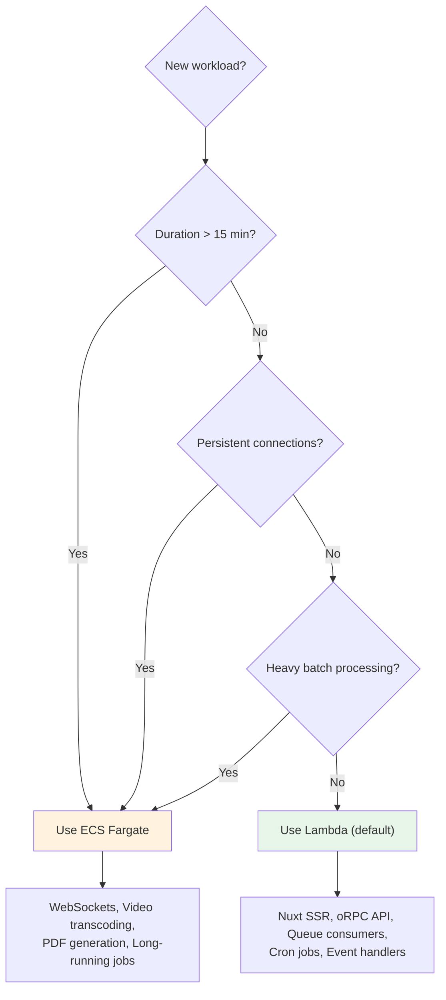

# Lambda vs ECS Fargate Decision Guide

See [ADR-005](./adr/005-lambda-default-ecs-escape.md) and [ADR-006](./adr/006-no-kubernetes.md) for the formal decisions.

## Default: Lambda

Use Lambda for:

- Nuxt SSR pages (via Nitro)
- oRPC/API endpoints
- Queue consumers that complete in <15 minutes
- Cron jobs that complete in <15 minutes
- EventBridge event handlers

Lambda advantages:

- Zero infrastructure config
- Auto-scales to zero (cost-effective)
- SST handles CloudFront + Lambda + S3 automatically
- Queue consumption is one line: `queue.subscribe(handler)`

## Escape Hatch: ECS Fargate

Use ECS Fargate for:

- Jobs that take >15 minutes
- WebSocket servers (persistent connections)
- Batch processing
- Services that need persistent state
- Video transcoding, PDF generation

ECS Fargate setup:

- Add a Dockerfile to the service directory
- Use `sst.aws.Cluster` + `addService()` in sst.config.ts
- SST handles ALB, auto-scaling, health checks

## Never: EKS

Kubernetes is an anti-pattern for agent-first development:

- Enormous surface area (Deployments, Services, Ingresses, ConfigMaps, Secrets, HPA, RBAC, Helm)
- Obscure error messages
- Slow feedback loop
- AI agents hallucinate field names and produce configs that validate but don't work

## Related Documentation

- [Architecture](./architecture.md) — system overview
- [Deployment Guide](./deployment.md) — how to deploy
- [ADR-005: Lambda Default, ECS Escape](./adr/005-lambda-default-ecs-escape.md) — formal decision
- [ADR-006: No Kubernetes](./adr/006-no-kubernetes.md) — why not EKS
- [ADR-004: SST over CDK](./adr/004-sst-over-cdk.md) — infrastructure tool
