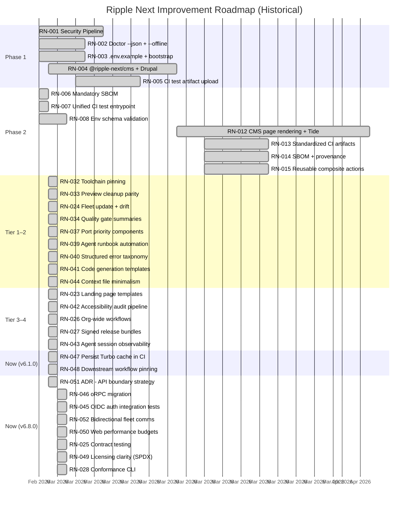

# Ripple Next — Completed Roadmap Items (Archive)

> This archive contains all completed roadmap items. Each item has a unique
> identifier (RN-XXX) for tracking. For active items, see [the roadmap](./README.md).

---

## Phase 1: Do Now — COMPLETE

All Phase 1 items were completed during the initial platform build-out.

---

### RN-001: Security Pipeline (`security.yml`)

**Phase:** 1 | **Impact:** Very High | **Effort:** Medium | **Risk:** Low
**Resolved blocker:** No security/supply-chain workflow gates (SAST/SCA/secret scanning)

Added a security workflow with CodeQL for SAST, dependency scanning, and secret
scanning with SARIF upload to GitHub Security tab.

**Reference:** `.github/workflows/security.yml`

- [x] Create security.yml with CodeQL, dependency review, and Gitleaks
- [ ] Enable GitHub Advanced Security on the repository
- [ ] Validate SARIF upload produces findings in Security tab
- [ ] Add branch protection rule requiring security checks to pass

---

### RN-002: Doctor Machine Mode (`--json`, `--offline`)

**Phase:** 1 | **Impact:** High | **Effort:** Medium | **Risk:** Low
**Resolved blocker:** Doctor had non-resilient network check, no machine-readable output

Upgraded `scripts/doctor.sh` to support `--json` flag for machine-readable output
and resilient network checks (soft-fail on network when `--offline` is passed).

**Reference:** `scripts/doctor.sh`

- [x] Add `--json` flag for structured output
- [x] Add `--offline` flag for ephemeral runners
- [x] Demote network check from hard-fail to warning
- [ ] Update CI workflows to use `pnpm doctor --json` where appropriate

---

### RN-003: Environment Contract (`.env.example` + `pnpm bootstrap`)

**Phase:** 1 | **Impact:** High | **Effort:** Medium | **Risk:** Low
**Resolved blocker:** No standardized env contract artifact

Added `.env.example` documenting all environment variables with defaults and
descriptions. Added `pnpm bootstrap` command for zero-to-ready setup.

**Reference:** `.env.example`, `package.json`

- [x] Create `.env.example` with all env vars documented
- [x] Add `pnpm bootstrap` command to package.json
- [ ] Verify docker-compose uses matching env var names

---

### RN-004: Drupal/Tide CMS Integration (`@ripple-next/cms`)

**Phase:** 1 | **Impact:** Very High | **Effort:** High | **Risk:** Medium
**Resolved blocker:** Missing CMS content layer

The original Ripple design system is built on Drupal/Tide. Created `@ripple-next/cms`
with Drupal JSON:API integration and a mock provider for testing, following the
provider pattern. Full decoupling architecture isolates Drupal to 2 files.

**Reference:** `packages/cms/`, [ADR-009](../adr/009-cms-provider-drupal.md), [ADR-011](../adr/011-cms-decoupling-pull-out-drupal.md)

- [x] Create `packages/cms/` with CMS provider interface (`types.ts`)
- [x] Implement `MockCmsProvider` for tests and local dev
- [x] Implement `DrupalCmsProvider` with JSON:API client for Tide
- [x] Add CMS conformance test suite to `packages/testing/conformance/`
- [x] Add content type Zod schemas to `packages/validation/`
- [x] Wire CMS provider into Nuxt server context
- [x] Add `NUXT_CMS_BASE_URL` to `.env.example` and runtime config
- [x] Update `readiness.json` with CMS subsystem entry

---

### RN-005: CI Test Artifact Upload

**Phase:** 1 | **Impact:** Medium | **Effort:** Low | **Risk:** Low

Added structured test result uploads (JUnit XML + coverage reports) to the test
job in CI for better observability.

**Reference:** [ADR-010](../adr/010-ci-observability-supply-chain.md)

- [x] Add Vitest JUnit reporter to test configuration
- [x] Upload test results as artifacts in CI (30-day retention)
- [x] Standardized artifact naming convention (`test-results-unit`, `test-results-e2e`)

---

## Phase 2: Do Next — Completed Items

---

### RN-006: Mandatory SBOM in Release Workflow

**Phase:** 2 | **Impact:** High | **Effort:** Low | **Risk:** Low
**Source:** AI Principal Engineer review

Removed `continue-on-error: true` from SBOM generation step in the release
workflow. SBOM/provenance is now fail-fast mandatory.

**Reference:** `.github/workflows/release.yml`

- [x] Make SBOM mandatory in release (removed `continue-on-error`)

---

### RN-007: Unified CI Test Entrypoint

**Phase:** 2 | **Impact:** High | **Effort:** Low | **Risk:** Low
**Source:** AI Principal Engineer review

Unified fragmented test commands into a single `pnpm test:ci` invocation with
optional coverage flags.

**Reference:** `.github/actions/test/action.yml`, `package.json`

- [x] Unify CI test entrypoint (single `pnpm test:ci` with optional coverage flags)

---

### RN-008: Env Schema Validation Gate (ADR-012)

**Phase:** 2 | **Impact:** High | **Effort:** Medium | **Risk:** Low
**Source:** AI Principal Engineer review

Added Zod-based env schema validation to `@ripple-next/validation` with a
`pnpm validate:env` command that fails with structured JSON diagnostics when
the required env contract is invalid.

**Reference:** `packages/validation/`, [ADR-012](../adr/012-env-schema-validation.md)

- [x] Add Zod-based env schema validation gate (`pnpm validate:env` + CI integration)

---

### RN-009: Devcontainer Baseline

**Phase:** 2 | **Impact:** High | **Effort:** Medium | **Risk:** Low
**Source:** AI Principal Engineer review

Shipped `.devcontainer/` with Node 22, Docker-in-Docker, GitHub CLI, AWS CLI,
and all local services (Postgres, Redis, MinIO, Mailpit, MeiliSearch)
pre-configured. Post-create script runs install, migrations, seed, and Nuxt
type generation.

**Reference:** `.devcontainer/`

- [x] Devcontainer baseline (`.devcontainer/` — already existed, now documented in roadmap)

---

### RN-010: Flaky Test Containment Policy (ADR-013)

**Phase:** 2 | **Impact:** High | **Effort:** Low | **Risk:** Low
**Source:** AI Principal Engineer review

Implemented quarantine convention with `pnpm check:quarantine` CI gate, 14-day
time box, 5% budget cap, Tier 1 protection, and mandatory issue linkage.

**Reference:** [ADR-013](../adr/013-flaky-test-containment.md)

- [x] Quarantine convention with naming pattern
- [x] 14-day time box for resolution
- [x] 5% budget cap on quarantined tests
- [x] Tier 1 protection (auth/db/queue never quarantined)
- [x] `pnpm check:quarantine` CI gate

---

### RN-011: Preview Deploy Guardrails (ADR-014)

**Phase:** 2 | **Impact:** Medium | **Effort:** Medium | **Risk:** Low
**Source:** AI Principal Engineer review
**Resolved blocker:** Preview deploy depended on long-lived repo secret naming convention

Implemented GitHub environment protection, label-gated deploys, infra change
auto-deploy, and duplicate comment prevention.

**Reference:** [ADR-014](../adr/014-preview-deploy-guardrails.md)

- [x] GitHub environment protection
- [x] Label-gated deploys
- [x] Infra change auto-deploy
- [x] Duplicate comment prevention

---

### RN-012: CMS Page Rendering + Tide Components + Decoupling

**Phase:** 2 | **Impact:** Very High | **Effort:** High | **Risk:** Medium

Built Nuxt pages and UI components that render content from the CMS provider,
achieving visual and functional parity with the original Ripple design system's
Tide content types. Implemented full decoupling architecture per ADR-011.

**Reference:** `packages/cms/`, `apps/web/`, [ADR-011](../adr/011-cms-decoupling-pull-out-drupal.md)

- [x] Create dynamic page route (`/[...slug].vue`) that fetches from CMS provider
- [x] Implement Tide-compatible components (accordion, card collection, timeline, etc.)
- [x] Full Tide paragraph-to-section mapping (all 8 paragraph types)
- [x] Provider factory with dynamic imports (`createCmsProvider()`)
- [x] DrupalCmsProvider unit tests with JSON:API fixture data
- [x] ADR-011: CMS decoupling strategy with removal/addition procedures

> **Note:** Some sub-items from this effort remain active — see
> [RN-019](#rn-019-navigationmenu-component),
> [RN-021](#rn-021-media-gallery--document-download-components),
> [RN-023](#rn-023-landing-page--content-templates).
> Storybook stories completed in [RN-020](#rn-020-storybook-stories-for-tide-components).

---

### RN-013: Standardized CI Artifacts

**Phase:** 2 | **Impact:** High | **Effort:** Medium | **Risk:** Low

JUnit XML, coverage reports, and test logs for every CI job with consistent
retention and naming policy.

**Reference:** [ADR-010](../adr/010-ci-observability-supply-chain.md)

- [x] Configure Vitest JUnit reporter across all workspaces
- [x] Upload artifacts with standardized naming (`test-results-unit`, `test-results-e2e`)
- [x] Set retention policy (30 days for reports, 7 days for traces, 90 days for SBOM)

---

### RN-014: SBOM + Provenance in Release

**Phase:** 2 | **Impact:** High | **Effort:** Medium | **Risk:** Medium

Added CycloneDX SBOM generation and signed attestations to the release workflow.

**Reference:** [ADR-010](../adr/010-ci-observability-supply-chain.md), `.github/workflows/release.yml`

- [x] Add `@cyclonedx/cyclonedx-npm` to release pipeline
- [x] Generate provenance attestations with `actions/attest-build-provenance`
- [x] Upload SBOM alongside package releases (90-day retention)

---

### RN-015: Reusable Composite Actions

**Phase:** 2 | **Impact:** Very High | **Effort:** Medium | **Risk:** Medium

Published reusable GitHub Actions for lint/test/typecheck/setup patterns that
downstream repos can reference.

**Reference:** `.github/actions/`, [ADR-010](../adr/010-ci-observability-supply-chain.md)

- [x] Extract workflow steps into reusable composite actions
- [x] Create `.github/actions/` directory with `setup`, `quality`, `test` actions
- [x] CI workflow updated to use composite actions (reduced duplication)

> **Note:** Downstream documentation completed — see
> [RN-022](#rn-022-downstream-workflow-documentation).

---

### RN-016: Hermetic Dev/Runtime (Devcontainer)

**Phase:** 3 (completed early) | **Impact:** High | **Effort:** High | **Risk:** Medium

Devcontainer baseline shipped in `.devcontainer/` with Node 22, Docker-in-Docker,
GitHub CLI, AWS CLI, and all local services pre-configured.

**Reference:** `.devcontainer/`

- [x] Evaluate devcontainer vs Nix for agent runner reproducibility — devcontainer chosen
- [x] Create hermetic profile that pins all system dependencies
- [ ] Validate in CI with containerized runners (optional — devcontainer primarily for local dev)

---

### RN-020: Storybook Stories for Tide Components

**Phase:** 2 | **Impact:** Low | **Effort:** Low | **Risk:** Low
**Continues:** [RN-012](#rn-012-cms-page-rendering--tide-components--decoupling)

Added Storybook stories with autodocs for all 8 Tide-compatible content
components: accordion, card collection, timeline, call-to-action, key dates,
content image, embedded video, and wysiwyg. Each story includes multiple
variants (default, with/without optional props, rich content).

**Reference:** `packages/ui/components/organisms/content/*.stories.ts`

- [x] Add Storybook stories for accordion, card collection, timeline
- [x] Add Storybook stories for CTA, key dates, image, video, wysiwyg
- [ ] Configure Chromatic or Percy for visual regression (deferred — optional enhancement)

---

### RN-022: Downstream Workflow Documentation

**Phase:** 2 | **Impact:** Medium | **Effort:** Low | **Risk:** Low
**Continues:** [RN-015](#rn-015-reusable-composite-actions)

Wrote comprehensive consumption guide for downstream repos documenting how to
use the `setup`, `quality`, and `test` composite actions. Includes example
workflow files (minimal CI, tiered CI, publish), version pinning strategy
(SHA, tag, branch), troubleshooting, and artifact reference.

**Reference:** `docs/downstream-workflows.md`

- [x] Write consumption guide for `setup`, `quality`, `test` actions
- [x] Add example workflow files for downstream repos
- [x] Document version pinning strategy for action references

---

### RN-018: Search Integration Provider

**Phase:** 2 | **Impact:** Medium | **Effort:** Medium | **Risk:** Medium

Dedicated search provider layer with `SearchEngine` interface, `MeiliSearchEngine`
for local dev, and `SearchEnhancedCmsProvider` decorator that wraps any `CmsProvider`
and delegates search queries to the external engine while forwarding all other
operations to the inner provider.

**Reference:** `packages/cms/providers/search.ts`, `packages/cms/tests/search.test.ts`

- [x] Define `SearchEngine` interface and `SearchDocument` type
- [x] Implement `MeiliSearchEngine` for local dev (MeiliSearch HTTP API)
- [x] Implement `SearchEnhancedCmsProvider` decorator pattern
- [x] Add unit tests for search provider (MemorySearchEngine + integration)
- [x] Export search provider from `@ripple-next/cms` package

---

### RN-019: Navigation/Menu Component

**Phase:** 2 | **Impact:** Medium | **Effort:** Medium | **Risk:** Low
**Continues:** [RN-012](#rn-012-cms-page-rendering--tide-components--decoupling)

Navigation components and composable for rendering CMS-provided menu structures
in header and footer, with nested menu support.

**Reference:** `packages/ui/components/molecules/RplNavigation.vue`, `apps/web/composables/useNavigation.ts`

- [x] Create `useNavigation()` composable with header/footer menu loading
- [x] Build `RplNavigation` component with horizontal/vertical variants
- [x] Wire navigation into default layout (header + footer slots)
- [x] Support nested menu structures from CMS (with depth flattening)
- [x] Add Vue Test Utils tests for navigation component

---

### RN-030: UI Component Test Suite

**Phase:** 2 | **Impact:** Medium | **Effort:** Medium | **Risk:** Low
**Source:** AI agent gap analysis
**Continues:** [RN-020](#rn-020-storybook-stories-for-tide-components)

Vue Test Utils component tests for all 16 UI components — atoms, molecules,
organisms, and all 8 Tide content section renderers. Moves the UI subsystem
from "partial" to "implemented" status.

**Reference:** `packages/ui/tests/`

- [x] Add component tests for atoms (RplButton, RplFormInput, RplIcon)
- [x] Add component tests for molecules (RplCard, RplHeroHeader, RplNavigation)
- [x] Add component tests for organisms (RplHeader, RplFooter)
- [x] Add component tests for Tide content (Accordion, CardCollection, CTA, Wysiwyg, Image, Video, KeyDates, Timeline)

---

### RN-031: Testcontainers Integration Tests for DB + API

**Phase:** 2 | **Impact:** High | **Effort:** Medium | **Risk:** Medium
**Source:** AI agent gap analysis

Integration tests using Testcontainers for `@ripple-next/db` repositories. Tests run
against a real PostgreSQL 17 container — no mocking of database behavior.

**Reference:** `packages/db/tests/integration/`

- [x] Add Testcontainers-based integration tests for UserRepository (9 tests)
- [x] Add Testcontainers-based integration tests for ProjectRepository (8 tests)
- [x] Validate CRUD operations, unique constraints, and foreign key relationships

---

## Tier 1 — Immediate (Completed)

---

### RN-032: Toolchain Pinning Hardening

**Priority:** Critical | **Impact:** High | **Effort:** Low | **Risk:** Low
**Source:** AI Principal Engineer review | **AI-first benefit:** Eliminates version drift across agent runs

Hardened reproducibility with exact, enforceable toolchain contracts across
local, CI, and devcontainer environments. `.nvmrc` is the single source of truth
for Node.js; `packageManager` field is the single source of truth for pnpm.

**Reference:** `.nvmrc`, `package.json`, `scripts/doctor.sh`, `AGENTS.md`

- [x] Pin exact Node version in `.nvmrc` (22.22.0); CI reads via `node-version-file`
- [x] Pin exact pnpm version — `engines.pnpm` tightened to `>=9.15.4` matching `packageManager`
- [x] `pnpm doctor` checks exact pnpm version against `packageManager` and Node against `.nvmrc`
- [x] Upgrade procedure documented in AGENTS.md → "Toolchain Pinning" section

---

### RN-033: Preview Cleanup Guardrails Parity

**Priority:** Critical | **Impact:** High | **Effort:** Low | **Risk:** Low
**Source:** AI Principal Engineer review | **AI-first benefit:** Eliminates noisy CI failures for agents

Aligned `cleanup-preview` behavior with deploy-preview guardrails so missing AWS
credentials produce a safe, explainable skip rather than noisy failures.

**Reference:** `.github/workflows/cleanup-preview.yml`, `docs/deployment.md`

- [x] Added `check-secrets` gate to cleanup workflow (mirrors deploy-preview pattern)
- [x] Emits `::notice::` when cleanup is skipped due to missing credentials
- [x] Cleanup job skipped entirely when secrets absent — green CI status preserved
- [x] Updated `docs/deployment.md` → "Credential Guardrails" section with skip behavior

---

### RN-024: Fleet Update Mechanism + Template Drift Automation

**Priority:** Critical | **Impact:** Very High | **Effort:** High | **Risk:** Medium
**Source:** Roadmap blocker + AI Principal Engineer review | **AI-first benefit:** Enables agent-driven fleet governance

Fleet governance mechanism with manifest-driven drift detection, sync PR
automation, and JSON compliance reporting. Action-first approach (not GitHub App).
9 governed surfaces across 3 severity levels. See ADR-019.

**Reference:** `docs/fleet-policy.json`, `scripts/check-fleet-drift.mjs`, `scripts/fleet-sync.mjs`, `scripts/fleet-compliance.mjs`, `.github/workflows/fleet-drift.yml`, `.github/workflows/fleet-sync.yml`, `.github/actions/fleet-drift/action.yml`, [ADR-019](../adr/019-fleet-governance.md)

- [x] Create template repository from this golden-path source
- [x] Build GitHub Action for template drift detection
- [x] Automated sync PRs for security/standards updates
- [x] Policy drift reporting dashboard

---

## Tier 2 — Next Sprint (Completed)

---

### RN-034: Machine-Readable Quality Gate Summaries

**Priority:** High | **Impact:** Medium | **Effort:** Medium | **Risk:** Low
**Source:** AI Principal Engineer review | **AI-first benefit:** Agents parse structured JSON instead of scraping logs

Unified quality gate runner (`pnpm verify`) that runs all gates and emits a
structured JSON summary conforming to the `ripple-gate-summary/v1` schema.

**Reference:** `scripts/verify.mjs`, `AGENTS.md`, `CLAUDE.md`

- [x] Add script wrappers emitting stable JSON for lint/typecheck/test
- [x] Include machine-readable status in CI artifacts
- [x] Ensure non-zero exits remain authoritative for gating
- [x] Document schema for downstream automation consumers

---

### RN-035: Rollback and Recovery Command Contract

**Priority:** High | **Impact:** High | **Effort:** Medium | **Risk:** Medium
**Source:** AI Principal Engineer review | **AI-first benefit:** Agents can execute safe recovery without human interpretation

Post-deploy health validation script with retry logic, structured
`ripple-health-report/v1` JSON output, and rollback trigger criteria linked to
error taxonomy.

**Reference:** `scripts/deploy-health-check.mjs`, `docs/deployment.md`, `docs/runbooks/rollback-production.json`

- [x] Add explicit rollback runbook with command examples
- [x] Provide scripted rollback entrypoint(s) for common failure modes
- [x] Add post-deploy health validation + rollback trigger criteria
- [x] Capture rollback evidence as CI/CD artifacts

---

### RN-036: IaC Policy Scanning for SST Changes

**Priority:** High | **Impact:** High | **Effort:** Medium | **Risk:** Medium
**Source:** AI Principal Engineer review | **AI-first benefit:** Blocks unsafe infra changes before deploy

Static policy scanner for `sst.config.ts` with 7 policies covering security,
safety, cost, and reliability. Machine-readable `ripple-iac-report/v1` JSON output.

**Reference:** `scripts/iac-policy-scan.mjs`, `docs/iac-policies.json`, `docs/deployment.md`

- [x] Add IaC policy scan job for `sst.config.ts` changes
- [x] Define baseline policy set (7 policies)
- [x] Route violations to clear, machine-readable diagnostics
- [x] Document exception workflow and approvals

---

### RN-037: Port Priority Components from Upstream Ripple 2

**Priority:** High | **Impact:** Very High | **Effort:** High | **Risk:** Medium
**Source:** [ADR-017](../adr/017-upstream-ripple-component-strategy.md) | **AI-first benefit:** Agents can build complete government pages without external component gaps

Port high-priority components from upstream Ripple 2 into `@ripple-next/ui`, rewritten
to follow our conventions. Closes the ~4-component gap with upstream.

**Reference:** `packages/ui/`, [ADR-017](../adr/017-upstream-ripple-component-strategy.md)

- [x] Port Checkbox, Radio, Dropdown, DateInput, Textarea, FileUpload, FormAlert, OptionButton
- [x] Port Breadcrumb, Pagination, InPageNavigation, SkipLink
- [x] Port Alert, Callout, Acknowledgement, BlockQuote
- [x] Port Tabs, SearchBar, Tag, Chip, RelatedLinks
- [x] Port Table, StatisticsGrid, CategoryGrid, ResultsListing, DetailList

---

### RN-038: Upstream Ripple Selective Sync Workflow

**Priority:** Medium | **Impact:** Medium | **Effort:** Low | **Risk:** Low
**Source:** [ADR-017](../adr/017-upstream-ripple-component-strategy.md) | **AI-first benefit:** Agents follow a documented procedure for upstream change adoption

Quarterly upstream review procedure documented in `CONTRIBUTING.md` with sync
checklist and component gap tracking in `readiness.json`.

**Reference:** `CONTRIBUTING.md`, `docs/readiness.json`

- [x] Document quarterly upstream review procedure in `CONTRIBUTING.md`
- [x] Create sync checklist (accessibility fixes, design token updates, new patterns)
- [x] Define criteria for what to sync vs what to skip
- [x] Add upstream version tracking to `docs/readiness.json`

---

### RN-039: Agent Runbook Automation

**Priority:** High | **Impact:** High | **Effort:** Medium | **Risk:** Low
**Source:** [ADR-018](../adr/018-ai-first-workflow-strategy.md) | **AI-first benefit:** Agents execute multi-step operations from codified procedures

Structured, machine-parseable runbooks (`docs/runbooks/*.json`) with preconditions,
ordered steps, validation criteria. CLI runner (`pnpm runbook`). Seven runbooks
covering deployment, rollback, fleet sync, and scaffolding operations.

**Reference:** `docs/runbooks/`, `scripts/runbook.mjs`

- [x] Create `docs/runbooks/` directory with standardised template
- [x] Write 7 runbooks (deploy-to-staging, rollback-production, add-new-provider, add-new-component, add-api-endpoint, onboard-new-package, fleet-sync)
- [x] Add `pnpm runbook <name>` command with `--json` flag

---

### RN-040: Structured Error Taxonomy

**Priority:** High | **Impact:** Medium | **Effort:** Medium | **Risk:** Low
**Source:** [ADR-018](../adr/018-ai-first-workflow-strategy.md) | **AI-first benefit:** Agents classify failures by code and take automated remediation paths

Machine-parseable error taxonomy (`docs/error-taxonomy.json`) with 44 classified
failure modes across 11 categories. Each error includes code, severity,
remediation steps, and automatable flag.

**Reference:** `docs/error-taxonomy.json`, `scripts/doctor.sh`

- [x] Define error taxonomy schema with category, code, severity, remediation
- [x] Categorise 44 error codes across 11 categories (ENV, LINT, TYPE, TEST, BUILD, DEPLOY, POLICY, IAC, FLEET, A11Y, SESSION)
- [x] Wire `pnpm doctor --json` output to use taxonomy codes

---

### RN-041: Code Generation Templates

**Priority:** High | **Impact:** High | **Effort:** Medium | **Risk:** Low
**Source:** [ADR-018](../adr/018-ai-first-workflow-strategy.md) | **AI-first benefit:** Agents scaffold convention-compliant code without memorising boilerplate

Zero-dependency code generators: component, provider, endpoint, and package — all
with `--dry-run` support and convention-compliant output.

**Reference:** `scripts/generate/`

- [x] `pnpm generate:component <name>` — SFC + test + story + index export
- [x] `pnpm generate:provider <package> <name>` — provider class + conformance test
- [x] `pnpm generate:endpoint <router> <procedure>` — tRPC procedure + validation + test
- [x] `pnpm generate:package <name>` — full package scaffold
- [x] Add `--dry-run` flag to preview generated files

### RN-044: Context File Minimalism (ADR-020)

**Priority:** High | **Impact:** Medium | **Effort:** Low | **Risk:** Low
**Source:** [arXiv:2602.11988](https://arxiv.org/abs/2602.11988) — Gloaguen et al., ETH Zurich (Feb 2026) | **AI-first benefit:** ~20% inference cost reduction, improved agent task success rates

Trimmed CLAUDE.md (177→~45 lines) and AGENTS.md (431→~185 lines) based on
empirical evidence that over-specified context files reduce agent success rates.
Relocated domain guidance to `.github/instructions/`. Machine-enforced line-count
gate prevents re-bloat.

**Reference:** `CLAUDE.md`, `AGENTS.md`, `.github/instructions/`, [ADR-020](../adr/020-context-file-minimalism.md)

- [x] Trim CLAUDE.md to minimal hard constraints (~45 lines)
- [x] Trim AGENTS.md to architecture + task routing (~185 lines)
- [x] Create ADR-020 with evidence summary
- [x] Relocate domain guidance to `.github/instructions/`
- [x] Add anti-bloat line-count gate and error taxonomy entries (RPL-DOCS-001/002)

---

## Tier 3 — Scheduled (Completed)

---

### RN-023: Landing Page + Content Templates

**Priority:** Medium | **Impact:** Medium | **Effort:** Medium | **Risk:** Low
**Continues:** [RN-012](#rn-012-cms-page-rendering--tide-components--decoupling)

Three page templates (`PageTemplateLanding`, `PageTemplateContent`,
`PageTemplateCampaign`) in `apps/web/components/templates/`. The `[...slug].vue`
catch-all page switches template based on `page.contentType`.

**Reference:** `apps/web/components/templates/`, `apps/web/pages/content/`

- [x] Build landing page template
- [x] Build content page template
- [x] Build campaign page template
- [x] Wire templates to CMS page type field

---

### RN-021: Media Gallery + Document Download Components

**Priority:** Medium | **Impact:** Low | **Effort:** Medium | **Risk:** Low
**Continues:** [RN-012](#rn-012-cms-page-rendering--tide-components--decoupling)

Two molecule components: `RplMediaGallery` (grid layout with keyboard-accessible
lightbox) and `RplDocumentDownload` (download list with file type icons).

**Reference:** `packages/ui/components/molecules/`

- [x] Build media gallery component with lightbox
- [x] Build document download component with file type icons
- [x] Integrate with CMS media content types

---

### RN-042: Accessibility Audit Pipeline

**Priority:** Medium | **Impact:** High | **Effort:** Medium | **Risk:** Low
**Source:** [ADR-018](../adr/018-ai-first-workflow-strategy.md) | **AI-first benefit:** Agents receive structured WCAG violations in CI

Automated WCAG 2.1 AA accessibility audit pipeline: Storybook addon, Playwright
E2E tests, and standalone audit script (`pnpm test:a11y`) emitting
`ripple-a11y-report/v1` JSON.

**Reference:** `scripts/a11y-audit.mjs`, `docs/accessibility.md`, `.storybook/main.ts`

- [x] Add `axe-core` integration to Playwright E2E tests
- [x] Add `@storybook/addon-a11y` to Storybook
- [x] Create `pnpm test:a11y` standalone audit command
- [x] Emit `ripple-a11y-report/v1` structured JSON
- [x] Add accessibility gate to Tier 2 CI
- [x] Document WCAG requirements in `docs/accessibility.md`

---

## Tier 4 — Backlog (Completed)

---

### RN-026: Org-Wide Reusable Workflow Distribution

**Priority:** Low | **Impact:** Very High | **Effort:** Medium | **Risk:** Medium
**Source:** AI Principal Engineer review

Centralised policy gates using `workflow_call` with versioned rollout channels.
Three reusable workflows: quality, test, and security.

**Reference:** `.github/workflows/reusable-quality.yml`, `.github/workflows/reusable-test.yml`, `.github/workflows/reusable-security.yml`, `docs/downstream-workflows.md`

- [x] Publish reusable workflows with `workflow_call` triggers
- [x] Implement versioned rollout channels (stable, canary)
- [x] Update downstream consumption guide

---

### RN-027: Signed Release Bundles + Verification

**Priority:** Low | **Impact:** High | **Effort:** Medium | **Risk:** Medium
**Source:** AI Principal Engineer review

Package-level SHA-256 checksums with sigstore attestation and verification CLI.

**Reference:** `scripts/verify-release.mjs`, `docs/release-verification.md`, `.github/workflows/release.yml`

- [x] Implement checksums generation in release workflow
- [x] Build verification CLI (`pnpm verify:release`)
- [x] Document consumer-side verification workflow

---

### RN-029: Validate Devcontainer in CI Runners

**Priority:** Low | **Impact:** Low | **Effort:** Low | **Risk:** Low
**Continues:** [RN-016](#rn-016-hermetic-devruntime-devcontainer)

CI job that builds and validates the devcontainer image with smoke tests.

**Reference:** `.github/workflows/ci.yml` (devcontainer job)

- [x] Add CI job that builds and validates devcontainer image
- [x] Run smoke tests: Node version match, pnpm, required tools, docker-compose

---

### RN-043: Agent Session Observability

**Priority:** Low | **Impact:** Medium | **Effort:** Medium | **Risk:** Low
**Source:** [ADR-018](../adr/018-ai-first-workflow-strategy.md) | **AI-first benefit:** Platform teams understand agent effectiveness

Track and aggregate metrics from AI agent sessions — files changed, gate
pass/fail rates, common failure patterns, time-to-green.

**Reference:** `scripts/session-logger.mjs`, `scripts/agent-metrics.mjs`, `docs/session-observability.md`

- [x] Define session metrics schemas (`ripple-session-log/v1`, `ripple-session-metrics/v1`)
- [x] Create session logger (`pnpm session:start/end/snapshot`)
- [x] Build aggregation script (`pnpm agent:metrics`)
- [x] Identify top friction points with automated recommendations
- [x] RPL-SESSION-001/002/003 error codes in taxonomy

---

## Now (v6.1.0) — Completed

---

### RN-047: Persist Turbo Cache in CI

**Impact:** High | **Effort:** Low | **Risk:** Low
**Source:** GPT-5.2-Codex CI workflow review | **Date:** 2026-02-28
**AI-first benefit:** Reduces agent feedback-loop latency without relaxing quality gates.

Added `actions/cache@v4` for `.turbo/` directory in all CI entrypoints: composite
setup action, reusable quality/test workflows, and standalone E2E workflow. Cache
key is `turbo-{os}-{hash(.nvmrc)}-{hash(pnpm-lock.yaml, turbo.json)}` with
progressive restore-key fallbacks. Turbo's internal content-addressable hashing
handles env-var-level invalidation (e.g. `NITRO_PRESET`). Documented local cache
behavior and optional remote cache pattern in `docs/downstream-workflows.md`.

**Reference:** `.github/actions/setup/action.yml`, `.github/workflows/reusable-quality.yml`, `.github/workflows/reusable-test.yml`, `.github/workflows/e2e.yml`, `docs/downstream-workflows.md`

- [x] Cache `.turbo/` keyed by lockfile + turbo config + Node version
- [x] Validate cache correctness (Turbo content-addressable hashing + env var deps)
- [x] Document default local cache behaviour and optional remote cache pattern

---

### RN-048: Downstream Workflow Pinning Policy

**Impact:** Medium | **Effort:** Low | **Risk:** Medium
**Source:** GPT-5.2-Codex downstream workflow review | **Date:** 2026-02-28
**AI-first benefit:** Makes downstream automation deterministic by preventing unplanned behaviour drift.

Replaced all `@main` action/workflow refs in `docs/downstream-workflows.md` usage
examples with `@v1` (16 refs changed). Canary channel documentation preserved for
repos that opt in. Added new `FLEET-SURF-009` governed surface for action version
pinning with content-pattern scanning in the drift engine. Extended
`check-fleet-drift.mjs` to support `contentPatterns` — scans workflow files for
regex matches and reports advisory findings.

**Reference:** `docs/downstream-workflows.md`, `docs/fleet-policy.json`, `scripts/check-fleet-drift.mjs`

- [x] Replace `@main` examples with versioned refs (`@v1`)
- [x] Add advisory fleet-drift check for action version refs (FLEET-SURF-009)

---

## Now (v6.8.0) — Completed

---

### RN-051: ADR — API Boundary Strategy (oRPC vs tRPC, Public vs Internal + Portal Publishing)

**Completed:** 2026-02-28 | **Impact:** Very High | **Effort:** Medium
**ADR:** [ADR-021](../adr/021-api-contract-strategy.md)

**Outcome shipped:**
- ADR-021 selects oRPC as canonical API boundary with OpenAPI 3.1.1 contracts
- `pnpm generate:openapi` and `pnpm check:api-contract` CI gate wired into `pnpm verify`
- Error taxonomy expanded: RPL-API-001 (spec drift), RPL-API-002 (breaking change)

**Evidence:** `docs/adr/021-api-contract-strategy.md`, `docs/api/openapi.json`, `scripts/generate-openapi.mjs`, `scripts/check-api-contract.mjs`

**Follow-ups:** RN-046 (oRPC migration, completed), RN-025 (contract testing, completed)

---

### RN-046: oRPC Migration + Router Integration Harness (Testcontainers)

**Completed:** 2026-03-01 | **Impact:** High | **Effort:** Medium

**Outcome shipped:**
- oRPC installed; user router (4 procedures) migrated from tRPC
- First `openapi.json` generated; contract drift gate activated
- tRPC fully removed; API subsystem → "implemented" (16/16)

**Evidence:** `apps/web/server/orpc/router.ts`, `docs/api/openapi.json`, `apps/web/package.json`

**Follow-ups:** Testcontainers router integration tests (parked), CI DATABASE_URL job (parked)

---

### RN-045: OIDC Auth Flow Integration Tests (PKCE + Sessions)

**Completed:** 2026-03-01 | **Impact:** High | **Effort:** Medium

**Outcome shipped:**
- Keycloak 26.0 Testcontainer fixture with checked-in realm configuration
- 8 integration tests: discovery, PKCE exchange, session lifecycle, error handling
- Error taxonomy: RPL-AUTH-001 through RPL-AUTH-004

**Evidence:** `packages/auth/tests/integration/`, `packages/testing/helpers/keycloak.ts`, `packages/auth/tests/fixtures/ripple-test-realm.json`

---

### RN-052: Bidirectional Fleet Communication (Downstream↔Upstream)

**Completed:** 2026-03-01 | **Impact:** Very High | **Effort:** High
**ADR:** [ADR-022](../adr/022-bidirectional-fleet-communication.md)

**Outcome shipped:**
- Fleet changelog, feedback schema, feedback generator, intake engine
- 11 governed surfaces; FLEET-SURF-010/011 added
- Downstream scaffold updated with `.fleet.json` and feedback/update workflows

**Evidence:** `docs/fleet-changelog.json`, `docs/fleet-feedback-schema.json`, `scripts/fleet-feedback.mjs`, `scripts/fleet-feedback-intake.mjs`, `.github/workflows/fleet-feedback-intake.yml`

**Follow-ups:** Validation with real downstream repos → [RN-054](./README.md#rn-054-downstream-proof-of-life--first-consumer-deployment)

---

### RN-050: Web Performance Budgets (Core Web Vitals)

**Completed:** 2026-03-01 | **Impact:** Medium | **Effort:** Medium

**Outcome shipped:**
- Playwright-based performance audit (`pnpm test:perf`) with Core Web Vitals thresholds
- `ripple-perf-report/v1` JSON output; RPL-PERF-001/002 error codes
- CI integration with `perf-report.json` artifact upload

**Evidence:** `scripts/perf-audit.mjs`, `docs/performance.md`, `.github/workflows/ci.yml`

**Follow-ups:** CI gate currently advisory (`|| true`) → [RN-053](./README.md#rn-053-ci-gate-truth--enforce-or-explicitly-label-advisory-gates)

---

### RN-049: Licensing Clarity Guardrail (SPDX + Dual-License Model)

**Completed:** 2026-03-01 | **Impact:** Medium | **Effort:** Low

**Outcome shipped:**
- SPDX `license` field added to all 12 `package.json` files
- Dual-license model documented (noncommercial free, commercial by agreement)

**Evidence:** `package.json` (root + 11 workspaces), LICENSE

**Follow-ups:** Government procurement compatibility review → [RN-058](./README.md#rn-058-licensing-resolution-adr--government-procurement-compatibility)

---

### RN-025: Contract Testing Across Consumers

**Completed:** 2026-03-01 | **Impact:** High | **Effort:** High

**Outcome shipped:**
- 22 consumer contract tests (spec ↔ router agreement)
- Breaking-change detection (`pnpm check:api-breaking`) with `ripple-api-breaking/v1` JSON
- Wired into `pnpm verify` (10th gate) and release workflow

**Evidence:** `apps/web/tests/unit/orpc/openapi-contract.test.ts`, `scripts/check-api-breaking.mjs`, `.github/workflows/release.yml`

**Follow-ups:** Portal publication (parked), SDK generation (parked)

---

### RN-028: Golden-Path Conformance CLI

**Completed:** 2026-03-01 | **Impact:** Very High | **Effort:** High

**Outcome shipped:**
- `pnpm conform` CLI: 7 categories, 21 checks, 100-point scale
- `ripple-conformance/v1` JSON; golden path scores 100/100
- RPL-CONFORM-001/002/003 error codes

**Evidence:** `scripts/conform.mjs`, `docs/conformance-rubric.json`, `docs/runbooks/run-conformance.json`

**Follow-ups:** Auto-remediation PRs → [RN-060](./README.md#rn-060-conformance-cli-auto-remediation-prs); optional verify integration (parked)

---

## Summary

| ID | Item | Phase | Status |
|----|------|-------|--------|
| [RN-001](#rn-001-security-pipeline-securityyml) | Security Pipeline | 1 | **Done** |
| [RN-002](#rn-002-doctor-machine-mode---json---offline) | Doctor Machine Mode | 1 | **Done** |
| [RN-003](#rn-003-environment-contract-envexample--pnpm-bootstrap) | Environment Contract | 1 | **Done** |
| [RN-004](#rn-004-drupaltide-cms-integration-ripplecms) | Drupal/Tide CMS Integration | 1 | **Done** |
| [RN-005](#rn-005-ci-test-artifact-upload) | CI Test Artifact Upload | 1 | **Done** |
| [RN-006](#rn-006-mandatory-sbom-in-release-workflow) | Mandatory SBOM in Release | 2 | **Done** |
| [RN-007](#rn-007-unified-ci-test-entrypoint) | Unified CI Test Entrypoint | 2 | **Done** |
| [RN-008](#rn-008-env-schema-validation-gate-adr-012) | Env Schema Validation | 2 | **Done** |
| [RN-009](#rn-009-devcontainer-baseline) | Devcontainer Baseline | 2 | **Done** |
| [RN-010](#rn-010-flaky-test-containment-policy-adr-013) | Flaky Test Containment | 2 | **Done** |
| [RN-011](#rn-011-preview-deploy-guardrails-adr-014) | Preview Deploy Guardrails | 2 | **Done** |
| [RN-012](#rn-012-cms-page-rendering--tide-components--decoupling) | CMS Page Rendering + Tide | 2 | **Done** |
| [RN-013](#rn-013-standardized-ci-artifacts) | Standardized CI Artifacts | 2 | **Done** |
| [RN-014](#rn-014-sbom--provenance-in-release) | SBOM + Provenance in Release | 2 | **Done** |
| [RN-015](#rn-015-reusable-composite-actions) | Reusable Composite Actions | 2 | **Done** |
| [RN-016](#rn-016-hermetic-devruntime-devcontainer) | Hermetic Dev/Runtime | 3 | **Done** |
| [RN-018](#rn-018-search-integration-provider) | Search Integration Provider | 2 | **Done** |
| [RN-019](#rn-019-navigationmenu-component) | Navigation/Menu Component | 2 | **Done** |
| [RN-020](#rn-020-storybook-stories-for-tide-components) | Storybook Stories (Tide) | 2 | **Done** |
| [RN-022](#rn-022-downstream-workflow-documentation) | Downstream Workflow Docs | 2 | **Done** |
| [RN-030](#rn-030-ui-component-test-suite) | UI Component Test Suite | 2 | **Done** |
| [RN-031](#rn-031-testcontainers-integration-tests-for-db--api) | Testcontainers Integration Tests | 2 | **Done** |
| [RN-032](#rn-032-toolchain-pinning-hardening) | Toolchain Pinning Hardening | Tier 1 | **Done** |
| [RN-033](#rn-033-preview-cleanup-guardrails-parity) | Preview Cleanup Guardrails Parity | Tier 1 | **Done** |
| [RN-024](#rn-024-fleet-update-mechanism--template-drift-automation) | Fleet Update + Drift Automation | Tier 1 | **Done** |
| [RN-034](#rn-034-machine-readable-quality-gate-summaries) | Machine-Readable Quality Gate Summaries | Tier 2 | **Done** |
| [RN-035](#rn-035-rollback-and-recovery-command-contract) | Rollback and Recovery Contract | Tier 2 | **Done** |
| [RN-036](#rn-036-iac-policy-scanning-for-sst-changes) | IaC Policy Scanning for SST | Tier 2 | **Done** |
| [RN-037](#rn-037-port-priority-components-from-upstream-ripple-2) | Port Priority Components (Upstream Ripple 2) | Tier 2 | **Done** |
| [RN-038](#rn-038-upstream-ripple-selective-sync-workflow) | Upstream Ripple Sync Workflow | Tier 2 | **Done** |
| [RN-039](#rn-039-agent-runbook-automation) | Agent Runbook Automation | Tier 2 | **Done** |
| [RN-040](#rn-040-structured-error-taxonomy) | Structured Error Taxonomy | Tier 2 | **Done** |
| [RN-041](#rn-041-code-generation-templates) | Code Generation Templates | Tier 2 | **Done** |
| [RN-044](#rn-044-context-file-minimalism-adr-020) | Context File Minimalism | Tier 2 | **Done** |
| [RN-023](#rn-023-landing-page--content-templates) | Landing Page Templates | Tier 3 | **Done** |
| [RN-021](#rn-021-media-gallery--document-download-components) | Media Gallery + Downloads | Tier 3 | **Done** |
| [RN-042](#rn-042-accessibility-audit-pipeline) | Accessibility Audit Pipeline | Tier 3 | **Done** |
| [RN-026](#rn-026-org-wide-reusable-workflow-distribution) | Org-Wide Workflows | Tier 4 | **Done** |
| [RN-027](#rn-027-signed-release-bundles--verification) | Signed Release Bundles | Tier 4 | **Done** |
| [RN-029](#rn-029-validate-devcontainer-in-ci-runners) | Devcontainer CI Validation | Tier 4 | **Done** |
| [RN-043](#rn-043-agent-session-observability) | Agent Session Observability | Tier 4 | **Done** |
| [RN-047](#rn-047-persist-turbo-cache-in-ci) | Persist Turbo Cache in CI | Now | **Done** |
| [RN-048](#rn-048-downstream-workflow-pinning-policy) | Downstream Workflow Pinning Policy | Now | **Done** |
| [RN-051](#rn-051-adr--api-boundary-strategy-orpc-vs-trpc-public-vs-internal--portal-publishing) | ADR — API Boundary Strategy | Now | **Done** |
| [RN-046](#rn-046-orpc-migration--router-integration-harness-testcontainers) | oRPC Migration | Now | **Done** |
| [RN-045](#rn-045-oidc-auth-flow-integration-tests-pkce--sessions) | OIDC Auth Integration Tests | Now | **Done** |
| [RN-052](#rn-052-bidirectional-fleet-communication-downstreamupstream) | Bidirectional Fleet Communication | Now | **Done** |
| [RN-050](#rn-050-web-performance-budgets-core-web-vitals) | Web Performance Budgets | Now | **Done** |
| [RN-049](#rn-049-licensing-clarity-guardrail-spdx--dual-license-model) | Licensing Clarity Guardrail (SPDX) | Now | **Done** |
| [RN-025](#rn-025-contract-testing-across-consumers) | Contract Testing Across Consumers | Now | **Done** |
| [RN-028](#rn-028-golden-path-conformance-cli) | Golden-Path Conformance CLI | Now | **Done** |

---

## Historical Timeline (Gantt)

---

## v1 Platform Completion Milestone

All standards achieved during the initial platform build-out (v1.0–v5.0):

- [x] Pinned runtime/package manager + lockfile enforced
- [x] Non-interactive bootstrap + doctor(json)
- [x] Env contract (`.env.example`) + Zod-based env schema validation
- [x] Tiered CI with path filtering
- [x] Security gates in CI (`security.yml`)
- [x] PR preview isolation + automatic teardown
- [x] Changeset/release automation
- [x] SBOM/provenance in releases (mandatory, fail-fast)
- [x] CODEOWNERS + policy checks on critical paths
- [x] Structured test artifact uploads (JUnit XML + coverage)
- [x] Reusable composite actions for fleet CI consistency
- [x] Devcontainer for hermetic local development
- [x] Unified CI test entrypoint (`pnpm test:ci`)
- [x] Flaky test containment policy with quarantine check
- [x] Preview deploy environment guardrails
- [x] Storybook stories for all UI components
- [x] Downstream workflow consumption guide
- [x] Vue Test Utils component tests for all 44 UI components
- [x] Navigation composable and components
- [x] Search integration provider layer
- [x] Testcontainers integration tests for database repositories
- [x] ADR index with all 20 decisions cross-referenced
- [x] Upstream Ripple 2 component strategy (ADR-017)
- [x] AI-first workflow strategy (ADR-018, ADR-020)
- [x] Agent runbook library (RN-039)
- [x] Structured error taxonomy (RN-040)
- [x] Code generation templates (RN-041)
- [x] Accessibility audit pipeline (RN-042)
- [x] Agent session observability (RN-043)
- [x] Context file minimalism with line-count gate (RN-044)
- [x] Turbo cache persistence in CI (RN-047)
- [x] Downstream workflow pinning policy with fleet-drift advisory check (RN-048)
- [x] API boundary strategy ADR — oRPC + OpenAPI-first contracts (RN-051, ADR-021)
- [x] oRPC migration — tRPC removed, 16/16 subsystems implemented (RN-046)
- [x] OIDC auth integration tests — Keycloak Testcontainer, PKCE lifecycle (RN-045)
- [x] Bidirectional fleet communication — downstream↔upstream feedback system (RN-052, ADR-022)
- [x] Web performance budgets — Core Web Vitals pipeline (RN-050)
- [x] Licensing clarity — SPDX metadata across all packages (RN-049)
- [x] Contract testing — 22 consumer contract tests + breaking-change detection (RN-025)
- [x] Golden-path conformance CLI — `pnpm conform` with 100-point scoring (RN-028)
