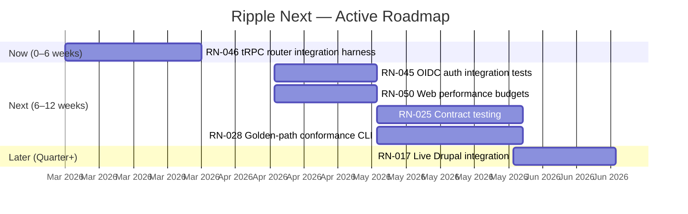

# Ripple Next — Product Roadmap

> v6.1.0 | 2026-02-28
>
> **AI-first platform.** Every item is machine-parseable (`RN-XXX`), includes
> AI-first benefit rationale, and is organised by time horizon for execution
> clarity. Supersedes the tier system ([ADR-016](../adr/016-roadmap-reorganisation.md))
> with Now/Next/Later planning.
>
> 45 items completed. See **[ARCHIVE.md](./ARCHIVE.md)**.

---

## Roadmap Timeline



## Agent-Friction Scorecard

| Dimension | Score | Notes |
|-----------|-------|-------|
| Setup determinism | 5/5 | Pinned pnpm, lockfile, `.env.example` + Zod env validation, devcontainer |
| One-command workflows | 5/5 | `pnpm bootstrap` — zero-to-ready, non-interactive |
| Local dev parity with CI | 5/5 | Shared tooling, dockerized deps, devcontainer, Testcontainers |
| Test reliability | 5/5 | Quarantine policy (ADR-013), unified `pnpm test:ci`, mock providers |
| Dependency + toolchain pinning | 5/5 | Exact Node (.nvmrc) + pnpm (packageManager) with doctor guards |
| Observability of failures | 5/5 | JUnit XML, Playwright traces, SBOM, JSON diagnostics |
| Automated remediation | 5/5 | `pnpm doctor --json`, conformance suites, documented procedures |
| Agent workflow integration | 5/5 | Runbooks, generators, error taxonomy ([ADR-018](../adr/018-ai-first-workflow-strategy.md)) |

**Overall: 40/40**

---

## North Star

Ripple Next is the **AI-augmented golden-path for government digital platforms**.
Downstream teams ship faster, safer, and more accessibly because the golden path
eliminates undifferentiated work and AI agents operate as first-class contributors
across the fleet.

**Platform status:** 15/16 subsystems implemented. API layer is partial
(router integration tests needed). Agent-Friction Scorecard: 40/40.

## Themes

1. **Production confidence** — close the API and auth integration test gaps
2. **Fleet adoption** — contract testing, conformance CLI, CI speed, deterministic pinning
3. **Quality depth** — performance budgets, live CMS validation

---

## Now (0–6 weeks)

> Items that close the remaining platform gap. Agents should start here.

### RN-046: tRPC Router Integration Harness (Testcontainers)

**Impact:** High | **Effort:** Medium | **Risk:** Low
**Source:** GPT-5.2-Codex API topology review | **Date:** 2026-02-28
**AI-first benefit:** Gives agents production-semantics confidence when refactoring router logic.

API layer is the only "partial" subsystem. Repository-level DB integration tests
exist ([RN-031](./ARCHIVE.md#rn-031-testcontainers-integration-tests-for-db--api)),
but router-level transaction and auth-path behaviour is contract-tested only.

**Affected items:** [RN-025](#rn-025-contract-testing-across-consumers)

- [ ] Add shared `createIntegrationCtx()` — provisions Postgres, runs migrations, isolates DB state per suite
- [ ] Integration tests for critical router paths (auth/session/audit-log-touching procedures first)
- [ ] CI job with `DATABASE_URL` env and path filters for deterministic scoping
- [ ] Update `docs/readiness.json` API status to "implemented" when blocker resolved

**Verification:** `pnpm test:integration` passes with Testcontainers; `readiness.json` updated; `pnpm verify` passes.

---

## Next (6–12 weeks)

> Items planned for the near term. Dependencies understood, design work may be needed.

### RN-045: OIDC Auth Flow Integration Tests (PKCE + Sessions)

**Impact:** High | **Effort:** Medium | **Risk:** Medium
**Source:** GPT-5.2-Codex readiness + auth test review | **Date:** 2026-02-28
**AI-first benefit:** Prevents agents from shipping auth regressions by validating prod-faithful OIDC flow deterministically.

Readiness reports auth integration test gap. Conformance tests validate interface
behaviour but not end-to-end authorization-code + PKCE session lifecycle.

- [ ] Add deterministic IdP fixture (container + checked-in config)
- [ ] Cover auth code + PKCE exchange, session creation/persistence, refresh/expiry, logout
- [ ] Gate on auth/config changes with optional nightly full-suite execution
- [ ] Add error taxonomy codes for IdP failure modes (issuer mismatch, redirect mismatch, clock skew)

**Verification:** Integration tests pass with containerised IdP; error taxonomy updated; `pnpm verify` passes.

---

### RN-050: Web Performance Budgets (Lighthouse CI)

**Impact:** Medium | **Effort:** Medium | **Risk:** Low
**Source:** Gap analysis — a11y auditing exists ([RN-042](./ARCHIVE.md#rn-042-accessibility-audit-pipeline)) but no performance equivalent
**AI-first benefit:** Agents get structured performance regression signals in CI.

Government sites have performance obligations. The platform has WCAG a11y auditing
but no Core Web Vitals monitoring. Lighthouse CI provides the performance analog.

- [ ] Define performance budgets (LCP, CLS, INP thresholds)
- [ ] Lighthouse CI integration in CI pipeline
- [ ] Emit structured `ripple-perf-report/v1` JSON
- [ ] Block on critical performance regressions

**Verification:** `pnpm test:perf -- --json` emits valid JSON; CI includes performance job; `pnpm verify` passes.

---

### RN-025: Contract Testing Across Consumers

**Impact:** High | **Effort:** High | **Risk:** Medium
**Source:** AI Principal Engineer review

Formal compatibility contract testing across published `@ripple/*` package
consumers. Becomes actionable after API integration tests (RN-046) establish the
test infrastructure.

- [ ] Define contract test patterns for package consumers
- [ ] Integrate consumer contract tests into release workflow
- [ ] Automated breaking-change detection and notification

---

### RN-028: Golden-Path Conformance CLI

**Impact:** Very High | **Effort:** High | **Risk:** Medium
**Source:** AI Principal Engineer review

One command that scores repos against required standards and auto-opens
remediation PRs. Builds on fleet governance ([RN-024](./ARCHIVE.md#rn-024-fleet-update-mechanism--template-drift-automation)).

- [ ] Define scoring rubric based on minimal repo standards
- [ ] Build CLI tool (`ripple-conform` or `pnpm conform`)
- [ ] Implement auto-remediation PR generation
- [ ] Integrate into fleet drift detection

---

## Later (Quarter+)

> Strategic items without a committed timeline.

### RN-017: Live Drupal Integration Testing

**Impact:** Medium | **Effort:** Medium | **Risk:** Medium
**Status:** Blocked — awaiting live Drupal/Tide URLs from content team.
**Continues:** [RN-004](./ARCHIVE.md#rn-004-drupaltide-cms-integration-ripplecms)

Integration test with a real Drupal/Tide instance to validate DrupalCmsProvider.
**Fallback:** Docker-based Tide fixture if not unblocked by Q2 2026.

- [ ] Set up test Drupal instance (Docker-based or hosted)
- [ ] Write integration test suite exercising all CMS provider methods
- [ ] Add CI job that runs integration tests on schedule (not every PR)

---

## Parked / Not Doing

| Item | Reason |
|------|--------|
| RN-049: Licensing Clarity Guardrail | Risk flag only. Keep SPDX-standard licence. No action needed. |
| Visual regression (Chromatic/Percy) | Deferred in [RN-020](./ARCHIVE.md#rn-020-storybook-stories-for-tide-components). Not justified by current UI churn. |

---

## Risks & Unknowns

| Risk | Mitigation |
|------|------------|
| RN-017 blocked on content team indefinitely | Docker Tide fixture as fallback by Q2 2026 |
| API layer "partial" status | RN-046 in Now addresses this |
| No runtime monitoring/alerting | Evaluate when production deployment is imminent; needs ADR |
| ~~`@main` refs in downstream workflow examples~~ | ~~RN-048 in Now addresses this~~ **Resolved** (v6.1.0) |
| Licensing drift (RN-049) | Keep SPDX-standard; reject custom non-commercial wording |

---

## AI Agent Suggestions

> AI agents propose new items here using the template below. Suggestions are
> triaged during periodic reviews. **Do not self-triage into active sections.**

### Template

```markdown
#### RN-XXX: Short Descriptive Title

**Category:** `[New Item]` | `[Priority Change]` | `[Risk Flag]` | `[Removal]`
**Source:** Agent type and analysis context
**Date:** YYYY-MM-DD
**Impact:** Low | Medium | High | Very High
**Effort:** Low | Medium | High
**Risk:** Low | Medium | High
**AI-first benefit:** One sentence explaining how this helps AI agent workflows

Description with rationale and evidence.

**Affected items:** RN-XXX, RN-YYY (if applicable)
**Proposed action:** What should happen

Checklist (if `[New Item]`):
- [ ] Task 1
- [ ] Task 2
```

### Open AI Suggestions

_No open suggestions. All previous suggestions triaged into active roadmap (v6.0.0)._

---

## Tech Lead Suggestions

> Human tech leads propose changes here. AI agents MUST read but MUST NOT modify.

### Template

```markdown
#### [Category] Short Title
**Author:** @yourname | **Date:** YYYY-MM-DD

Description, rationale, and evidence.

**Affected items:** RN-XXX, RN-YYY (if applicable)
**Proposed action:** What should happen
```

### Open Suggestions

_No open suggestions._

---

## Archive (Done)

45 items completed (RN-001 through RN-048, excluding RN-017/025/028).
See **[ARCHIVE.md](./ARCHIVE.md)** for full details.

Cross-references: [ADR index](../adr/README.md) | [Readiness](../readiness.json) | [Architecture](../architecture.md)
