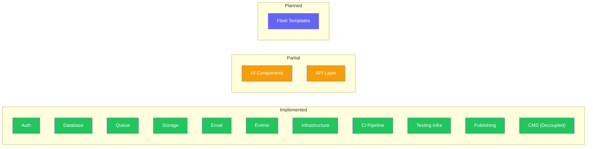
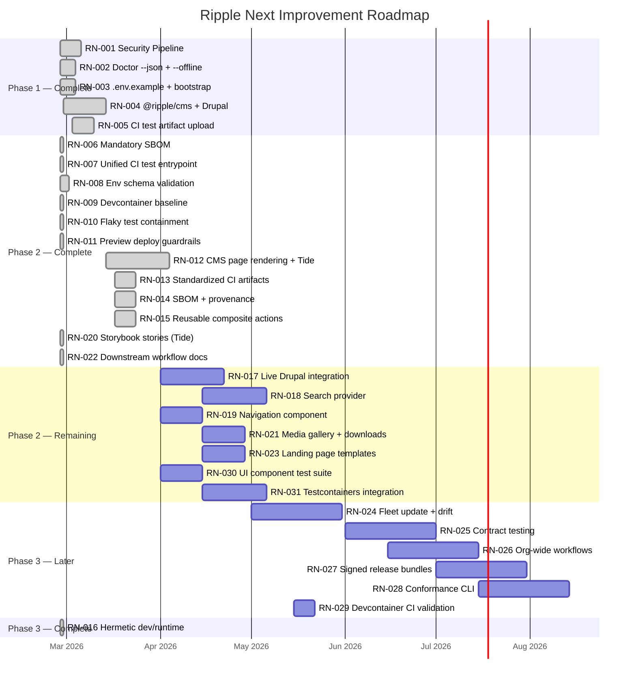
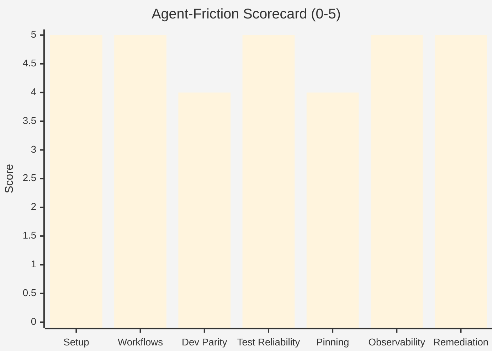
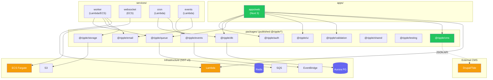
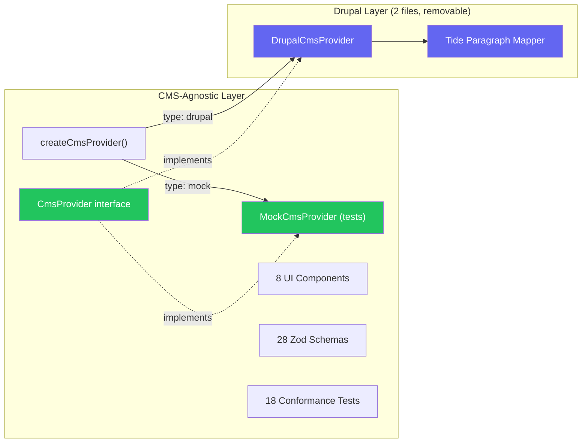
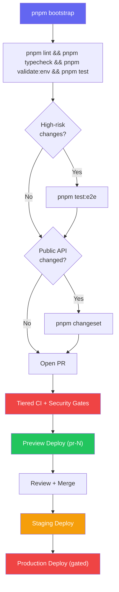

# Ripple Next — Product Roadmap

> Last updated: 2026-02-27 | Version: 2.1.0

Every item has a unique ticket number (`RN-XXX`). Completed items live in
[ARCHIVE.md](./ARCHIVE.md) (RN-001 through RN-022).

---

## Executive Verdict

**Ship-ready? Yes, with conditions.**

The repo has strong foundations for an **AI-first** government digital platform:
pinned package manager + lockfile discipline, a dedicated `pnpm doctor` command,
tiered CI with structured test artifacts, isolated preview stages, changeset-based
publishing with SBOM and provenance, and reusable composite actions for fleet
consistency.

**Remaining blocker:** Fleet template/update mechanics — repo-template + sync bot
for downstream upgrades ([RN-024](#rn-024-fleet-update-mechanism--template-drift-automation)).

### Evidence Highlights

- Deterministic package manager and lockfile usage (`pnpm@9.15.4`, frozen lockfile in CI).
- CI is tiered with change detection and high-risk routing.
- **Structured test artifact uploads** — JUnit XML + coverage reports uploaded on every CI run with 30-day retention ([RN-005](./ARCHIVE.md#rn-005-ci-test-artifact-upload), [RN-013](./ARCHIVE.md#rn-013-standardized-ci-artifacts)).
- **SBOM + provenance (mandatory)** — CycloneDX SBOM generation is fail-fast in release workflow ([RN-006](./ARCHIVE.md#rn-006-mandatory-sbom-in-release-workflow), [RN-014](./ARCHIVE.md#rn-014-sbom--provenance-in-release)).
- **Reusable composite actions** — `setup`, `quality`, `test` actions available for downstream repos ([RN-015](./ARCHIVE.md#rn-015-reusable-composite-actions)), with [downstream consumption guide](../downstream-workflows.md) ([RN-022](./ARCHIVE.md#rn-022-downstream-workflow-documentation)).
- **Env schema validation** — Zod-based env schemas in `@ripple/validation` + zero-dependency `pnpm validate:env` gate in CI ([RN-008](./ARCHIVE.md#rn-008-env-schema-validation-gate-adr-012)). See ADR-012.
- **Devcontainer** — `.devcontainer/` with Node 22, Docker-in-Docker, GitHub CLI, AWS CLI, and all services pre-configured ([RN-009](./ARCHIVE.md#rn-009-devcontainer-baseline)).
- Preview environments isolated per PR stage (`pr-{number}`) and cleaned on PR close ([RN-011](./ARCHIVE.md#rn-011-preview-deploy-guardrails-adr-014)).
- Changesets and private registry publish workflow in place.
- Provider pattern enables mock/memory providers for agent-fast test loops.
- `pnpm doctor --json` and `pnpm bootstrap` provide non-interactive agent ergonomics ([RN-002](./ARCHIVE.md#rn-002-doctor-machine-mode---json---offline), [RN-003](./ARCHIVE.md#rn-003-environment-contract-envexample--pnpm-bootstrap)).
- **Security pipeline** — CodeQL SAST, dependency review, Gitleaks secret audit ([RN-001](./ARCHIVE.md#rn-001-security-pipeline-securityyml)).
- **Flaky test containment** — Quarantine policy (ADR-013) with `pnpm check:quarantine` CI gate ([RN-010](./ARCHIVE.md#rn-010-flaky-test-containment-policy-adr-013)).
- **Preview deploy guardrails** — GitHub environment protection, label-gated deploys (ADR-014).
- **Storybook coverage** — All 15 UI components (atoms, molecules, organisms, Tide content) have Storybook stories with autodocs ([RN-020](./ARCHIVE.md#rn-020-storybook-stories-for-tide-components)).

---

## Platform Maturity Overview

---

## Completed Work (RN-001 – RN-022)

18 items have been completed across Phases 1–3. See **[ARCHIVE.md](./ARCHIVE.md)**
for full details on each.

| ID | Item | Phase |
|----|------|-------|
| [RN-001](./ARCHIVE.md#rn-001-security-pipeline-securityyml) | Security Pipeline | 1 |
| [RN-002](./ARCHIVE.md#rn-002-doctor-machine-mode---json---offline) | Doctor Machine Mode | 1 |
| [RN-003](./ARCHIVE.md#rn-003-environment-contract-envexample--pnpm-bootstrap) | Environment Contract | 1 |
| [RN-004](./ARCHIVE.md#rn-004-drupaltide-cms-integration-ripplecms) | Drupal/Tide CMS Integration | 1 |
| [RN-005](./ARCHIVE.md#rn-005-ci-test-artifact-upload) | CI Test Artifact Upload | 1 |
| [RN-006](./ARCHIVE.md#rn-006-mandatory-sbom-in-release-workflow) | Mandatory SBOM in Release | 2 |
| [RN-007](./ARCHIVE.md#rn-007-unified-ci-test-entrypoint) | Unified CI Test Entrypoint | 2 |
| [RN-008](./ARCHIVE.md#rn-008-env-schema-validation-gate-adr-012) | Env Schema Validation (ADR-012) | 2 |
| [RN-009](./ARCHIVE.md#rn-009-devcontainer-baseline) | Devcontainer Baseline | 2 |
| [RN-010](./ARCHIVE.md#rn-010-flaky-test-containment-policy-adr-013) | Flaky Test Containment (ADR-013) | 2 |
| [RN-011](./ARCHIVE.md#rn-011-preview-deploy-guardrails-adr-014) | Preview Deploy Guardrails (ADR-014) | 2 |
| [RN-012](./ARCHIVE.md#rn-012-cms-page-rendering--tide-components--decoupling) | CMS Page Rendering + Tide Components | 2 |
| [RN-013](./ARCHIVE.md#rn-013-standardized-ci-artifacts) | Standardized CI Artifacts | 2 |
| [RN-014](./ARCHIVE.md#rn-014-sbom--provenance-in-release) | SBOM + Provenance in Release | 2 |
| [RN-015](./ARCHIVE.md#rn-015-reusable-composite-actions) | Reusable Composite Actions | 2 |
| [RN-016](./ARCHIVE.md#rn-016-hermetic-devruntime-devcontainer) | Hermetic Dev/Runtime | 3 |
| [RN-020](./ARCHIVE.md#rn-020-storybook-stories-for-tide-components) | Storybook Stories for Tide Components | 2 |
| [RN-022](./ARCHIVE.md#rn-022-downstream-workflow-documentation) | Downstream Workflow Documentation | 2 |

---

## Active Roadmap

### Phase 2 Remaining — In Progress

#### RN-017: Live Drupal Integration Testing

**Impact:** Medium | **Effort:** Medium | **Risk:** Medium
**Continues:** [RN-004](./ARCHIVE.md#rn-004-drupaltide-cms-integration-ripplecms)

Integration test with a real Drupal/Tide instance to validate DrupalCmsProvider
against a live JSON:API endpoint.

- [ ] Set up test Drupal instance (Docker-based or hosted)
- [ ] Write integration test suite exercising all CMS provider methods
- [ ] Add CI job that runs integration tests on schedule (not every PR)

---

#### RN-018: Search Integration Provider

**Impact:** Medium | **Effort:** Medium | **Risk:** Medium

Dedicated search provider (MeiliSearch for local, Elasticsearch for prod) beyond
the basic CMS search interface.

- [ ] Define `SearchProvider` interface in `packages/cms/types.ts`
- [ ] Implement `MeiliSearchProvider` for local dev
- [ ] Implement `ElasticsearchProvider` for production
- [ ] Add conformance tests for search provider
- [ ] Wire into Nuxt server context alongside CMS provider

---

#### RN-019: Navigation/Menu Component

**Impact:** Medium | **Effort:** Medium | **Risk:** Low
**Continues:** [RN-012](./ARCHIVE.md#rn-012-cms-page-rendering--tide-components--decoupling)

Menu rendering from CMS-provided menu structure, including primary navigation,
footer, and sidebar menus.

- [ ] Create navigation composable (`useNavigation()`)
- [ ] Build header navigation component
- [ ] Build footer navigation component
- [ ] Support nested menu structures from CMS

---

#### RN-021: Media Gallery + Document Download Components

**Impact:** Low | **Effort:** Medium | **Risk:** Low
**Continues:** [RN-012](./ARCHIVE.md#rn-012-cms-page-rendering--tide-components--decoupling)

Media gallery and document download components for Tide content types.

- [ ] Build media gallery component with lightbox
- [ ] Build document download component with file type icons
- [ ] Integrate with CMS media content types

---

#### RN-023: Landing Page + Content Templates

**Impact:** Medium | **Effort:** Medium | **Risk:** Low
**Continues:** [RN-012](./ARCHIVE.md#rn-012-cms-page-rendering--tide-components--decoupling)

Pre-built page templates for common government content layouts (landing pages,
content pages, campaign pages).

- [ ] Build landing page template
- [ ] Build content page template
- [ ] Build campaign page template
- [ ] Wire templates to CMS page type field

---

#### RN-030: UI Component Test Suite

**Impact:** Medium | **Effort:** Medium | **Risk:** Low
**Source:** AI agent gap analysis
**Continues:** [RN-020](./ARCHIVE.md#rn-020-storybook-stories-for-tide-components)

Vue Test Utils component tests for all Tide content components and existing
atoms/molecules. This addresses the UI subsystem's "partial" status — the main
blocker is "Component tests needed for new Tide-compatible content components".

- [ ] Add component tests for atoms (RplButton, RplFormInput, RplIcon)
- [ ] Add component tests for molecules (RplCard, RplHeroHeader)
- [ ] Add component tests for Tide content organisms (all 8 components)
- [ ] Ensure UI package coverage meets Tier 3 thresholds (20% lines, 10% branches)

---

#### RN-031: Testcontainers Integration Tests for DB + API

**Impact:** High | **Effort:** Medium | **Risk:** Medium
**Source:** AI agent gap analysis

Integration tests using Testcontainers for both `@ripple/db` repositories and
tRPC API routers. Addresses blockers in readiness.json for database ("No
integration tests for repositories using testcontainers") and API ("No
integration tests with real DB").

- [ ] Add Testcontainers-based integration tests for UserRepository
- [ ] Add Testcontainers-based integration tests for tRPC user router
- [ ] Validate audit_log and project repositories with real PostgreSQL
- [ ] Add CI job for integration tests (Tier 2, not every PR)

---

### Phase 3: Do Later (Quarterly)

#### RN-024: Fleet Update Mechanism + Template Drift Automation

**Impact:** Very High | **Effort:** High | **Risk:** Medium
**Source:** Roadmap blocker + AI Principal Engineer review

Template repo + sync bot + policy drift reporting for downstream clones. This is
the last remaining top blocker.

- [ ] Create template repository from this golden-path source
- [ ] Build GitHub App or Action for template drift detection
- [ ] Automated sync PRs for security/standards updates
- [ ] Policy drift reporting dashboard

---

#### RN-025: Contract Testing Across Consumers

**Impact:** High | **Effort:** High | **Risk:** Medium

Formal compatibility contract testing across published `@ripple/*` package
consumers.

- [ ] Define contract test patterns for package consumers
- [ ] Integrate consumer contract tests into release workflow
- [ ] Automated breaking-change detection and notification

---

#### RN-026: Org-Wide Reusable Workflow Distribution

**Impact:** Very High | **Effort:** Medium | **Risk:** Medium
**Source:** AI Principal Engineer review

Centralize policy gates using `workflow_call` with versioned rollout channels
for the entire organization.

- [ ] Publish reusable workflows to a central `.github` org repo
- [ ] Implement versioned rollout channels (stable, canary)
- [ ] Migrate downstream repos to org-wide workflows

---

#### RN-027: Signed Release Bundles + Verification

**Impact:** High | **Effort:** Medium | **Risk:** Medium
**Source:** AI Principal Engineer review

Extend provenance with package-level signature verification commands for
consumers.

- [ ] Implement package signing in release workflow
- [ ] Build verification CLI command (`pnpm verify:release`)
- [ ] Document consumer-side verification workflow

---

#### RN-028: Golden-Path Conformance CLI

**Impact:** Very High | **Effort:** High | **Risk:** Medium
**Source:** AI Principal Engineer review

One command that scores repos against required standards and auto-opens
remediation PRs.

- [ ] Define scoring rubric based on minimal repo standards checklist
- [ ] Build CLI tool (`ripple-conform` or `pnpm conform`)
- [ ] Implement auto-remediation PR generation
- [ ] Integrate into fleet drift detection ([RN-024](#rn-024-fleet-update-mechanism--template-drift-automation))

---

#### RN-029: Validate Devcontainer in CI Runners

**Impact:** Low | **Effort:** Low | **Risk:** Low
**Continues:** [RN-016](./ARCHIVE.md#rn-016-hermetic-devruntime-devcontainer)

Optional validation that the devcontainer works in containerized CI runners.

- [ ] Add CI job that builds and validates devcontainer image
- [ ] Run smoke test inside devcontainer in CI

---

## Active Items Summary

| ID | Item | Phase | Priority | Impact |
|----|------|-------|----------|--------|
| [RN-017](#rn-017-live-drupal-integration-testing) | Live Drupal Integration Testing | 2 | Medium | Medium |
| [RN-018](#rn-018-search-integration-provider) | Search Integration Provider | 2 | Medium | Medium |
| [RN-019](#rn-019-navigationmenu-component) | Navigation/Menu Component | 2 | Medium | Medium |
| [RN-021](#rn-021-media-gallery--document-download-components) | Media Gallery + Downloads | 2 | Low | Low |
| [RN-023](#rn-023-landing-page--content-templates) | Landing Page Templates | 2 | Medium | Medium |
| [RN-030](#rn-030-ui-component-test-suite) | UI Component Test Suite | 2 | Medium | Medium |
| [RN-031](#rn-031-testcontainers-integration-tests-for-db--api) | Testcontainers Integration Tests | 2 | **High** | **High** |
| [RN-024](#rn-024-fleet-update-mechanism--template-drift-automation) | Fleet Update + Drift Automation | 3 | **High** | **Very High** |
| [RN-025](#rn-025-contract-testing-across-consumers) | Contract Testing | 3 | Medium | High |
| [RN-026](#rn-026-org-wide-reusable-workflow-distribution) | Org-Wide Workflows | 3 | Medium | Very High |
| [RN-027](#rn-027-signed-release-bundles--verification) | Signed Release Bundles | 3 | Low | High |
| [RN-028](#rn-028-golden-path-conformance-cli) | Conformance CLI | 3 | Low | Very High |
| [RN-029](#rn-029-validate-devcontainer-in-ci-runners) | Devcontainer CI Validation | 3 | Low | Low |

---

## Roadmap Gantt

---

## Reference Sections

### LocalStack Assessment

**Short answer: not as the default local-dev path for this repository.**

This repo uses a **provider pattern** with local-first implementations
(memory/mock, BullMQ, MinIO, SMTP) that are faster, simpler, and less
flaky for agent loops. LocalStack adds orchestration overhead and
service-emulation drift.

**Recommended compromise:**

- Keep LocalStack **optional**, not required.
- Use it only for narrow AWS API-shape compatibility testing
  (e.g., SQS/S3 IAM policy behavior before preview deploy).
- Gate it behind `pnpm test:aws-compat` so routine agent workflows
  remain low-friction.

### Agent-Friction Scorecard

| Dimension | Score | Notes |
|-----------|-------|-------|
| Setup determinism | 5/5 | Strong pinning, lockfile, `.env.example` + Zod env validation, devcontainer |
| One-command workflows | 5/5 | `pnpm bootstrap` — zero-to-ready, non-interactive |
| Local dev parity with CI | 4/5 | Shared tooling, dockerized deps, devcontainer available |
| Test reliability / flake resistance | 5/5 | Quarantine policy (ADR-013), unified `pnpm test:ci`, CMS mock provider |
| Dependency + toolchain pinning | 4/5 | `packageManager` + lockfile; semver ranges remain (normal) |
| Observability of failures | 5/5 | JUnit XML, Playwright traces, SBOM mandatory, JSON env diagnostics |
| Automated remediation friendliness | 5/5 | `pnpm doctor --json`, conformance suites, documented removal procedures |

**Overall: 33/35**

### Security + Supply Chain

| Area | Current State | Target |
|------|--------------|--------|
| Secrets handling | OIDC role assumption + Gitleaks audit | Maintained |
| Dependency risk | Dependency review (blocks high-severity + GPL/AGPL) | Maintained |
| SBOM/provenance | CycloneDX SBOM mandatory (fail-fast) + build provenance attestation | SPDX as additional format if compliance requires |
| SAST/DAST | CodeQL SAST with SARIF upload | Maintained |

### Architecture Overview

### Drupal/Tide CMS — Decoupled Architecture

Drupal-specific code is isolated to exactly **2 files** (`packages/cms/providers/drupal.ts`
and `packages/cms/providers/tide-paragraph-mapper.ts`). Everything else is CMS-agnostic.

See [ADR-011](../adr/011-cms-decoupling-pull-out-drupal.md) for the full decoupling
strategy, removal procedure, and addition procedure.

### Proposed Golden Path

### Minimal Required Repo Standards

- [x] Pinned runtime/package manager + lockfile enforced
- [x] Non-interactive bootstrap + doctor(json)
- [x] Env contract (`.env.example`) + Zod-based env schema validation
- [x] Tiered CI with path filtering
- [x] Security gates in CI (`security.yml`)
- [x] PR preview isolation + automatic teardown
- [x] Changeset/release automation
- [x] SBOM/provenance in releases (mandatory, fail-fast)
- [x] CODEOWNERS + policy checks on critical paths
- [x] Structured test artifact uploads (JUnit XML + coverage)
- [x] Reusable composite actions for fleet CI consistency
- [x] Devcontainer for hermetic local development
- [x] Unified CI test entrypoint (`pnpm test:ci`)
- [x] Flaky test containment policy with quarantine check
- [x] Preview deploy environment guardrails
- [x] Storybook stories for all UI components (atoms, molecules, organisms, Tide content)
- [x] Downstream workflow consumption guide

### Template Strategy

Maintain this repo as golden-path source, plus:

1. **Template distribution layer** — GitHub template or scaffolder ([RN-024](#rn-024-fleet-update-mechanism--template-drift-automation))
2. **Reusable org workflows** — referenced by all derived repos ([RN-026](#rn-026-org-wide-reusable-workflow-distribution))
3. **Automated drift detection** — sync PRs for standards/security updates ([RN-024](#rn-024-fleet-update-mechanism--template-drift-automation))
4. **Conformance scoring** — automated repo health checks ([RN-028](#rn-028-golden-path-conformance-cli))
5. **Keep domain logic in versioned `@ripple/*` libraries** — keep templates thin
