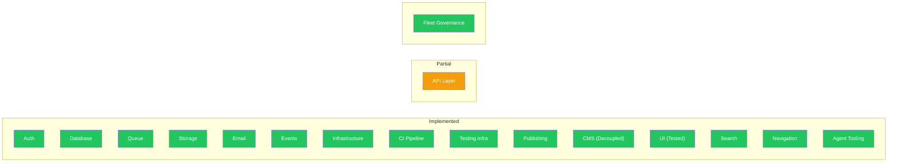
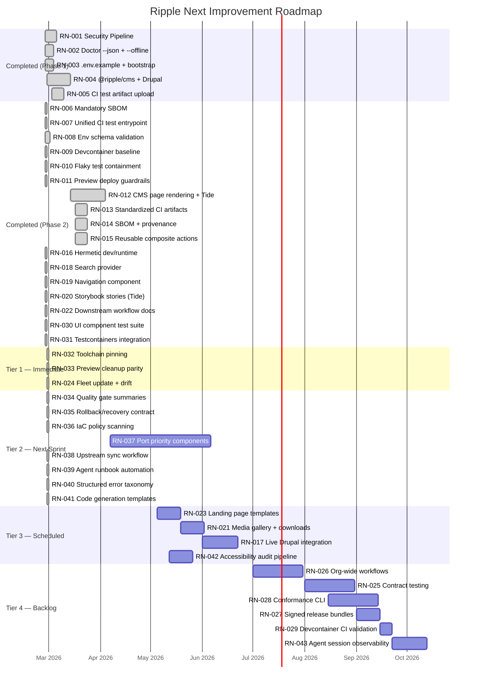
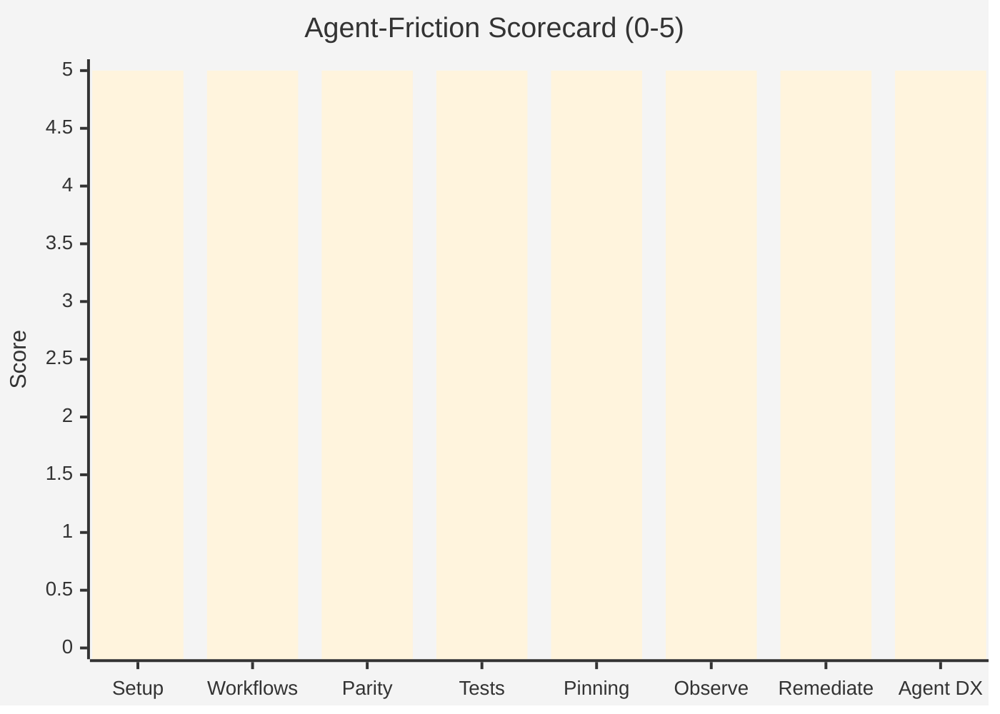
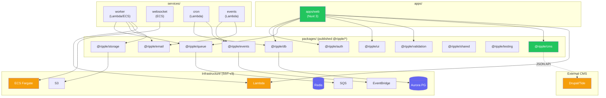
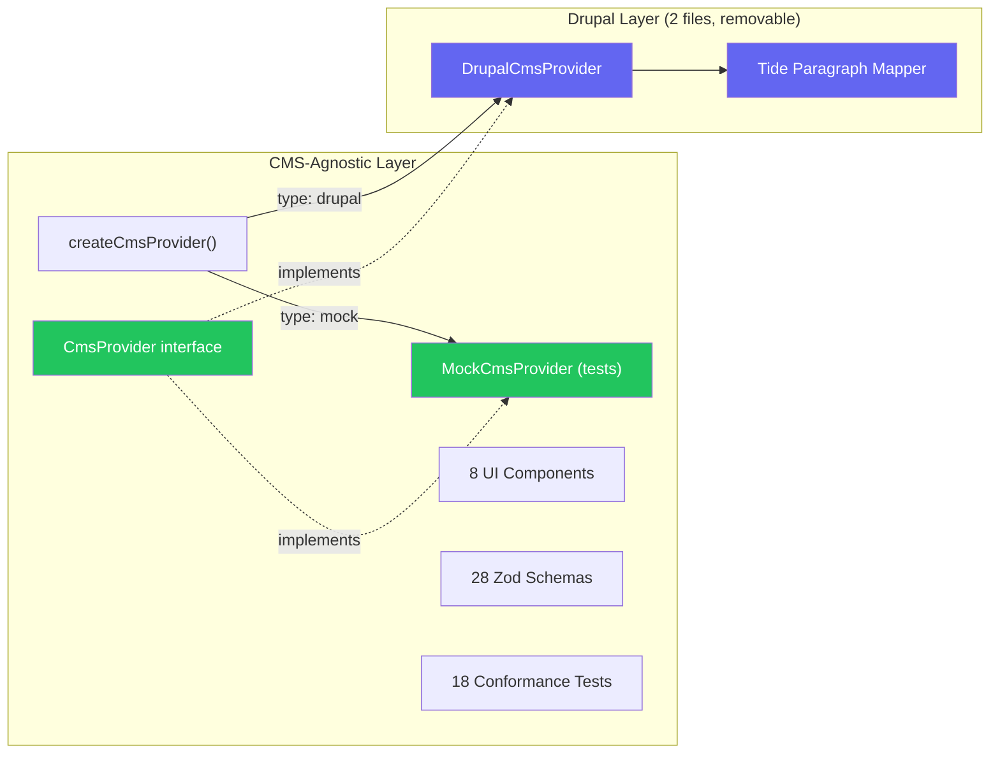
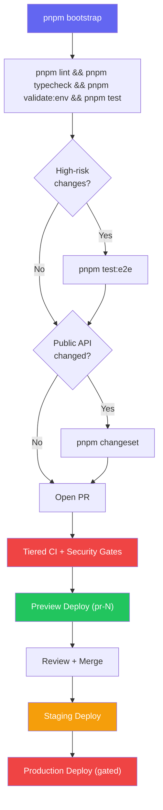

# Ripple Next — Product Roadmap

> Last updated: 2026-02-28 | Version: 5.0.0
>
> **AI-first platform.** This roadmap is structured for both human and AI agent
> consumption. Every item is machine-parseable, uniquely identified (`RN-XXX`),
> and prioritised using a tiered system that favours agent-executable, high-impact
> work first.
>
> **v5.0.0 changes:** Added AI-first workflow strategy items (RN-039 through
> RN-043), created [ADR-018](../adr/018-ai-first-workflow-strategy.md), refreshed
> scorecard and Gantt, optimised documentation cross-references.

Completed items (RN-001 through RN-031) live in [ARCHIVE.md](./ARCHIVE.md).

---

## Executive Verdict

**Ship-ready? Yes, with conditions.**

The repo has strong foundations for an **AI-first** government digital platform:
pinned package manager + lockfile discipline, a dedicated `pnpm doctor` command,
tiered CI with structured test artifacts, isolated preview stages, changeset-based
publishing with SBOM and provenance, and reusable composite actions for fleet
consistency.

**All critical blockers resolved.** Fleet governance ([RN-024](#rn-024-fleet-update-mechanism--template-drift-automation) ✅),
agent workflow tooling ([RN-039](#rn-039-agent-runbook-automation)–[RN-041](#rn-041-code-generation-templates) ✅),
and quality gate summaries ([RN-034](#rn-034-machine-readable-quality-gate-summaries) ✅) are all complete.

### AI-First Strategy

This platform treats **AI agents as first-class developers**. Every architectural
and workflow decision is evaluated through the lens of agent effectiveness:

1. **Machine-parseable outputs** — All quality gates, diagnostics, and status
   reports emit structured JSON that agents parse without scraping.
2. **Deterministic environments** — Pinned toolchains, frozen lockfiles,
   devcontainer, and `pnpm bootstrap` give agents identical setups every run.
3. **Fast feedback loops** — Memory/mock providers keep test suites under 100ms;
   conformance suites validate provider contracts without cloud dependencies.
4. **Codified runbooks** — Common operations (deploy, rollback, add component,
   add provider) have documented, executable procedures agents follow without
   human interpretation.
5. **Scaffolding generators** — Code generation templates for components,
   providers, and API routes eliminate boilerplate and enforce conventions.

See [ADR-018](../adr/018-ai-first-workflow-strategy.md) for the full strategy.

### Evidence Highlights

- **Exact toolchain pinning** — Node.js pinned in `.nvmrc`, pnpm pinned in `packageManager`; CI reads both; `pnpm doctor` enforces exact match (RN-032).
- CI is tiered with change detection and high-risk routing.
- **Structured test artifact uploads** — JUnit XML + coverage reports uploaded on every CI run with 30-day retention.
- **SBOM + provenance (mandatory)** — CycloneDX SBOM generation is fail-fast in release workflow.
- **Reusable composite actions** — `setup`, `quality`, `test` actions available for downstream repos, with [downstream consumption guide](../downstream-workflows.md).
- **Env schema validation** — Zod-based env schemas in `@ripple/validation` + zero-dependency `pnpm validate:env` gate in CI. See ADR-012.
- **Devcontainer** — `.devcontainer/` with Node 22, Docker-in-Docker, GitHub CLI, AWS CLI, and all services pre-configured.
- Preview environments isolated per PR stage (`pr-{number}`) and cleaned on PR close.
- Changesets and private registry publish workflow in place.
- Provider pattern enables mock/memory providers for agent-fast test loops.
- `pnpm doctor --json` and `pnpm bootstrap` provide non-interactive agent ergonomics.
- **Security pipeline** — CodeQL SAST, dependency review, Gitleaks secret audit.
- **Flaky test containment** — Quarantine policy (ADR-013) with `pnpm check:quarantine` CI gate.
- **Preview deploy guardrails** — GitHub environment protection, label-gated deploys (ADR-014).
- **UI component tests** — Vue Test Utils tests for all 37 components (381 tests) with full coverage of atoms (including 8 form components, 4 messaging components, Breadcrumb + SkipLink, Tag, Chip), molecules (including Pagination + InPageNavigation, Tabs, SearchBar, RelatedLinks), organisms, and Tide content renderers.
- **Testcontainers integration tests** — Real PostgreSQL integration tests for UserRepository and ProjectRepository.
- **Upstream Ripple strategy** — Hybrid port/own/sync model for upstream Ripple 2 components ([ADR-017](../adr/017-upstream-ripple-component-strategy.md)), no runtime dependency on `@dpc-sdp/*`.
- **ADR coverage** — 19 ADRs with [indexed directory](../adr/README.md), including AI-first workflow strategy (ADR-018) and fleet governance (ADR-019).

---

## Platform Maturity Overview



---

## Completed Work (RN-001 – RN-031)

22 items have been completed across Phases 1–3. See **[ARCHIVE.md](./ARCHIVE.md)**
for full details on each.

| ID | Item | Phase |
|----|------|-------|
| [RN-001](./ARCHIVE.md#rn-001-security-pipeline-securityyml) | Security Pipeline | 1 |
| [RN-002](./ARCHIVE.md#rn-002-doctor-machine-mode---json---offline) | Doctor Machine Mode | 1 |
| [RN-003](./ARCHIVE.md#rn-003-environment-contract-envexample--pnpm-bootstrap) | Environment Contract | 1 |
| [RN-004](./ARCHIVE.md#rn-004-drupaltide-cms-integration-ripplecms) | Drupal/Tide CMS Integration | 1 |
| [RN-005](./ARCHIVE.md#rn-005-ci-test-artifact-upload) | CI Test Artifact Upload | 1 |
| [RN-006](./ARCHIVE.md#rn-006-mandatory-sbom-in-release-workflow) | Mandatory SBOM in Release | 2 |
| [RN-007](./ARCHIVE.md#rn-007-unified-ci-test-entrypoint) | Unified CI Test Entrypoint | 2 |
| [RN-008](./ARCHIVE.md#rn-008-env-schema-validation-gate-adr-012) | Env Schema Validation (ADR-012) | 2 |
| [RN-009](./ARCHIVE.md#rn-009-devcontainer-baseline) | Devcontainer Baseline | 2 |
| [RN-010](./ARCHIVE.md#rn-010-flaky-test-containment-policy-adr-013) | Flaky Test Containment (ADR-013) | 2 |
| [RN-011](./ARCHIVE.md#rn-011-preview-deploy-guardrails-adr-014) | Preview Deploy Guardrails (ADR-014) | 2 |
| [RN-012](./ARCHIVE.md#rn-012-cms-page-rendering--tide-components--decoupling) | CMS Page Rendering + Tide Components | 2 |
| [RN-013](./ARCHIVE.md#rn-013-standardized-ci-artifacts) | Standardized CI Artifacts | 2 |
| [RN-014](./ARCHIVE.md#rn-014-sbom--provenance-in-release) | SBOM + Provenance in Release | 2 |
| [RN-015](./ARCHIVE.md#rn-015-reusable-composite-actions) | Reusable Composite Actions | 2 |
| [RN-016](./ARCHIVE.md#rn-016-hermetic-devruntime-devcontainer) | Hermetic Dev/Runtime | 3 |
| [RN-018](./ARCHIVE.md#rn-018-search-integration-provider) | Search Integration Provider | 2 |
| [RN-019](./ARCHIVE.md#rn-019-navigationmenu-component) | Navigation/Menu Component | 2 |
| [RN-020](./ARCHIVE.md#rn-020-storybook-stories-for-tide-components) | Storybook Stories for Tide Components | 2 |
| [RN-022](./ARCHIVE.md#rn-022-downstream-workflow-documentation) | Downstream Workflow Documentation | 2 |
| [RN-030](./ARCHIVE.md#rn-030-ui-component-test-suite) | UI Component Test Suite | 2 |
| [RN-031](./ARCHIVE.md#rn-031-testcontainers-integration-tests-for-db--api) | Testcontainers Integration Tests | 2 |

---

## Active Roadmap

> Items are organised by priority tier. Within each tier, items are ordered by
> recommended execution sequence. AI agents should start from **Tier 1** and work
> down. Each item includes machine-readable metadata for automated planning.

### Tier 1: Immediate — Quick Wins + Top Blocker

> High-impact items that are either low-effort quick wins or critical blockers.
> These should be tackled first in any sprint.

#### RN-032: Toolchain Pinning Hardening ✅

**Priority:** Critical | **Impact:** High | **Effort:** Low | **Risk:** Low
**Source:** AI Principal Engineer review | **AI-first benefit:** Eliminates version drift across agent runs
**Status:** Done (2026-02-28)

Hardened reproducibility with exact, enforceable toolchain contracts across
local, CI, and devcontainer environments. `.nvmrc` is the single source of truth
for Node.js; `packageManager` field is the single source of truth for pnpm.

- [x] Pin exact Node version in `.nvmrc` (22.22.0); CI reads via `node-version-file`
- [x] Pin exact pnpm version — `engines.pnpm` tightened to `>=9.15.4` matching `packageManager`
- [x] `pnpm doctor` checks exact pnpm version against `packageManager` and Node against `.nvmrc`
- [x] Upgrade procedure documented in AGENTS.md → "Toolchain Pinning" section

**Verification:** `pnpm doctor` shows pinned versions; `pnpm lint && pnpm typecheck && pnpm test` all pass.

---

#### RN-033: Preview Cleanup Guardrails Parity ✅

**Priority:** Critical | **Impact:** High | **Effort:** Low | **Risk:** Low
**Source:** AI Principal Engineer review | **AI-first benefit:** Eliminates noisy CI failures for agents
**Status:** Done (2026-02-28)

Aligned `cleanup-preview` behavior with deploy-preview guardrails so missing AWS
credentials produce a safe, explainable skip rather than noisy failures.

- [x] Added `check-secrets` gate to cleanup workflow (mirrors deploy-preview pattern)
- [x] Emits `::notice::` when cleanup is skipped due to missing credentials
- [x] Cleanup job skipped entirely when secrets absent — green CI status preserved
- [x] Updated `docs/deployment.md` → "Credential Guardrails" section with skip behavior

**Verification:** Workflow YAML structure matches deploy-preview guardrails; `pnpm lint` passes.

---

#### RN-024: Fleet Update Mechanism + Template Drift Automation ✅

**Priority:** Critical | **Impact:** Very High | **Effort:** High | **Risk:** Medium
**Source:** Roadmap blocker + AI Principal Engineer review | **AI-first benefit:** Enables agent-driven fleet governance
**Status:** Done (2026-02-28)

Fleet governance mechanism with manifest-driven drift detection, sync PR
automation, and JSON compliance reporting. Action-first approach (not GitHub App).
8 governed surfaces across 3 severity levels. See ADR-019.

- [x] Create template repository from this golden-path source (`.github/template-config.json`, `docs/fleet-policy.json`)
- [x] Build GitHub Action for template drift detection (`scripts/check-fleet-drift.mjs`, `.github/workflows/fleet-drift.yml`, `.github/actions/fleet-drift/action.yml`)
- [x] Automated sync PRs for security/standards updates (`scripts/fleet-sync.mjs`, `.github/workflows/fleet-sync.yml`)
- [x] Policy drift reporting dashboard (`scripts/fleet-compliance.mjs`, JSON artifact + CI summary)

**Verification:** `pnpm check:fleet-drift --json` emits valid `ripple-fleet-drift/v1` JSON; `pnpm fleet:compliance --json` emits valid `ripple-fleet-compliance/v1` JSON; `pnpm runbook fleet-sync` renders steps; all quality gates pass.

---

### Tier 2: Next Sprint — AI-First Platform Enablers + Component Parity

> Items that directly improve agent automation, observability, and operational
> safety, plus critical component gaps that block government site delivery.

#### RN-034: Machine-Readable Quality Gate Summaries ✅

**Priority:** High | **Impact:** Medium | **Effort:** Medium | **Risk:** Low
**Source:** AI Principal Engineer review | **AI-first benefit:** Agents parse structured JSON instead of scraping logs
**Status:** Done (2026-02-28)

Unified quality gate runner (`pnpm verify`) that runs all gates (validate:env,
lint, typecheck, test, check:readiness, check:quarantine) and emits a structured
JSON summary conforming to the `ripple-gate-summary/v1` schema.

- [x] Add script wrappers emitting stable JSON for lint/typecheck/test (`scripts/verify.mjs`)
- [x] Include machine-readable status in CI artifacts (`gate-summary` artifact, 30-day retention)
- [x] Ensure non-zero exits remain authoritative for gating (exit 1 if any gate fails)
- [x] Document schema for downstream automation consumers (AGENTS.md, CLAUDE.md, script header)

**Verification:** `pnpm verify -- --json` emits valid JSON; `pnpm lint && pnpm typecheck && pnpm test` all pass; CI workflow uploads `gate-summary.json` artifact.

---

#### RN-035: Rollback and Recovery Command Contract ✅

**Priority:** High | **Impact:** High | **Effort:** Medium | **Risk:** Medium
**Source:** AI Principal Engineer review | **AI-first benefit:** Agents can execute safe recovery without human interpretation
**Status:** Done (2026-02-28)

Post-deploy health validation script (`scripts/deploy-health-check.mjs`) with
retry logic, structured `ripple-health-report/v1` JSON output, and rollback
trigger criteria linked to error taxonomy (RPL-DEPLOY-001). CI workflows
capture health reports as artifacts. Rollback procedures documented in
`docs/deployment.md` and runbook (`docs/runbooks/rollback-production.json`).

- [x] Add explicit rollback runbook with command examples (via RN-039)
- [x] Provide scripted rollback entrypoint(s) for common failure modes (`scripts/deploy-health-check.mjs`)
- [x] Add post-deploy health validation + rollback trigger criteria (`docs/deployment.md`)
- [x] Capture rollback evidence as CI/CD artifacts (`health-report-{stage}`, 30-day retention)

**Verification:** `node scripts/deploy-health-check.mjs --help` shows usage; deploy workflows include health check steps; `docs/deployment.md` has rollback section; all gates pass.

---

#### RN-036: IaC Policy Scanning for SST Changes ✅

**Priority:** High | **Impact:** High | **Effort:** Medium | **Risk:** Medium
**Source:** AI Principal Engineer review | **AI-first benefit:** Blocks unsafe infra changes before deploy
**Status:** Done (2026-02-28)

Static policy scanner (`scripts/iac-policy-scan.mjs`) for `sst.config.ts` with
7 policies covering security, safety, cost, and reliability. Machine-readable
`ripple-iac-report/v1` JSON output. Exception workflow via inline comments.
CI job runs on infra changes. 7 new error taxonomy entries (RPL-IAC-001 through
RPL-IAC-007). Integrated into `pnpm verify` gate runner.

- [x] Add IaC policy scan job for `sst.config.ts` changes (CI `iac-policy` job, path-filtered)
- [x] Define baseline policy set (7 policies: production protection, no wildcard CORS, HTTPS-only, bounded scaling, Lambda timeout limits, no hardcoded ARNs, VPC for data resources)
- [x] Route violations to clear, machine-readable diagnostics (`ripple-iac-report/v1` JSON schema)
- [x] Document exception workflow and approvals (`docs/deployment.md` → "IaC Policy Scanning" section)

**Verification:** `pnpm check:iac` passes (0 errors, 1 warning); `pnpm check:iac -- --json` emits valid JSON; CI workflow includes `iac-policy` job; `docs/deployment.md` has policy scan + exception docs; error taxonomy has 31 entries; all gates pass.

---

#### RN-037: Port Priority Components from Upstream Ripple 2

**Priority:** High | **Impact:** Very High | **Effort:** High | **Risk:** Medium
**Source:** [ADR-017](../adr/017-upstream-ripple-component-strategy.md) | **AI-first benefit:** Agents can build complete government pages without external component gaps

Port high-priority components from the upstream [Ripple 2 design system](https://github.com/dpc-sdp/ripple)
into `@ripple/ui`, rewritten to follow our conventions (Composition API,
`--rpl-*` design tokens, Vue Test Utils, CMS-agnostic). Closes the **~9-component
gap** between our 37-component library and upstream's ~46 components.

Each ported component must: follow our SFC conventions, include Vue Test Utils
tests, include a Storybook story with autodocs, strip all SDP/Tide-specific
logic, and use our design token system.

**P1 — Forms (government sites are form-heavy): ✅ Done (2026-02-28)**
- [x] Port Checkbox, Radio, Dropdown, DateInput components
- [x] Port Textarea, FileUpload, FormAlert, OptionButton components
- [x] Add form validation integration and accessibility (WCAG 2.1 AA)

**P2 — Navigation (essential UX + accessibility): ✅ Done (2026-02-28)**
- [x] Port Breadcrumb, Pagination, InPageNavigation components
- [x] Port SkipLink component (WCAG 2.4.1 requirement)

**P3 — Messaging (status communication): ✅ Done (2026-02-28)**
- [x] Port Alert, Callout, Acknowledgement, BlockQuote components

**P4 — Interactive patterns: ✅ Done (2026-02-28)**
- [x] Port Tabs, SearchBar, Tag, Chip, RelatedLinks components

**P5 — Data display:**
- [ ] Port Table, StatisticsGrid, CategoryGrid, ResultsListing, DetailList components

---

#### RN-038: Upstream Ripple Selective Sync Workflow ✅

**Priority:** Medium | **Impact:** Medium | **Effort:** Low | **Risk:** Low
**Source:** [ADR-017](../adr/017-upstream-ripple-component-strategy.md) | **AI-first benefit:** Agents follow a documented procedure for upstream change adoption
**Status:** Done (2026-02-28)

Quarterly upstream review procedure documented in `CONTRIBUTING.md` with sync
checklist (always/conditional/never categories), porting conventions, and
component gap tracking in `readiness.json`. Builds on ADR-017's strategic
framework with operational procedures.

- [x] Document quarterly upstream review procedure in `CONTRIBUTING.md`
- [x] Create sync checklist (accessibility fixes, design token updates, new patterns)
- [x] Define criteria for what to sync vs what to skip (no SDP/Tide coupling)
- [x] Add upstream version tracking to `docs/readiness.json`

**Verification:** `CONTRIBUTING.md` has upstream sync section; `readiness.json` has `upstreamRipple` tracking block; all gates pass.

---

#### RN-039: Agent Runbook Automation ✅

**Priority:** High | **Impact:** High | **Effort:** Medium | **Risk:** Low
**Source:** [ADR-018](../adr/018-ai-first-workflow-strategy.md) | **AI-first benefit:** Agents execute multi-step operations from codified procedures without human interpretation
**Status:** Done (2026-02-28)

Structured, machine-parseable runbooks (`docs/runbooks/*.json`) with preconditions,
ordered steps, validation criteria, and related file references. CLI runner
(`pnpm runbook`) prints steps in human-readable or JSON format. Seven runbooks
covering deployment, rollback, fleet sync, and all scaffolding operations.

- [x] Create `docs/runbooks/` directory with standardised template
- [x] Write runbook: **deploy-to-staging** (build, validate, deploy, verify health)
- [x] Write runbook: **rollback-production** (identify version, rollback, verify, notify)
- [x] Write runbook: **add-new-provider** (scaffold, implement interface, conformance test, register)
- [x] Write runbook: **add-new-component** (scaffold SFC, test, story, register, document)
- [x] Write runbook: **add-api-endpoint** (tRPC router, validation schema, test, document)
- [x] Write runbook: **onboard-new-package** (scaffold package, configure exports, add to workspace, publish config)
- [x] Write runbook: **fleet-sync** (drift detection, sync PR generation, compliance report)
- [x] Add `pnpm runbook <name>` command that prints the runbook steps to stdout (machine-readable JSON with `--json` flag)

**Verification:** `pnpm runbook --list` shows 7 runbooks; `pnpm runbook <name> -- --json` emits valid JSON; all gates pass.

---

#### RN-040: Structured Error Taxonomy ✅

**Priority:** High | **Impact:** Medium | **Effort:** Medium | **Risk:** Low
**Source:** [ADR-018](../adr/018-ai-first-workflow-strategy.md) | **AI-first benefit:** Agents classify failures by code and take automated remediation paths
**Status:** Done (2026-02-28)

Machine-parseable error taxonomy (`docs/error-taxonomy.json`) with 39 classified
failure modes across 9 categories (ENV, LINT, TYPE, TEST, BUILD, DEPLOY, POLICY,
IAC, FLEET). Each error includes code, severity, remediation steps, and
automatable flag. Doctor `--json` output now includes `taxonomyCode` fields.

- [x] Define error taxonomy schema (`docs/error-taxonomy.json`) with category, code, severity, remediation
- [x] Categorise quality gate failures (lint, typecheck, test, env validation) — 16 error codes
- [x] Categorise build failures (compilation, bundling, missing deps) — 3 error codes
- [x] Categorise deployment failures (health check, resource limit, permission) — 3 error codes
- [x] Categorise IaC policy violations (RPL-IAC-001 through RPL-IAC-007) — 7 error codes
- [x] Categorise fleet governance failures (RPL-FLEET-001 through RPL-FLEET-006) — 6 error codes
- [x] Wire `pnpm doctor --json` output to use taxonomy codes (`taxonomyCode` field)
- [x] Remediation steps documented per error (actionable commands in each entry)

**Verification:** `pnpm doctor -- --json` includes `taxonomyCode` fields; `docs/error-taxonomy.json` valid JSON with 39 entries across 9 categories; `pnpm verify` passes all gates.

---

#### RN-041: Code Generation Templates ✅

**Priority:** High | **Impact:** High | **Effort:** Medium | **Risk:** Low
**Source:** [ADR-018](../adr/018-ai-first-workflow-strategy.md) | **AI-first benefit:** Agents scaffold convention-compliant code without memorising boilerplate
**Status:** Done (2026-02-28)

Zero-dependency code generators using Node.js string templates. Four generators
covering components, providers, endpoints, and packages — all with `--dry-run`
support and convention-compliant output.

- [x] Create `scripts/generate/` with string template engine (`lib.mjs` + per-generator modules)
- [x] `pnpm generate:component <name>` — SFC + test + story + index export
- [x] `pnpm generate:provider <package> <name>` — provider class + conformance test registration
- [x] `pnpm generate:endpoint <router> <procedure>` — tRPC procedure + validation schema + test stub
- [x] `pnpm generate:package <name>` — full package scaffold (types, index, tests, package.json, tsconfig)
- [x] Add `--dry-run` flag to preview generated files without writing
- [x] Document generators in `AGENTS.md` and `CLAUDE.md`

**Verification:** All four generators tested with `--dry-run`; `pnpm lint && pnpm typecheck && pnpm test` all pass.

---

### Tier 3: Scheduled — Feature Completeness

> Content delivery and integration items. Important for product completeness
> but not blockers for platform maturity.

#### RN-023: Landing Page + Content Templates

**Priority:** Medium | **Impact:** Medium | **Effort:** Medium | **Risk:** Low
**Continues:** [RN-012](./ARCHIVE.md#rn-012-cms-page-rendering--tide-components--decoupling)

Pre-built page templates for common government content layouts (landing pages,
content pages, campaign pages).

- [ ] Build landing page template
- [ ] Build content page template
- [ ] Build campaign page template
- [ ] Wire templates to CMS page type field

---

#### RN-021: Media Gallery + Document Download Components

**Priority:** Medium | **Impact:** Low | **Effort:** Medium | **Risk:** Low
**Continues:** [RN-012](./ARCHIVE.md#rn-012-cms-page-rendering--tide-components--decoupling)

Media gallery and document download components for Tide content types.

- [ ] Build media gallery component with lightbox
- [ ] Build document download component with file type icons
- [ ] Integrate with CMS media content types

---

#### RN-017: Live Drupal Integration Testing

**Priority:** Medium | **Impact:** Medium | **Effort:** Medium | **Risk:** Medium
**Continues:** [RN-004](./ARCHIVE.md#rn-004-drupaltide-cms-integration-ripplecms)
**Status:** Blocked — awaiting live Drupal/Tide URLs from content team.

Integration test with a real Drupal/Tide instance to validate DrupalCmsProvider
against a live JSON:API endpoint.

- [ ] Set up test Drupal instance (Docker-based or hosted)
- [ ] Write integration test suite exercising all CMS provider methods
- [ ] Add CI job that runs integration tests on schedule (not every PR)

---

#### RN-042: Accessibility Audit Pipeline

**Priority:** Medium | **Impact:** High | **Effort:** Medium | **Risk:** Low
**Source:** [ADR-018](../adr/018-ai-first-workflow-strategy.md) | **AI-first benefit:** Agents receive structured WCAG violations with remediation guidance in CI

Integrate automated WCAG 2.1 AA accessibility checks into the CI pipeline and
Storybook, providing machine-readable violation reports that agents can act on.

- [ ] Add `axe-core` integration to Playwright E2E tests
- [ ] Add `@storybook/addon-a11y` to Storybook configuration
- [ ] Create `pnpm test:a11y` command for standalone accessibility audit
- [ ] Emit structured JSON report (violation, impact, selector, remediation)
- [ ] Add accessibility gate to Tier 2 CI (block on critical/serious violations)
- [ ] Document WCAG compliance requirements in `docs/accessibility.md`

---

### Tier 4: Backlog — Fleet Governance + Hardening

> Strategic items for org-wide governance and supply chain hardening.
> Schedule when Tier 1–3 are substantially complete.

#### RN-026: Org-Wide Reusable Workflow Distribution

**Priority:** Low | **Impact:** Very High | **Effort:** Medium | **Risk:** Medium
**Source:** AI Principal Engineer review

Centralise policy gates using `workflow_call` with versioned rollout channels
for the entire organisation.

- [ ] Publish reusable workflows to a central `.github` org repo
- [ ] Implement versioned rollout channels (stable, canary)
- [ ] Migrate downstream repos to org-wide workflows

---

#### RN-025: Contract Testing Across Consumers

**Priority:** Low | **Impact:** High | **Effort:** High | **Risk:** Medium

Formal compatibility contract testing across published `@ripple/*` package
consumers.

- [ ] Define contract test patterns for package consumers
- [ ] Integrate consumer contract tests into release workflow
- [ ] Automated breaking-change detection and notification

---

#### RN-028: Golden-Path Conformance CLI

**Priority:** Low | **Impact:** Very High | **Effort:** High | **Risk:** Medium
**Source:** AI Principal Engineer review

One command that scores repos against required standards and auto-opens
remediation PRs.

- [ ] Define scoring rubric based on minimal repo standards checklist
- [ ] Build CLI tool (`ripple-conform` or `pnpm conform`)
- [ ] Implement auto-remediation PR generation
- [ ] Integrate into fleet drift detection ([RN-024](#rn-024-fleet-update-mechanism--template-drift-automation))

---

#### RN-027: Signed Release Bundles + Verification

**Priority:** Low | **Impact:** High | **Effort:** Medium | **Risk:** Medium
**Source:** AI Principal Engineer review

Extend provenance with package-level signature verification commands for
consumers.

- [ ] Implement package signing in release workflow
- [ ] Build verification CLI command (`pnpm verify:release`)
- [ ] Document consumer-side verification workflow

---

#### RN-029: Validate Devcontainer in CI Runners

**Priority:** Low | **Impact:** Low | **Effort:** Low | **Risk:** Low
**Continues:** [RN-016](./ARCHIVE.md#rn-016-hermetic-devruntime-devcontainer)

Optional validation that the devcontainer works in containerised CI runners.

- [ ] Add CI job that builds and validates devcontainer image
- [ ] Run smoke test inside devcontainer in CI

---

#### RN-043: Agent Session Observability

**Priority:** Low | **Impact:** Medium | **Effort:** Medium | **Risk:** Low
**Source:** [ADR-018](../adr/018-ai-first-workflow-strategy.md) | **AI-first benefit:** Platform teams understand agent effectiveness and identify bottlenecks

Track and aggregate metrics from AI agent sessions — files changed, tests run,
quality gate pass/fail rates, common failure patterns, time-to-green — to
continuously improve agent ergonomics.

- [ ] Define session metrics schema (files changed, commands run, outcomes)
- [ ] Create lightweight session logger (opt-in, privacy-respecting)
- [ ] Build aggregation script (`pnpm agent:metrics`) for session summaries
- [ ] Identify top friction points from aggregated data
- [ ] Feed insights back into roadmap prioritisation

---

## Active Items Summary

| ID | Item | Tier | Priority | Impact | Effort | Status |
|----|------|------|----------|--------|--------|--------|
| [RN-032](#rn-032-toolchain-pinning-hardening) | Toolchain Pinning Hardening | 1 | Critical | High | Low | Done |
| [RN-033](#rn-033-preview-cleanup-guardrails-parity) | Preview Cleanup Guardrails Parity | 1 | Critical | High | Low | Done |
| [RN-024](#rn-024-fleet-update-mechanism--template-drift-automation) | Fleet Update + Drift Automation | 1 | Critical | Very High | High | Done |
| [RN-034](#rn-034-machine-readable-quality-gate-summaries) | Machine-Readable Quality Gate Summaries | 2 | High | Medium | Medium | Done |
| [RN-035](#rn-035-rollback-and-recovery-command-contract) | Rollback and Recovery Contract | 2 | High | High | Medium | Done |
| [RN-036](#rn-036-iac-policy-scanning-for-sst-changes) | IaC Policy Scanning for SST | 2 | High | High | Medium | Done |
| [RN-037](#rn-037-port-priority-components-from-upstream-ripple-2) | Port Priority Components (Upstream Ripple 2) | 2 | High | Very High | High | In Progress (P1+P2+P3+P4 done) |
| [RN-038](#rn-038-upstream-ripple-selective-sync-workflow) | Upstream Ripple Sync Workflow | 2 | Medium | Medium | Low | Done |
| [RN-039](#rn-039-agent-runbook-automation) | Agent Runbook Automation | 2 | High | High | Medium | Done |
| [RN-040](#rn-040-structured-error-taxonomy) | Structured Error Taxonomy | 2 | High | Medium | Medium | Done |
| [RN-041](#rn-041-code-generation-templates) | Code Generation Templates | 2 | High | High | Medium | Done |
| [RN-023](#rn-023-landing-page--content-templates) | Landing Page Templates | 3 | Medium | Medium | Medium | Pending |
| [RN-021](#rn-021-media-gallery--document-download-components) | Media Gallery + Downloads | 3 | Medium | Low | Medium | Pending |
| [RN-017](#rn-017-live-drupal-integration-testing) | Live Drupal Integration Testing | 3 | Medium | Medium | Medium | Blocked |
| [RN-042](#rn-042-accessibility-audit-pipeline) | Accessibility Audit Pipeline | 3 | Medium | High | Medium | Pending |
| [RN-026](#rn-026-org-wide-reusable-workflow-distribution) | Org-Wide Workflows | 4 | Low | Very High | Medium | Pending |
| [RN-025](#rn-025-contract-testing-across-consumers) | Contract Testing | 4 | Low | High | High | Pending |
| [RN-028](#rn-028-golden-path-conformance-cli) | Conformance CLI | 4 | Low | Very High | High | Pending |
| [RN-027](#rn-027-signed-release-bundles--verification) | Signed Release Bundles | 4 | Low | High | Medium | Pending |
| [RN-029](#rn-029-validate-devcontainer-in-ci-runners) | Devcontainer CI Validation | 4 | Low | Low | Low | Pending |
| [RN-043](#rn-043-agent-session-observability) | Agent Session Observability | 4 | Low | Medium | Medium | Pending |

---

## Roadmap Gantt



---

## AI Agent Suggestions

> **This section is for AI agents** (Claude Code, Copilot, Cursor, etc.) to
> propose new roadmap items, challenge priorities, or flag risks discovered
> during automated analysis. Human reviewers triage suggestions into the active
> roadmap during periodic roadmap reviews.
>
> **Current status: Empty** — all previous suggestions have been triaged into
> the active roadmap (see [ADR-016](../adr/016-roadmap-reorganisation.md)).

### How to Add an AI Suggestion

AI agents MUST follow this format exactly. Suggestions that do not match this
template will be rejected during triage.

1. Assign the next available `RN-XXX` number (check the active roadmap and archive)
2. Use the template below — every field is required
3. Do NOT modify any other section of this file when adding a suggestion
4. Do NOT self-triage — a human or scheduled review will move accepted items into the active roadmap

#### Template

```markdown
#### RN-XXX: Short Descriptive Title

**Category:** `[New Item]` | `[Priority Change]` | `[Risk Flag]` | `[Removal]`
**Source:** Agent type and analysis context (e.g., "Claude Code — gap analysis during RN-031 implementation")
**Date:** YYYY-MM-DD
**Impact:** Low | Medium | High | Very High
**Effort:** Low | Medium | High
**Risk:** Low | Medium | High
**AI-first benefit:** One sentence explaining how this helps AI agent workflows

Description of the suggestion with rationale and evidence.

**Affected items:** RN-XXX, RN-YYY (if applicable)
**Proposed action:** What should happen (e.g., add to Tier 2, reprioritise RN-024)

Checklist (if `[New Item]`):
- [ ] Task 1
- [ ] Task 2
```

### Open AI Suggestions

_No open suggestions. All previous suggestions (RN-032 through RN-036) were triaged into the active roadmap on 2026-02-27. See [ADR-016](../adr/016-roadmap-reorganisation.md)._

---

## Tech Lead Suggestions

> **This section is for human tech leads, architects, and team members** to
> propose roadmap changes, challenge priorities, or flag concerns. AI agents
> MUST read this section during planning but MUST NOT modify it — only humans
> should add or edit entries here.

### How to Add a Suggestion

1. Add your suggestion below using the template
2. Include your name/handle and the date
3. Tag it with a category: `[Priority Change]`, `[New Item]`, `[Challenge]`, `[Removal]`, or `[Question]`
4. A roadmap review (human or AI-assisted) will triage suggestions into the active roadmap

#### Template

```markdown
#### [Category] Short Title
**Author:** @yourname | **Date:** YYYY-MM-DD

Description of the suggestion, rationale, and any evidence or context.

**Affected items:** RN-XXX, RN-YYY (if applicable)
**Proposed action:** What should happen (e.g., reprioritise, add new item, remove, merge)
```

### Open Suggestions

_No open suggestions. Add yours above using the template._

---

## Reference Sections

### LocalStack Assessment

See [ADR-015: LocalStack Assessment](../adr/015-localstack-assessment.md) for the
full decision. **Short answer:** not the default local-dev path. The provider pattern
([ADR-003](../adr/003-provider-pattern.md)) provides faster, simpler, and more
reliable local development. LocalStack is optional for narrow AWS API-shape
compatibility testing only.

### Agent-Friction Scorecard

| Dimension | Score | Notes |
|-----------|-------|-------|
| Setup determinism | 5/5 | Pinned pnpm, lockfile, `.env.example` + Zod env validation, devcontainer |
| One-command workflows | 5/5 | `pnpm bootstrap` — zero-to-ready, non-interactive |
| Local dev parity with CI | 5/5 | Shared tooling, dockerized deps, devcontainer, Testcontainers |
| Test reliability / flake resistance | 5/5 | Quarantine policy (ADR-013), unified `pnpm test:ci`, mock providers, component tests |
| Dependency + toolchain pinning | 5/5 | Exact Node (.nvmrc) + pnpm (packageManager) pinning with doctor guards ([RN-032](#rn-032-toolchain-pinning-hardening)) |
| Observability of failures | 5/5 | JUnit XML, Playwright traces, SBOM, JSON diagnostics |
| Automated remediation friendliness | 5/5 | `pnpm doctor --json`, conformance suites, documented procedures |
| Agent workflow integration | 5/5 | Runbooks ([RN-039](#rn-039-agent-runbook-automation) ✅), generators ([RN-041](#rn-041-code-generation-templates) ✅), error taxonomy ([RN-040](#rn-040-structured-error-taxonomy) ✅) |

**Overall: 40/40** _(v5.0.0: all dimensions at 5/5 — toolchain pinning via RN-032, agent workflows via RN-039/040/041; see [ADR-018](../adr/018-ai-first-workflow-strategy.md))_



### Security + Supply Chain

| Area | Current State | Target |
|------|--------------|--------|
| Secrets handling | OIDC role assumption + Gitleaks audit | Maintained |
| Dependency risk | Dependency review (blocks high-severity + GPL/AGPL) | Maintained |
| SBOM/provenance | CycloneDX SBOM mandatory (fail-fast) + build provenance attestation | SPDX as additional format if compliance requires |
| SAST/DAST | CodeQL SAST with SARIF upload | Maintained |

### Architecture Overview



### Drupal/Tide CMS — Decoupled Architecture

Drupal-specific code is isolated to exactly **2 files** (`packages/cms/providers/drupal.ts`
and `packages/cms/providers/tide-paragraph-mapper.ts`). Everything else is CMS-agnostic.

See [ADR-011](../adr/011-cms-decoupling-pull-out-drupal.md) for the full decoupling
strategy, removal procedure, and addition procedure.



### Proposed Golden Path



### Minimal Required Repo Standards

- [x] Pinned runtime/package manager + lockfile enforced
- [x] Non-interactive bootstrap + doctor(json)
- [x] Env contract (`.env.example`) + Zod-based env schema validation
- [x] Tiered CI with path filtering
- [x] Security gates in CI (`security.yml`)
- [x] PR preview isolation + automatic teardown
- [x] Changeset/release automation
- [x] SBOM/provenance in releases (mandatory, fail-fast)
- [x] CODEOWNERS + policy checks on critical paths
- [x] Structured test artifact uploads (JUnit XML + coverage)
- [x] Reusable composite actions for fleet CI consistency
- [x] Devcontainer for hermetic local development
- [x] Unified CI test entrypoint (`pnpm test:ci`)
- [x] Flaky test containment policy with quarantine check
- [x] Preview deploy environment guardrails
- [x] Storybook stories for all UI components (atoms, molecules, organisms, Tide content)
- [x] Downstream workflow consumption guide
- [x] Vue Test Utils component tests for all 37 UI components
- [x] Navigation composable and components (header + footer menus from CMS)
- [x] Search integration provider layer (MeiliSearch + decorator pattern)
- [x] Testcontainers integration tests for database repositories
- [x] ADR index with all 19 decisions cross-referenced
- [x] Upstream Ripple 2 component strategy documented (ADR-017: port, own, selectively sync)
- [x] AI-first workflow strategy documented (ADR-018: runbooks, generators, error taxonomy)
- [x] Agent runbook library for common operations ([RN-039](#rn-039-agent-runbook-automation))
- [x] Structured error taxonomy for automated triage ([RN-040](#rn-040-structured-error-taxonomy))
- [x] Code generation templates for components, providers, endpoints ([RN-041](#rn-041-code-generation-templates))
- [ ] Accessibility audit pipeline with WCAG compliance ([RN-042](#rn-042-accessibility-audit-pipeline))

### Template Strategy

Maintain this repo as golden-path source, plus:

1. **Template distribution layer** — manifest-driven fleet governance with `fleet-policy.json` ([RN-024](#rn-024-fleet-update-mechanism--template-drift-automation) ✅)
2. **Reusable org workflows** — referenced by all derived repos ([RN-026](#rn-026-org-wide-reusable-workflow-distribution))
3. **Automated drift detection** — `check-fleet-drift.mjs` + sync PRs for security/standards updates ([RN-024](#rn-024-fleet-update-mechanism--template-drift-automation) ✅)
4. **Conformance scoring** — automated repo health checks ([RN-028](#rn-028-golden-path-conformance-cli))
5. **Keep domain logic in versioned `@ripple/*` libraries** — keep templates thin
