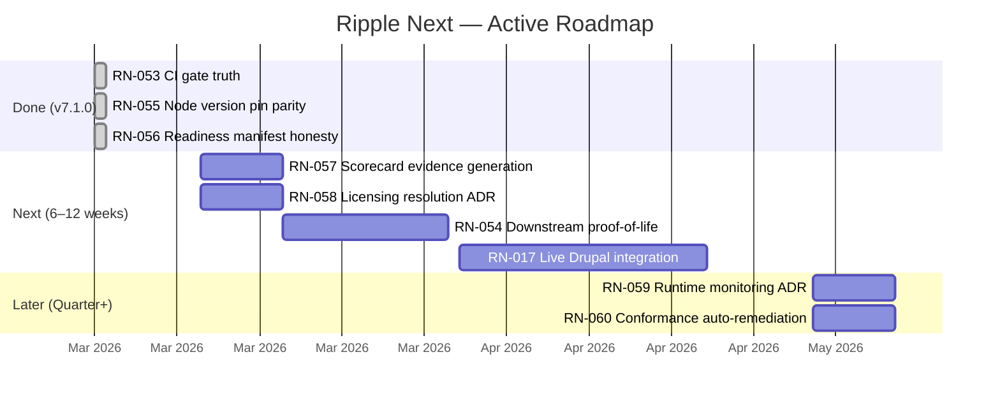

# Ripple Next — Product Roadmap

> v7.1.0 | 2026-03-01
>
> **AI-first platform.** Every item is machine-parseable (`RN-XXX`), includes
> AI-first benefit rationale, and is organised by time horizon for execution
> clarity. Supersedes the tier system ([ADR-016](../adr/016-roadmap-reorganisation.md))
> with Now/Next/Later planning.
>
> 54 items completed (51 archived in **[ARCHIVE.md](./ARCHIVE.md)**, 3 in Done below).
> 6 items active. 5 items parked.

---

## Roadmap Timeline



## Agent-Friction Scorecard

> **Status:** Interim self-assessment with known gaps flagged. Pending automated
> evidence generation ([RN-057](#rn-057-agent-friction-scorecard--evidence-based-generation)).

| Dimension | Score | Notes | Known gaps |
|-----------|-------|-------|------------|
| Setup determinism | 5/5 | Pinned pnpm, lockfile, `.env.example` + Zod env validation, devcontainer. `.nvmrc` and `engines.node` exact match enforced by `pnpm doctor` (RN-055 done) | — |
| One-command workflows | 5/5 | `pnpm bootstrap` — zero-to-ready, non-interactive | — |
| Local dev parity with CI | 4/5 | Shared tooling, dockerized deps, devcontainer. CI gates classified as blocking or advisory in [`docs/ci-gates.md`](../ci-gates.md) (RN-053 done). Readiness + quarantine now blocking | 3 advisory gates remain (a11y, perf, gate summary artifact) — promote when environment-stable |
| Test reliability | 3/5 | Quarantine policy, unified `test:ci`, mock providers | No multi-contributor validation; no production evidence |
| Dependency + toolchain pinning | 5/5 | Exact Node (.nvmrc = engines.node = 22.22.0) + pnpm (packageManager) with doctor guards (RN-055 done) | — |
| Observability of failures | 5/5 | JUnit XML, Playwright traces, SBOM, JSON diagnostics | — |
| Automated remediation | 3/5 | `pnpm doctor --json`, conformance CLI, error taxonomy | `conform --fix` not implemented ([RN-060](#rn-060-conformance-cli-auto-remediation-prs)); fleet sync untested |
| Agent workflow integration | 5/5 | Runbooks, generators, error taxonomy ([ADR-018](../adr/018-ai-first-workflow-strategy.md)) | — |

**Overall: 35/40** (interim; gaps tracked as active roadmap items)

---

## North Star

Ripple Next is the **AI-augmented golden-path for government digital platforms**.
Downstream teams ship faster, safer, and more accessibly because the golden path
eliminates undifferentiated work and AI agents operate as first-class contributors
across the fleet.

**Platform status:** 16/16 subsystems with `maturity` field in
[`readiness.json`](../readiness.json) (RN-056 done). Distribution:
2 integration-tested (auth, database), 8 conformance-tested (queue, storage,
email, events, CMS, UI, API, testing-infra), 6 interface-defined
(infrastructure, CI, publishing, navigation, agent-tooling, fleet-governance).
0 production-proven. See [`readiness.json`](../readiness.json) for
per-subsystem detail.

## Themes

1. **Honesty & trust** — ~~Fix self-assessed scores, label subsystem maturity correctly, make CI gates deterministic~~ (RN-053 done, RN-055 done, RN-056 done). Remaining: automated evidence generation (RN-057)
2. **Production credibility** — Resolve licensing, publish packages, deploy first downstream consumer (RN-058, RN-054)
3. **Quality depth** — Live CMS validation, runtime monitoring (RN-017, RN-059)
4. **Fleet automation** — Auto-remediation for downstream repos once fleet exists (RN-060)

---

## Done (v7.1.0)

> Honesty debt items shipped 2026-03-01. Moved to [ARCHIVE.md](./ARCHIVE.md) on next roadmap version.

### RN-053: CI Gate Truth — Enforce or Explicitly Label Advisory Gates

**Status:** Done (2026-03-01)

- [x] Each `|| true` gate either made blocking or explicitly labeled "advisory" with workflow comment and entry in `docs/ci-gates.md`
- [x] Scorecard "Local dev parity with CI" updated (3/5 → 4/5)
- [x] `pnpm verify` remains the authoritative local gate (no `|| true`)

**Changes:** `check:readiness` and `check:quarantine` made blocking in `reusable-quality.yml`. Gate summary, a11y audit, perf audit labeled advisory with comments. Created `docs/ci-gates.md`.
**Verified:** `grep -rn 'continue-on-error' .github/workflows/` returns 0 results. `grep -rn '|| true' .github/workflows/` returns only deploy health checks, fleet sync, and 3 documented advisory gates. `pnpm verify` passes (10/10).

---

### RN-055: Node Version Pin Parity

**Status:** Done (2026-03-01)

- [x] `engines.node` in `package.json` changed to `22.22.0` (exact, matching `.nvmrc`)
- [x] `pnpm doctor` validates `.nvmrc` and `engines.node` show same value (new check added)
- [x] Conformance rubric remediation text references `.nvmrc` as source of truth
- [x] Upgrade procedure: update `.nvmrc` first, then `engines.node` follows

**Verified:** `.nvmrc` (22.22.0) = `engines.node` (22.22.0) = MATCH. `pnpm doctor` passes with pin parity check.

---

### RN-056: Readiness Manifest Honesty — Subsystem Maturity Levels

**Status:** Done (2026-03-01)

- [x] `maturity` field added to all 16 subsystems in `readiness.json`
- [x] `pnpm check:readiness` validates `maturity` field exists and value is valid
- [x] North Star section updated to reference maturity distribution

**Distribution:** 2 integration-tested, 8 conformance-tested, 6 interface-defined, 0 production-proven.
**Verified:** `pnpm check:readiness` passes (90/90 checks). `readiness.json` version bumped to 0.26.0 with `maturityLevels` legend.

---

## Next (6–12 weeks)

> Resolve blockers for production credibility. Dependencies from Now items understood.

### RN-057: Agent-Friction Scorecard — Evidence-Based Generation

**Tier:** 2 | **Priority:** High | **Impact:** High | **Effort:** Medium | **Risk:** Low
**Source:** Critique 3 — "A perfect score across all 8 dimensions is not credible self-assessment"
**AI-first benefit:** Replaces manual self-assessment with a deterministic, reproducible measurement command.
**Status:** Planned
**Dependencies:** ~~RN-053~~ (done — gate classification available in `docs/ci-gates.md`)

#### Definition of Done

- [ ] `scripts/scorecard.mjs` evaluates all 8 dimensions against verifiable criteria
- [ ] Output: `ripple-scorecard/v1` JSON with dimension scores, evidence links, gap descriptions
- [ ] Static scorecard in roadmap replaced with `pnpm scorecard -- --json` reference
- [ ] Dimensions with gaps score < 5 with remediation notes

#### Verification

- `pnpm scorecard -- --json` outputs valid `ripple-scorecard/v1` JSON
- No dimension shows 5/5 without corresponding evidence artifact
- Score matches interim manual assessment (±2 points total)

**Links:** [Critique 3](../critique-evaluation.md), `scripts/conform.mjs` (pattern reference)

---

### RN-058: Licensing Resolution ADR — Government Procurement Compatibility

**Tier:** 2 | **Priority:** Critical | **Impact:** Very High | **Effort:** Medium | **Risk:** High
**Source:** Critique 3 — "Non-commercial licensing for government software is unusual and potentially incompatible with government procurement"
**AI-first benefit:** License ambiguity blocks automated publishing gates; clear licensing enables deterministic npm publish decisions.
**Status:** Planned
**Dependencies:** None

PolyForm Noncommercial 1.0.0 may conflict with government contractor usage and
standard procurement frameworks. [RN-049](./ARCHIVE.md#rn-049-licensing-clarity-guardrail-spdx--dual-license-model)
added SPDX metadata but did not resolve the underlying licensing question.

#### Definition of Done

- [ ] ADR evaluating license options (PolyForm Noncommercial, Apache 2.0, MIT, dual-license, AGPL)
- [ ] Government procurement compatibility analysis included
- [ ] Decision documented with explicit rationale
- [ ] All `package.json` license fields updated if license changes
- [ ] LICENSE file updated if license changes

#### Verification

- ADR exists in `docs/adr/`
- `jq '.license' package.json` returns chosen SPDX identifier
- License compatible with identified government procurement frameworks

**Links:** [Critique 3](../critique-evaluation.md), [RN-049](./ARCHIVE.md#rn-049-licensing-clarity-guardrail-spdx--dual-license-model), LICENSE

---

### RN-054: Downstream Proof-of-Life — First Consumer Deployment

**Tier:** 2 | **Priority:** Critical | **Impact:** Very High | **Effort:** High | **Risk:** High
**Source:** Critique 3 — "the project is a promising skeleton with exceptional documentation — but a skeleton nonetheless"
**AI-first benefit:** Validates that agents can scaffold, configure, test, and deploy a downstream repo end-to-end using platform tooling.
**Status:** Planned
**Dependencies:** [RN-058](#rn-058-licensing-resolution-adr--government-procurement-compatibility), ~~RN-053~~ (done)

The single most important item on the roadmap. Creates one downstream repo using
`pnpm generate:scaffold`, publishes @ripple-next/* packages, consumes them, and
deploys to staging. Validates or invalidates Critique 3's central finding.

#### Definition of Done

- [ ] Downstream repo created via `pnpm generate:scaffold`
- [ ] At least 3 @ripple-next/* packages consumed from registry (auth, db, ui)
- [ ] Downstream CI passes using golden-path reusable workflows
- [ ] Fleet drift detection runs against downstream repo
- [ ] Downstream deployed to staging environment (SST)
- [ ] `pnpm conform -- --target=../downstream-repo` scores ≥ 70

#### Verification

- `npm view @ripple-next/auth versions` returns ≥ 1 published version
- Downstream repo CI green with artifact uploads
- `pnpm conform -- --json --target=../downstream-repo` → score ≥ 70
- Fleet drift report shows compliance status

**Links:** [Critique 3](../critique-evaluation.md), `scripts/generate/scaffold.mjs`, `docs/downstream-workflows.md`

---

### RN-017: Live Drupal Integration Testing

**Tier:** 2 | **Priority:** Medium | **Impact:** Medium | **Effort:** Medium | **Risk:** Medium
**Source:** CMS integration gap — continues [RN-004](./ARCHIVE.md#rn-004-drupaltide-cms-integration-ripplecms)
**AI-first benefit:** Validates CMS provider against real Drupal, giving agents confidence in content-layer operations.
**Status:** Blocked → activating Docker fallback (Q2 2026 deadline reached)
**Dependencies:** None

Integration test with a real Drupal/Tide instance to validate DrupalCmsProvider.
Original plan awaited live URLs from content team. Q2 2026 Docker fallback now active.

#### Definition of Done

- [ ] Docker-based Tide fixture (Drupal + Tide modules) in `docker-compose.test.yml` or Testcontainer
- [ ] Integration test suite exercising all CMS provider methods against real Drupal
- [ ] CI job runs integration tests on schedule (not every PR)
- [ ] `readiness.json` CMS blocker removed

#### Verification

- `docker compose -f docker-compose.test.yml up drupal` starts Tide instance
- `pnpm test:integration -- --filter=cms` passes against Docker Drupal
- `jq '.subsystems.cms.blockers' docs/readiness.json` returns `[]`

**Links:** [RN-004](./ARCHIVE.md#rn-004-drupaltide-cms-integration-ripplecms), `packages/cms/`

---

## Later (Quarter+)

> Strategic items. Execute after downstream proof-of-life validates the platform.

### RN-059: Runtime Monitoring ADR — Observability for Lambda-First Architecture

**Tier:** 3 | **Priority:** Medium | **Impact:** High | **Effort:** Medium | **Risk:** Medium
**Source:** Risks table (ongoing) — "No runtime monitoring/alerting"
**AI-first benefit:** Structured monitoring enables agents to diagnose production issues using machine-readable telemetry.
**Status:** Planned
**Dependencies:** [RN-054](#rn-054-downstream-proof-of-life--first-consumer-deployment) (needs production-like deployment)

#### Definition of Done

- [ ] ADR evaluating CloudWatch, Datadog, OpenTelemetry for Lambda + Nuxt SSR
- [ ] Cost model for each option at 3 scale tiers
- [ ] Structured alert schema for agent-parseable alerts
- [ ] Error taxonomy integration plan (RPL-MONITOR-* codes)

#### Verification

- ADR exists in `docs/adr/`
- Decision rationale includes Lambda cold-start and SSR considerations
- Cost estimates provided for 3 scale tiers

**Links:** Risks table, `sst.config.ts`

---

### RN-060: Conformance CLI Auto-Remediation PRs

**Tier:** 3 | **Priority:** Medium | **Impact:** Medium | **Effort:** Medium | **Risk:** Low
**Source:** Deferred follow-up from [RN-028](./ARCHIVE.md#rn-028-golden-path-conformance-cli)
**AI-first benefit:** Agents auto-fix downstream conformance gaps without human scaffolding decisions.
**Status:** Planned
**Dependencies:** [RN-054](#rn-054-downstream-proof-of-life--first-consumer-deployment) (needs downstream repo to target)

#### Definition of Done

- [ ] `pnpm conform -- --fix --target=path` generates missing files from templates
- [ ] `pnpm conform -- --fix --pr` creates a GitHub PR with remediation changes
- [ ] Only scaffolds files for failed checks; does not overwrite existing
- [ ] Dry-run mode shows what would be created

#### Verification

- Running against repo missing 3 conformance files creates exactly those 3 files
- `pnpm conform -- --fix --dry-run --target=path` shows planned changes without writing
- Post-fix conformance score improves

**Links:** [RN-028](./ARCHIVE.md#rn-028-golden-path-conformance-cli), `scripts/conform.mjs`, `docs/conformance-rubric.json`

---

## Parked / Not Doing

| Item | Reason | Trigger |
|------|--------|---------|
| Visual regression (Chromatic/Percy) | Deferred from [RN-020](./ARCHIVE.md#rn-020-storybook-stories-for-tide-components). Not justified by current UI churn. | Pull in when UI library has ≥ 3 downstream consumers |
| Portal publication infrastructure | Deferred from [RN-025](./ARCHIVE.md#rn-025-contract-testing-across-consumers) Phase 4b. | Pull in when external integrators are onboarded |
| SDK generation from OpenAPI spec | Deferred from [RN-025](./ARCHIVE.md#rn-025-contract-testing-across-consumers). | Pull in when consumer demand exists |
| Testcontainers router integration tests | Deferred from [RN-046](./ARCHIVE.md#rn-046-orpc-migration--router-integration-harness-testcontainers). Contract tests sufficient. | Pull in when API complexity warrants router-level DB tests |
| Conform as optional verify gate | Deferred from [RN-028](./ARCHIVE.md#rn-028-golden-path-conformance-cli). | Pull in when downstream repos use conform regularly |

---

## Risks & Unknowns

| Risk | Mitigation |
|------|------------|
| RN-017 blocked on content team | Docker Tide fixture fallback activated (Q2 2026 deadline reached) |
| PolyForm Noncommercial may conflict with government procurement | [RN-058](#rn-058-licensing-resolution-adr--government-procurement-compatibility) in Next |
| No runtime monitoring/alerting | [RN-059](#rn-059-runtime-monitoring-adr--observability-for-lambda-first-architecture) in Later |
| No downstream consumer exists | [RN-054](#rn-054-downstream-proof-of-life--first-consumer-deployment) in Next |
| ~~CI gates suppressed (`\|\| true`)~~ | Resolved: RN-053 done — gates classified as blocking or advisory in `docs/ci-gates.md` |
| Agent-Friction Scorecard self-assessed | [RN-057](#rn-057-agent-friction-scorecard--evidence-based-generation) in Next |
| Every package still v0.1.0 | Blocked by [RN-058](#rn-058-licensing-resolution-adr--government-procurement-compatibility); first real publish in [RN-054](#rn-054-downstream-proof-of-life--first-consumer-deployment) |

---

## Suggestion Triage Log (v7.0.0)

### Adopted

| Suggestion | Source | Action |
|-----------|--------|--------|
| Enforce perf/a11y CI pass/fail semantics | AI agent analysis | Folded into [RN-053](#rn-053-ci-gate-truth--enforce-or-explicitly-label-advisory-gates) (broader scope — all 5 suppressed gates) |
| Node pin policy parity (.nvmrc vs engines) | AI agent analysis | Adopted as [RN-055](#rn-055-node-version-pin-parity) |
| Phase RN-028 into scoring then auto-remediation | AI agent analysis | RN-028 scoring complete; auto-remediation captured as [RN-060](#rn-060-conformance-cli-auto-remediation-prs) |
| Replace static perfect score with evidence artifact | AI agent analysis | Adopted as [RN-057](#rn-057-agent-friction-scorecard--evidence-based-generation) |

### Rejected

| Suggestion | Source | Rationale |
|-----------|--------|-----------|
| Bootstrap contract truth enforcement | AI agent analysis | Bootstrap script (`pnpm install && pnpm doctor`) matches its documentation. No docs-script discrepancy found. Adding `validate:env` to bootstrap would fail on fresh clones without `.env` file. |

---

## AI Agent Suggestions

> AI agents propose new items here using the template below. Suggestions are
> triaged during periodic reviews. **Do not self-triage into active sections.**

### Template

```markdown
#### RN-XXX: Short Descriptive Title

**Category:** `[New Item]` | `[Priority Change]` | `[Risk Flag]` | `[Removal]`
**Source:** Agent type and analysis context
**Date:** YYYY-MM-DD
**Impact:** Low | Medium | High | Very High
**Effort:** Low | Medium | High
**Risk:** Low | Medium | High
**AI-first benefit:** One sentence explaining how this helps AI agent workflows

Description with rationale and evidence.

**Affected items:** RN-XXX, RN-YYY (if applicable)
**Proposed action:** What should happen

Checklist (if `[New Item]`):
- [ ] Task 1
- [ ] Task 2
```

### Open AI Suggestions

_No open suggestions. All suggestions triaged in v7.0.0 (see Triage Log above)._

---

## Tech Lead Suggestions

> Human tech leads propose changes here. AI agents MUST read but MUST NOT modify.

### Open Suggestions

_No open suggestions._

---

## Archive (Done)

54 items completed (RN-001 through RN-056, excluding RN-017 and RN-054).
51 archived in **[ARCHIVE.md](./ARCHIVE.md)**; RN-053, RN-055, RN-056 in Done section above.

Cross-references: [ADR index](../adr/README.md) | [Readiness](../readiness.json) | [Architecture](../architecture.md) | [Critique](../critique-evaluation.md)
