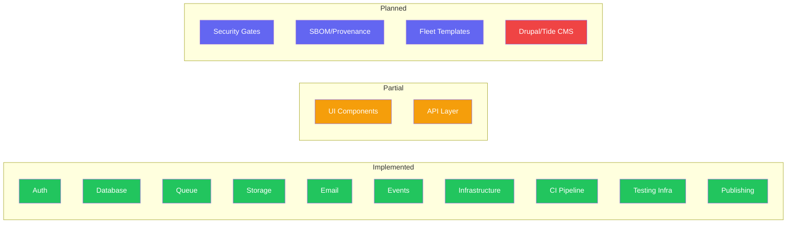
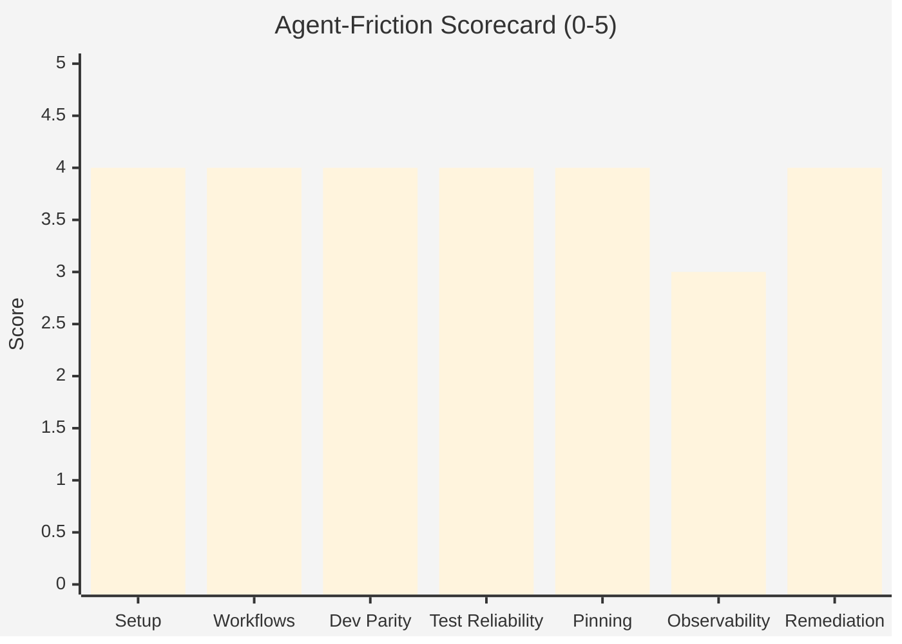
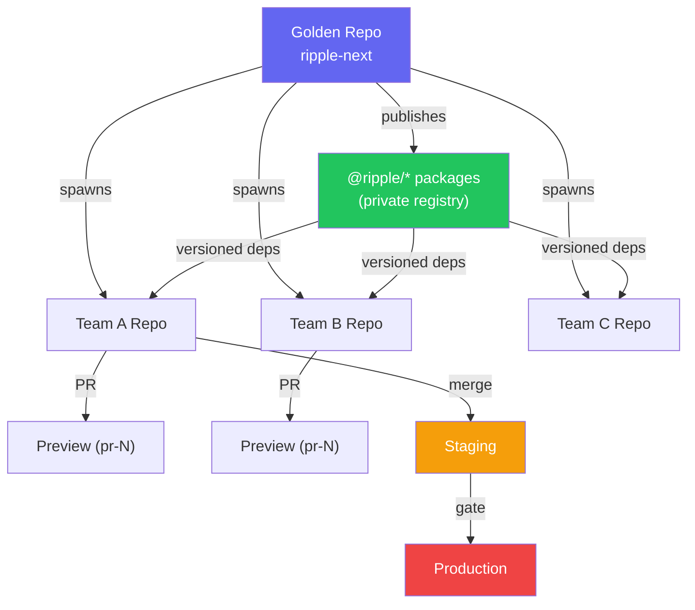
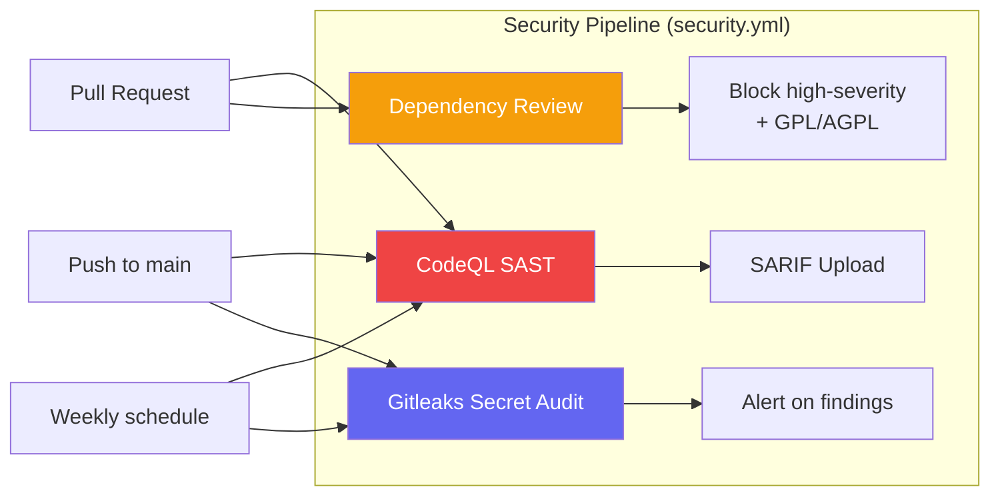
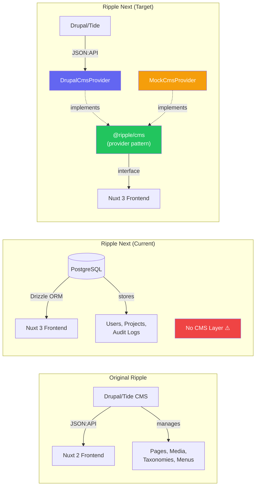
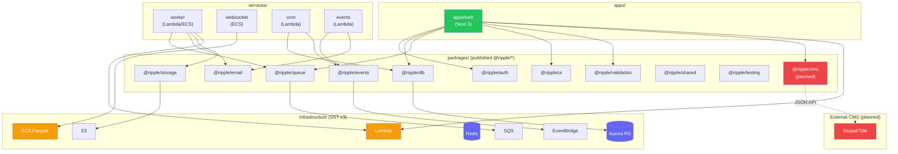
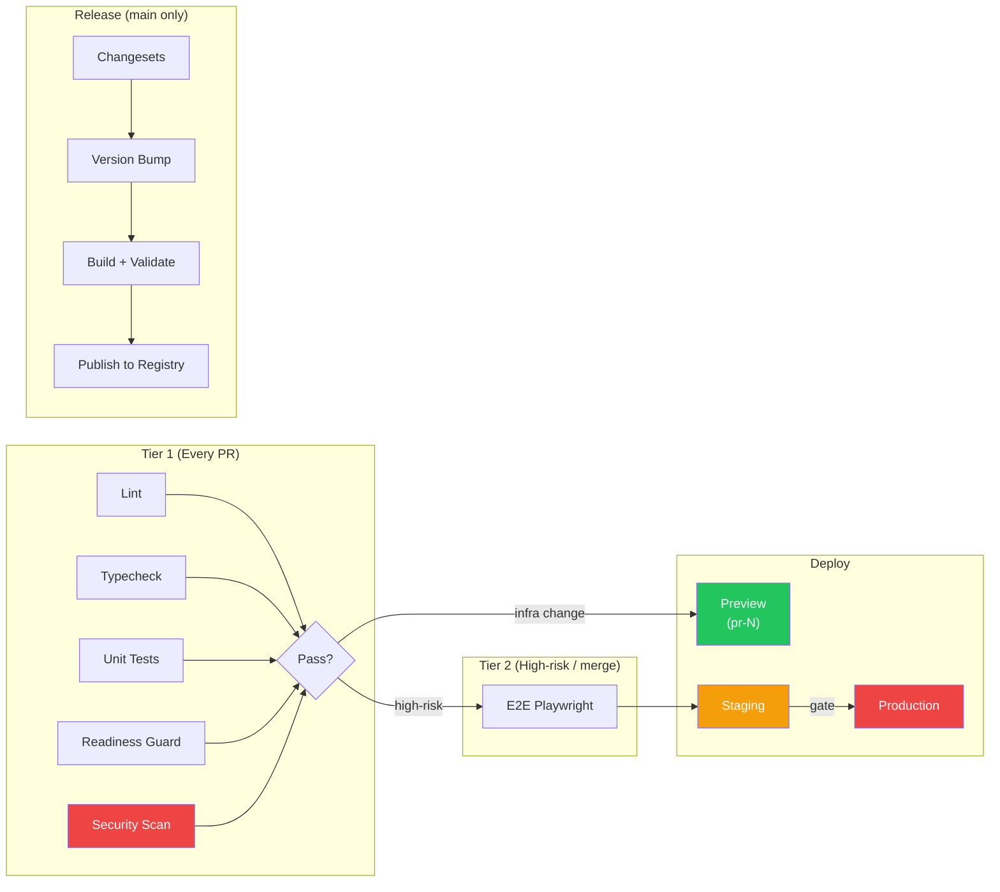
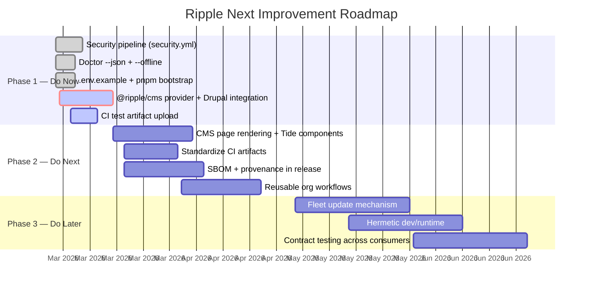
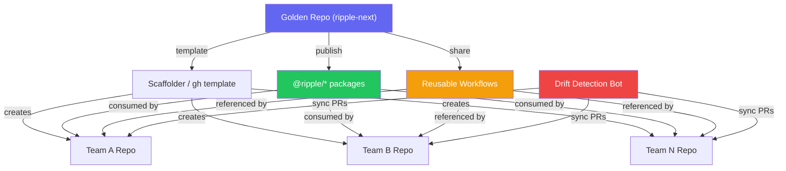

# Ripple Next — Product Roadmap

> Last updated: 2026-02-27 | Version: 1.0.0

## Executive Verdict

**Ship-ready? Yes, with conditions.**

The repo has strong foundations for an AI-first government digital platform:
pinned package manager + lockfile discipline, a dedicated `pnpm doctor` command,
tiered CI, isolated preview stages, and changeset-based publishing.

### Platform Maturity Overview

### Top Blockers

| # | Blocker | Impact | Status |
|---|---------|--------|--------|
| 1 | **No Drupal/Tide CMS integration** — the original Ripple is a Drupal design system; Ripple Next has no CMS content layer | Critical — blocks content parity with original Ripple | **Planned** |
| 2 | No security/supply-chain workflow gates (SAST/SCA/secret scanning/SBOM/provenance) | Critical — required for hostile-internet assumptions and fleet trust | **In Progress** |
| 3 | Doctor has non-resilient network check (npm ping hard-fails), no machine-readable output for agents | High — breaks ephemeral/offline runners | **Done** |
| 4 | No standardized env contract artifact (.env.example/schema) | High — hidden setup variance across teams/agents | **Done** |
| 5 | CI artifact observability is partial (Playwright only, no structured reports for unit/integration) | Medium — limits CI debugging at scale | Planned |
| 6 | Fleet template/update mechanics underdefined (no "template sync" for downstream repos) | Medium — impacts fleet-scale operations | Planned |

---

## Agent-Friction Scorecard

| Dimension | Score | Notes |
|-----------|-------|-------|
| Setup determinism | 4/5 | Strong pinning (pnpm@9.15.4, Node 22 via engines + .nvmrc), lockfile present, frozen installs in CI. `.env.example` added. |
| One-command workflows | 4/5 | `pnpm bootstrap` provides zero-to-ready flow. Core commands clean (`pnpm dev/build/test/lint/typecheck`). |
| Local dev parity with CI | 4/5 | Shared pnpm/node/tooling and Postgres/Redis in CI; docker-compose mirrors infra locally. |
| Test reliability / flake resistance | 4/5 | Playwright retries, CI single worker, trace/screenshot on failure; coverage thresholds by risk tier. |
| Dependency + toolchain pinning | 4/5 | `packageManager` + lockfile + node versioning present; many deps still semver-ranged (normal). |
| Observability of failures | 3/5 | Good baseline + Playwright artifact upload; broader standardized test artifacts missing. |
| Automated remediation friendliness | 4/5 | `pnpm doctor --json` provides stable machine contract. `--offline` flag for ephemeral runners. |

**Overall: 27/35** — Strong foundation, improved from 25/35 with bootstrap and doctor upgrades.

---

## Concurrency + Scale Readiness

### Multi-team development
Good ownership boundaries via CODEOWNERS on critical surfaces (infra/schema/auth/contracts).

### Environment/deployment concurrency
Strong PR stage namespacing (`pr-{number}`) + cleanup workflow; CI concurrency
cancel-in-progress by ref.

### Repo templating/bootstrapping strategy
Architecture docs are solid, but no explicit template-generation + update propagation
mechanism for downstream clones.

### Versioning for 100s of projects
Changesets + private package publishing is the right direction for fleet upgrades
without lockstep deploys.

---

## Security + Supply Chain

| Area | Current State | Target |
|------|--------------|--------|
| Secrets handling | Workflows use OIDC role assumption (good) | Add secret scanning in CI |
| Dependency risk | No scanning workflow | Add dependency scan (Dependabot/Trivy) |
| SBOM/provenance | Not present | CycloneDX/SPDX + signed attestations |
| SAST/DAST | Not present | CodeQL/Semgrep + SARIF upload |

---

## Drupal/Tide CMS Integration (Gap Analysis)

The original [Ripple design system](https://github.com/dpc-sdp/ripple) is tightly
coupled to **Tide** — a Drupal distribution that serves as the content management
backend for Victorian government websites. Ripple Next currently has **no CMS or
content management integration**. The platform's data model covers users, projects,
and audit logs, but lacks content entities (pages, sections, media, taxonomies,
menus) that are fundamental to the original Ripple's purpose.

This is a **high-priority gap** that must be addressed to achieve parity with the
original system and serve government content publishing use cases.

### What needs to be built

| Component | Description | Priority |
|-----------|-------------|----------|
| `@ripple/cms` package | CMS provider interface with content types (pages, media, taxonomies, menus, search) | **High** |
| `DrupalCmsProvider` | JSON:API client for Drupal/Tide — fetches pages, routes, menus, taxonomies | **High** |
| `MockCmsProvider` | In-memory CMS for tests and local dev without Drupal | **High** |
| Content type schemas | Zod schemas in `@ripple/validation` for CMS content entities | **High** |
| CMS conformance tests | Provider conformance suite in `@ripple/testing/conformance/` | **High** |
| Page rendering layer | Nuxt pages/components that render CMS content (landing pages, content pages, media galleries) | Medium |
| Tide-compatible components | UI components matching original Ripple's Tide content types (accordion, card collection, timeline, etc.) | Medium |
| Search integration | Search provider interface (MeiliSearch/Elasticsearch) for content indexing | Medium |

### Design principles

The CMS integration should follow the same **provider pattern** used throughout
the codebase:

1. **`@ripple/cms/types.ts`** — CMS provider interface
2. **`@ripple/cms/providers/mock.ts`** — Memory provider for tests
3. **`@ripple/cms/providers/drupal.ts`** — Drupal JSON:API client
4. **Tests ALWAYS use MockCmsProvider** — no Drupal dependency in tests
5. **Conformance suite** validates any CMS provider implements the full contract

This ensures Ripple Next can work with Drupal/Tide (for government sites that
already use it) while remaining CMS-agnostic for new deployments.

---

## Architecture + Maintainability

| Area | Assessment |
|------|-----------|
| Module boundaries | **Very strong.** Hybrid monorepo with provider/repository patterns and explicit package segmentation. |
| API contracts | tRPC + repository pattern + health endpoint guidance is clear; readiness manifest records subsystem maturity. |
| Configuration strategy | SST centralizes infra and stage behavior; good defaults for production protect/retain. |
| Backwards compatibility | Changesets and package publishing support incremental consumer upgrades — key fleet strength. |
| CMS integration | **Missing.** No content management layer. Original Ripple's Drupal/Tide integration not yet ported. |

---

## CI/CD and Release Engineering

| Area | Assessment |
|------|-----------|
| Pipeline design | Tiered CI with path filters and risk-triggered E2E is efficient and scalable. |
| Reproducible builds | Node 22 + frozen lockfile + consistent pnpm usage; no full hermetic containerized build yet. |
| Artifact strategy | E2E artifacts on failure exist; broaden to JUnit/coverage artifacts for all quality jobs. |
| Progressive delivery | Preview/staging/production paths defined; production uses environment gate + SST protect/retain. |

---

## Roadmap Phases

### Phase 1: Do Now (1-2 weeks)

#### 1.1 Security Pipeline (`security.yml`)

**Impact:** Very High | **Effort:** Medium | **Risk:** Low

Add a security workflow with CodeQL/Semgrep for SAST, dependency scanning,
and secret scanning with SARIF upload to GitHub Security tab.

See: `.github/workflows/security.yml` (added with this roadmap)

- [x] Create security.yml with CodeQL, dependency review, and Gitleaks
- [ ] Enable GitHub Advanced Security on the repository
- [ ] Validate SARIF upload produces findings in Security tab
- [ ] Add branch protection rule requiring security checks to pass

#### 1.2 Doctor Machine Mode (`--json`)

**Impact:** High | **Effort:** Medium | **Risk:** Low

Upgrade `scripts/doctor.sh` to support `--json` flag for machine-readable
output and resilient network checks (soft-fail on network when `--offline`
is passed).

See: `scripts/doctor.sh` (updated with this roadmap)

- [x] Add `--json` flag for structured output
- [x] Add `--offline` flag for ephemeral runners
- [x] Demote network check from hard-fail to warning
- [ ] Update CI workflows to use `pnpm doctor --json` where appropriate

#### 1.3 Environment Contract (`.env.example`)

**Impact:** High | **Effort:** Medium | **Risk:** Low

Add `.env.example` documenting all environment variables with defaults and
descriptions. Add `pnpm bootstrap` command for zero-to-ready setup.

See: `.env.example` (added with this roadmap)

- [x] Create `.env.example` with all env vars documented
- [x] Add `pnpm bootstrap` command to package.json
- [ ] Verify docker-compose uses matching env var names

#### 1.4 Drupal/Tide CMS Integration (`@ripple/cms`)

**Impact:** Very High | **Effort:** High | **Risk:** Medium

The original Ripple design system is built on Drupal/Tide. Ripple Next must
provide a CMS content layer to serve government content publishing use cases.
Following the provider pattern, create `@ripple/cms` with Drupal JSON:API
integration and a mock provider for testing.

See: [Drupal/Tide CMS Integration](#drupaltide-cms-integration-gap-analysis)

- [ ] Create `packages/cms/` with CMS provider interface (`types.ts`)
- [ ] Implement `MockCmsProvider` for tests and local dev
- [ ] Implement `DrupalCmsProvider` with JSON:API client for Tide
- [ ] Add CMS conformance test suite to `packages/testing/conformance/`
- [ ] Add content type Zod schemas to `packages/validation/`
- [ ] Wire CMS provider into Nuxt server context
- [ ] Add `NUXT_CMS_BASE_URL` to `.env.example` and runtime config
- [ ] Update `readiness.json` with CMS subsystem entry

#### 1.5 CI Test Artifact Upload

**Impact:** Medium | **Effort:** Low | **Risk:** Low

Add structured test result uploads (JUnit XML + coverage reports) to the
test job in CI for better observability.

- [ ] Add Vitest JUnit reporter to test configuration
- [ ] Upload test results as artifacts in CI
- [ ] Add coverage summary comment on PRs

---

### Phase 2: Do Next (1-2 months)

#### 2.1 CMS Page Rendering + Tide Components

**Impact:** Very High | **Effort:** High | **Risk:** Medium

Build Nuxt pages and UI components that render content from the CMS provider,
achieving visual and functional parity with the original Ripple design system's
Tide content types.

- [ ] Create dynamic page route (`/[...slug].vue`) that fetches from CMS provider
- [ ] Implement Tide-compatible components (accordion, card collection, timeline, etc.)
- [ ] Add landing page and content page templates
- [ ] Media gallery and document download components
- [ ] Navigation/menu rendering from CMS-provided menu structure
- [ ] Search integration provider (MeiliSearch for local, Elasticsearch for prod)
- [ ] Storybook stories for all new Tide-compatible components

#### 2.2 Standardize CI Artifacts

**Impact:** High | **Effort:** Medium | **Risk:** Low

JUnit XML, coverage reports, and test logs for every CI job with consistent
retention and naming policy.

- [ ] Configure Vitest JUnit reporter across all workspaces
- [ ] Upload artifacts with standardized naming (`{job}-{suite}-results`)
- [ ] Set retention policy (30 days for reports, 7 days for traces)

#### 2.3 SBOM + Provenance in Release

**Impact:** High | **Effort:** Medium | **Risk:** Medium

Add CycloneDX/SPDX SBOM generation and signed attestations to the release
workflow.

- [ ] Add `@cyclonedx/bom` or equivalent to release pipeline
- [ ] Generate provenance attestations with `actions/attest-build-provenance`
- [ ] Publish SBOM alongside package releases

#### 2.4 Reusable Org Workflows

**Impact:** Very High | **Effort:** Medium | **Risk:** Medium

Publish reusable GitHub Actions workflows for lint/test/typecheck/security/deploy
patterns that downstream repos can reference.

- [ ] Extract workflow steps into reusable composite actions
- [ ] Create `.github/actions/` directory with shared actions
- [ ] Document workflow consumption pattern for downstream repos

---

### Phase 3: Do Later (Quarterly)

#### 3.1 Fleet Update Mechanism

**Impact:** Very High | **Effort:** High | **Risk:** Medium

Template repo + sync bot + policy drift reporting for downstream clones.

- [ ] Create template repository from this golden-path source
- [ ] Build GitHub App or Action for template drift detection
- [ ] Automated sync PRs for security/standards updates

#### 3.2 Hermetic Dev/Runtime

**Impact:** High | **Effort:** High | **Risk:** Medium

Devcontainer/Nix/asdf profile for deterministic agent runners at scale.

- [ ] Evaluate devcontainer vs Nix for agent runner reproducibility
- [ ] Create hermetic profile that pins all system dependencies
- [ ] Validate in CI with containerized runners

#### 3.3 Contract Testing Across Consumers

**Impact:** High | **Effort:** High | **Risk:** Medium

Formal compatibility contract testing across published `@ripple/*` package
consumers.

- [ ] Define contract test patterns for package consumers
- [ ] Integrate consumer contract tests into release workflow
- [ ] Automated breaking-change detection and notification

---

## Proposed Golden Path

### Ideal developer/agent workflow

### Minimal required repo standards checklist

- [x] Pinned runtime/package manager + lockfile enforced
- [x] Non-interactive bootstrap + doctor(json)
- [x] Env contract (`.env.example`)
- [x] Tiered CI with path filtering
- [x] Security gates in CI (`security.yml`)
- [x] PR preview isolation + automatic teardown
- [x] Changeset/release automation
- [ ] SBOM/provenance in releases
- [x] CODEOWNERS + policy checks on critical paths

### Template strategy (spawn + keep updated)

Maintain this repo as golden-path source, plus:

1. **Template distribution layer** — GitHub template or scaffolder
2. **Reusable org workflows** — referenced by all derived repos
3. **Automated drift detection** — sync PRs for standards/security updates
4. **Keep domain logic in versioned `@ripple/*` libraries** — keep templates thin

