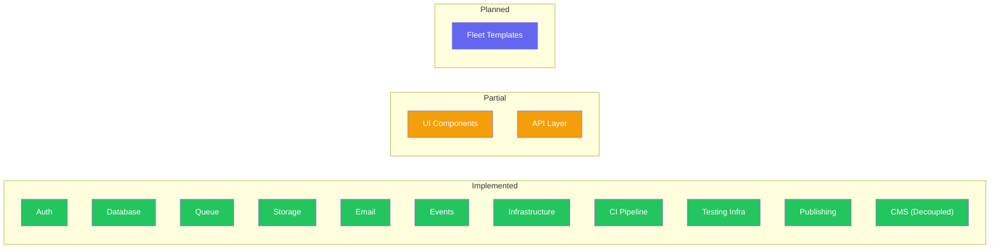
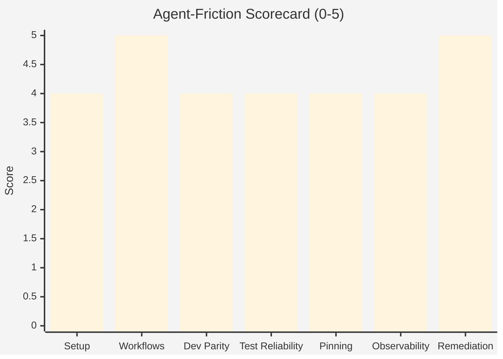
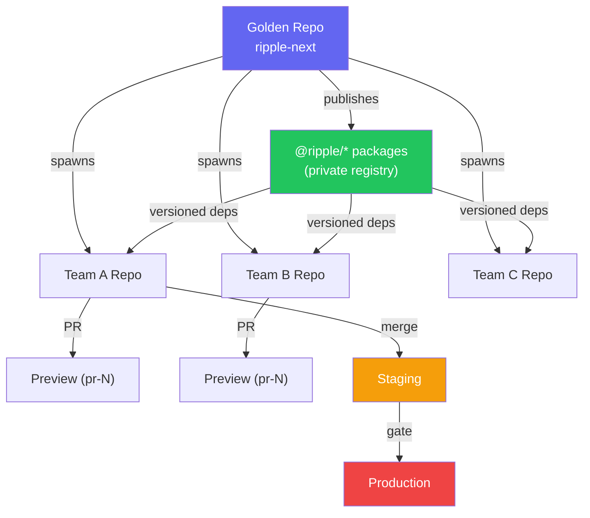
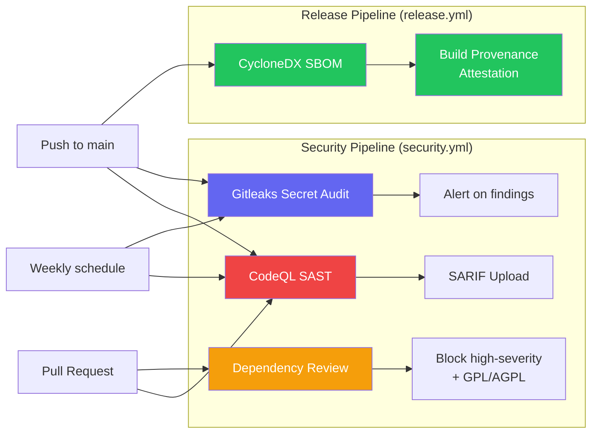
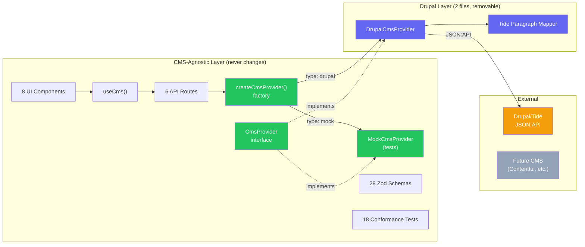
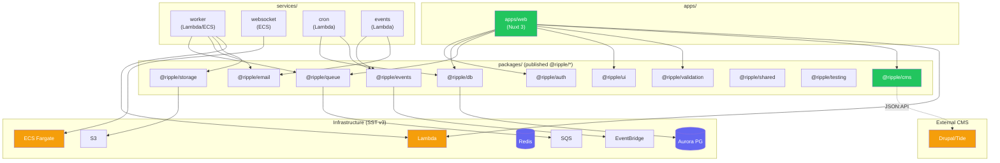
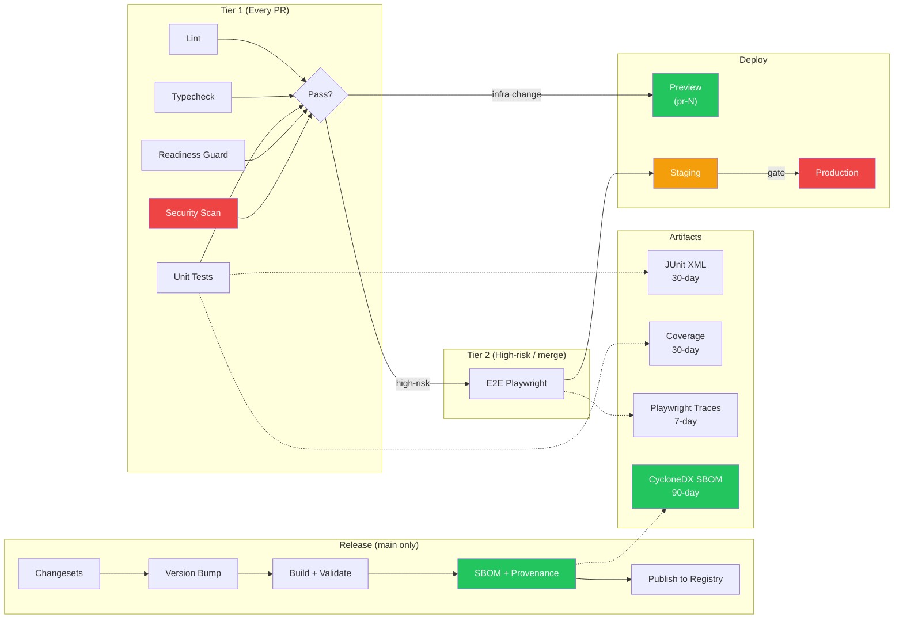
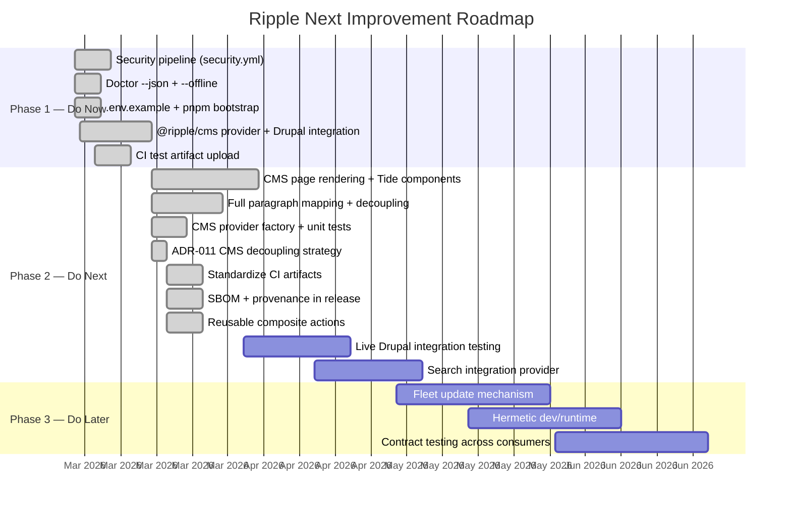
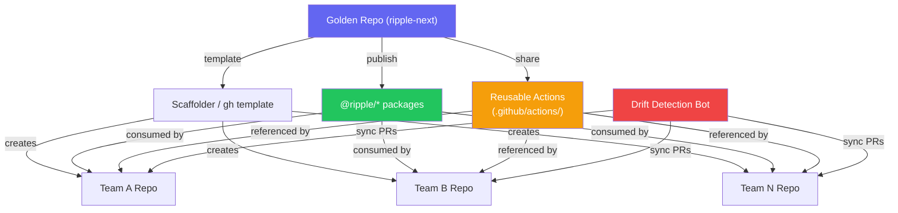

# Ripple Next — Product Roadmap

> Last updated: 2026-02-27 | Version: 1.4.0

## Executive Verdict

**Ship-ready? Yes, with conditions.**

The repo has strong foundations for an **AI-first** government digital platform:
pinned package manager + lockfile discipline, a dedicated `pnpm doctor` command,
tiered CI with structured test artifacts, isolated preview stages, changeset-based
publishing with SBOM and provenance, and reusable composite actions for fleet
consistency.

Top blockers before this can be the default golden path for a large AI-first fleet:

1. ~~**CMS content layer**~~ — `@ripple/cms` fully implemented with Drupal decoupling architecture. Full paragraph-to-section mapping, provider factory with dynamic imports, DrupalCmsProvider unit tests. Drupal isolated to 2 files, removable without touching frontend/tests/API. See ADR-011. **Done.**
2. **Fleet template/update mechanics** — Repo-template + sync bot for downstream upgrades.

### Evidence Highlights

- Deterministic package manager and lockfile usage present (`pnpm@9.15.4`, frozen lockfile in CI).
- CI is tiered with change detection and high-risk routing.
- **Structured test artifact uploads** — JUnit XML + coverage reports uploaded on every CI run with 30-day retention.
- **SBOM + provenance** — CycloneDX SBOM generated and build provenance attested on every release.
- **Reusable composite actions** — `setup`, `quality`, `test` actions available for downstream repos.
- Preview environments isolated per PR stage (`pr-{number}`) and cleaned on PR close.
- Changesets and private registry publish workflow in place.
- Provider pattern enables mock/memory providers for agent-fast test loops.
- `pnpm doctor --json` and `pnpm bootstrap` provide non-interactive agent ergonomics.
- `.env.example` with `NUXT_` prefixed vars documents the full environment contract.
- **Security pipeline** — CodeQL SAST, dependency review, Gitleaks secret audit.

### Platform Maturity Overview



### Top Blockers

| # | Blocker | Impact | Status |
|---|---------|--------|--------|
| 1 | ~~**Drupal/Tide CMS integration**~~ — Full provider pattern with decoupling architecture: MockCmsProvider + DrupalCmsProvider + provider factory + full paragraph mapping + unit tests. Drupal isolated to 2 files, removable per ADR-011. | Content parity + decoupling achieved | **Done** |
| 2 | ~~No security/supply-chain workflow gates (SAST/SCA/secret scanning/SBOM/provenance)~~ | ~~Critical~~ | **Done** |
| 3 | ~~Doctor has non-resilient network check (npm ping hard-fails), no machine-readable output for agents~~ | ~~High~~ | **Done** |
| 4 | ~~No standardized env contract artifact (.env.example/schema)~~ | ~~High~~ | **Done** |
| 5 | ~~CI artifact observability is partial (Playwright only, no structured reports for unit/integration)~~ | ~~Medium~~ | **Done** |
| 6 | Fleet template/update mechanics underdefined (no "template sync" for downstream repos) | Medium — impacts fleet-scale operations | Planned |

---

## LocalStack Assessment

**Short answer: not as the default local-dev path for this repository.**

This repo already uses a **provider pattern** with local-first implementations
(memory/mock, BullMQ, MinIO, SMTP) that are faster, simpler, and generally less
flaky for agent loops. LocalStack adds another orchestration layer and
service-emulation drift that often slows CI and increases triage cost in
high-concurrency setups.

For AI agents, fastest path is: mock/memory for unit tests, dockerized real
dependencies for integration tests, and isolated cloud preview stages for
end-to-end behavior.

**Recommended compromise:**

- Keep LocalStack **optional**, not required.
- Use it only for a narrow integration lane where AWS API-shape compatibility is
  specifically under test (e.g., SQS/S3 IAM policy behavior before preview deploy).
- Gate it behind a dedicated command/profile (`pnpm test:aws-compat`) so routine
  agent workflows remain low-friction.

## Local Runtime Reality (Agents + Developer Workstations)

Given the constraint — **AWS only for deployment environments**, while agents run
on whatever local runtime they have and developers are primarily on macOS — the
default path is platform-agnostic and Docker-friendly rather than
AWS-emulation-heavy.

**Design principles:**

- Core build/test loops runnable on macOS with just Node + pnpm (+ Docker when
  integration tests require infra dependencies).
- AWS treated as a **deployment target contract**, validated in preview/staging/prod,
  not as a mandatory local dependency.
- Local providers and mocks are first-class so ephemeral agents on heterogeneous
  machines execute deterministic quality gates.
- AWS-shape validation (including any LocalStack lane) reserved for targeted
  compatibility checks, not baseline `pnpm test` workflows.

---

## Agent-Friction Scorecard

| Dimension | Score | Notes |
|-----------|-------|-------|
| Setup determinism | 4/5 | Strong pinning (pnpm@9.15.4, Node 22 via engines + .nvmrc), lockfile present, frozen installs in CI. `.env.example` added. |
| One-command workflows | 5/5 | `pnpm bootstrap` provides zero-to-ready flow. Core commands clean. CMS provider factory auto-selects mock/drupal based on env config — zero setup for agents. |
| Local dev parity with CI | 4/5 | Shared pnpm/node/tooling and Postgres/Redis in CI; docker-compose mirrors infra locally. |
| Test reliability / flake resistance | 4/5 | Playwright retries, CI single worker, trace/screenshot on failure; coverage thresholds by risk tier. CMS tests use mock provider — zero network flakes. |
| Dependency + toolchain pinning | 4/5 | `packageManager` + lockfile + node versioning present; many deps still semver-ranged (normal). |
| Observability of failures | 4/5 | JUnit XML test artifacts uploaded on every CI run (30-day retention). Playwright traces on failure (7-day). Coverage reports available. Structured artifact naming convention. |
| Automated remediation friendliness | 5/5 | `pnpm doctor --json` provides stable machine contract. `--offline` flag for ephemeral runners. Reusable composite actions. CMS decoupling documented with mechanical removal/addition procedures (ADR-011). Provider conformance suites validate any change automatically. |

**Overall: 30/35** — Improved from 28/35 with CMS decoupling, provider factory auto-selection, and documented remediation procedures.



---

## Concurrency + Scale Readiness

### Multi-team development
Good ownership boundaries via CODEOWNERS on critical surfaces (infra/schema/auth/contracts).

### Environment/deployment concurrency
Strong PR stage namespacing (`pr-{number}`) + cleanup workflow; CI concurrency
cancel-in-progress by ref.

### Repo templating/bootstrapping strategy
Architecture docs are solid. Reusable composite actions (`.github/actions/`) provide
CI consistency for downstream repos. Full template-generation + update propagation
mechanism planned.

### Versioning for 100s of projects
Changesets + private package publishing is the right direction for fleet upgrades
without lockstep deploys.



---

## Security + Supply Chain

| Area | Current State | Target |
|------|--------------|--------|
| Secrets handling | Workflows use OIDC role assumption (good) + Gitleaks audit | Maintained |
| Dependency risk | Dependency review on PRs (blocks high-severity + GPL/AGPL) | Maintained |
| SBOM/provenance | CycloneDX SBOM generated on release + build provenance attestation | SPDX as additional format if compliance requires |
| SAST/DAST | CodeQL SAST with SARIF upload | Maintained |



---

## Drupal/Tide CMS Integration (Decoupled Architecture)

The original [Ripple design system](https://github.com/dpc-sdp/ripple) is tightly
coupled to **Tide** — a Drupal distribution that serves as the content management
backend for Victorian government websites. Ripple Next has a **fully decoupled CMS
content layer** via `@ripple/cms` that:

- **Supports Drupal/Tide** for existing government sites
- **Can pull out Drupal entirely** without touching frontend, tests, or API layer
- **Enables alternative CMS backends** (Contentful, Strapi, WordPress, etc.)

### Architecture: "Pull Out Drupal"

Drupal-specific code is isolated to exactly **2 files**:

```
packages/cms/providers/
├── drupal.ts                 # DrupalCmsProvider — JSON:API client
└── tide-paragraph-mapper.ts  # Tide paragraph → PageSection mapping
```

Everything else is CMS-agnostic: `CmsProvider` interface, `MockCmsProvider`,
UI components, composables, API routes, conformance tests, Zod schemas.

See [ADR-011](../adr/011-cms-decoupling-pull-out-drupal.md) for the full decoupling strategy.



### What was built

| Component | Description | Status |
|-----------|-------------|--------|
| `@ripple/cms` package | CMS provider interface with content types (pages, media, taxonomies, menus, search) | **Done** |
| `DrupalCmsProvider` | JSON:API client for Drupal/Tide with full paragraph mapping | **Done** |
| `MockCmsProvider` | In-memory CMS for tests and local dev without Drupal | **Done** |
| `createCmsProvider()` factory | Provider factory with dynamic imports for tree-shakeable Drupal code | **Done** |
| Tide paragraph mapper | Full mapping of all 8 Tide paragraph types to PageSection union | **Done** |
| DrupalCmsProvider unit tests | 20+ unit tests with JSON:API fixture data (no live Drupal needed) | **Done** |
| Content type Zod schemas | 28 Zod schemas in `@ripple/validation/schemas/cms.ts` | **Done** |
| CMS conformance tests | 18 conformance tests in `@ripple/testing/conformance/cms.conformance.ts` | **Done** |
| Page rendering layer | Dynamic page route at `/content/[...slug].vue` with section component rendering | **Done** |
| Tide-compatible components | 8 UI components (accordion, card collection, timeline, CTA, key dates, image, video, wysiwyg) | **Done** |
| ADR-011 | CMS decoupling strategy with documented removal and addition procedures | **Done** |

### What remains

| Component | Description | Priority |
|-----------|-------------|----------|
| Live Drupal integration test | Integration test with a real Drupal/Tide instance | Medium |
| Storybook stories | Stories for all 8 Tide-compatible content components | Medium |
| Search provider | Dedicated search provider (MeiliSearch/Elasticsearch) beyond CMS search | Medium |
| Landing page templates | Pre-built page templates for common government content layouts | Low |
| Navigation component | Menu rendering from CMS-provided menu structure | Low |

### Drupal removal procedure (ADR-011)

To completely remove Drupal from Ripple Next:

1. Delete `packages/cms/providers/drupal.ts` + `tide-paragraph-mapper.ts`
2. Remove `'drupal'` case from `packages/cms/factory.ts`
3. Remove `DrupalCmsProvider` export from `packages/cms/index.ts`
4. Remove CMS env vars from `.env.example`
5. Delete `packages/cms/tests/drupal.test.ts`

**Nothing else changes.** All tests pass. All UI components work. All API routes work.

### Adding a new CMS backend

1. Create `packages/cms/providers/{cms-name}.ts` implementing `CmsProvider`
2. Add the new type to `packages/cms/factory.ts`
3. Run conformance suite — all 18 tests must pass
4. No changes needed to UI, composables, API routes, or existing tests

---

## Architecture + Maintainability

| Area | Assessment |
|------|-----------|
| Module boundaries | **Very strong.** Hybrid monorepo with provider/repository patterns and explicit package segmentation. |
| API contracts | tRPC + repository pattern + health endpoint guidance is clear; readiness manifest records subsystem maturity. |
| Configuration strategy | SST centralizes infra and stage behavior; good defaults for production protect/retain. |
| Backwards compatibility | Changesets and package publishing support incremental consumer upgrades — key fleet strength. |
| CMS integration | **Implemented (Decoupled).** `@ripple/cms` with full provider pattern, provider factory with dynamic imports, full Tide paragraph mapping, DrupalCmsProvider unit tests. Drupal isolated to 2 files, removable per ADR-011. |
| CI observability | **Strong.** JUnit XML test artifacts, coverage reports, Playwright traces, structured naming convention, 30-day retention. |
| Supply-chain security | **Strong.** CycloneDX SBOM, build provenance attestations, CodeQL SAST, dependency review, Gitleaks. |



---

## CI/CD and Release Engineering

| Area | Assessment |
|------|-----------|
| Pipeline design | Tiered CI with path filters, risk-triggered E2E, and reusable composite actions. |
| Reproducible builds | Node 22 + frozen lockfile + consistent pnpm usage; no full hermetic containerized build yet. |
| Artifact strategy | JUnit XML + coverage reports for all test jobs (30-day retention). Playwright traces on failure (7-day). SBOM on release (90-day). |
| Progressive delivery | Preview/staging/production paths defined; production uses environment gate + SST protect/retain. |
| Supply-chain | CycloneDX SBOM + build provenance attestations on every release. CodeQL SAST, dependency review, Gitleaks. |



---

## Roadmap Phases



### Phase 1: Do Now (1-2 weeks) — COMPLETE

#### 1.1 Security Pipeline (`security.yml`)

**Impact:** Very High | **Effort:** Medium | **Risk:** Low

Add a security workflow with CodeQL/Semgrep for SAST, dependency scanning,
and secret scanning with SARIF upload to GitHub Security tab.

See: `.github/workflows/security.yml` (added with this roadmap)

- [x] Create security.yml with CodeQL, dependency review, and Gitleaks
- [ ] Enable GitHub Advanced Security on the repository
- [ ] Validate SARIF upload produces findings in Security tab
- [ ] Add branch protection rule requiring security checks to pass

#### 1.2 Doctor Machine Mode (`--json`)

**Impact:** High | **Effort:** Medium | **Risk:** Low

Upgrade `scripts/doctor.sh` to support `--json` flag for machine-readable
output and resilient network checks (soft-fail on network when `--offline`
is passed).

See: `scripts/doctor.sh` (updated with this roadmap)

- [x] Add `--json` flag for structured output
- [x] Add `--offline` flag for ephemeral runners
- [x] Demote network check from hard-fail to warning
- [ ] Update CI workflows to use `pnpm doctor --json` where appropriate

#### 1.3 Environment Contract (`.env.example`)

**Impact:** High | **Effort:** Medium | **Risk:** Low

Add `.env.example` documenting all environment variables with defaults and
descriptions. Add `pnpm bootstrap` command for zero-to-ready setup.

See: `.env.example` (added with this roadmap)

- [x] Create `.env.example` with all env vars documented
- [x] Add `pnpm bootstrap` command to package.json
- [ ] Verify docker-compose uses matching env var names

#### 1.4 Drupal/Tide CMS Integration (`@ripple/cms`)

**Impact:** Very High | **Effort:** High | **Risk:** Medium

The original Ripple design system is built on Drupal/Tide. Ripple Next must
provide a CMS content layer to serve government content publishing use cases.
Following the provider pattern, create `@ripple/cms` with Drupal JSON:API
integration and a mock provider for testing.

See: [Drupal/Tide CMS Integration](#drupaltide-cms-integration-gap-analysis)

- [x] Create `packages/cms/` with CMS provider interface (`types.ts`)
- [x] Implement `MockCmsProvider` for tests and local dev
- [x] Implement `DrupalCmsProvider` with JSON:API client for Tide
- [x] Add CMS conformance test suite to `packages/testing/conformance/`
- [x] Add content type Zod schemas to `packages/validation/`
- [x] Wire CMS provider into Nuxt server context
- [x] Add `NUXT_CMS_BASE_URL` to `.env.example` and runtime config
- [x] Update `readiness.json` with CMS subsystem entry

#### 1.5 CI Test Artifact Upload

**Impact:** Medium | **Effort:** Low | **Risk:** Low

Add structured test result uploads (JUnit XML + coverage reports) to the
test job in CI for better observability.

See: [ADR-010](../adr/010-ci-observability-supply-chain.md)

- [x] Add Vitest JUnit reporter to test configuration
- [x] Upload test results as artifacts in CI (30-day retention)
- [x] Standardized artifact naming convention (`test-results-unit`, `test-results-e2e`)

---

### Phase 2: Do Next (1-2 months) — MOSTLY COMPLETE

#### 2.1 CMS Page Rendering + Tide Components + Decoupling

**Impact:** Very High | **Effort:** High | **Risk:** Medium

Build Nuxt pages and UI components that render content from the CMS provider,
achieving visual and functional parity with the original Ripple design system's
Tide content types. Implement full decoupling architecture.

- [x] Create dynamic page route (`/[...slug].vue`) that fetches from CMS provider
- [x] Implement Tide-compatible components (accordion, card collection, timeline, etc.)
- [x] Full Tide paragraph-to-section mapping (all 8 paragraph types)
- [x] Provider factory with dynamic imports (`createCmsProvider()`)
- [x] DrupalCmsProvider unit tests with JSON:API fixture data
- [x] ADR-011: CMS decoupling strategy with removal/addition procedures
- [ ] Add landing page and content page templates
- [ ] Media gallery and document download components
- [ ] Navigation/menu rendering from CMS-provided menu structure
- [ ] Search integration provider (MeiliSearch for local, Elasticsearch for prod)
- [ ] Storybook stories for all new Tide-compatible components

#### 2.2 Standardize CI Artifacts

**Impact:** High | **Effort:** Medium | **Risk:** Low

JUnit XML, coverage reports, and test logs for every CI job with consistent
retention and naming policy.

See: [ADR-010](../adr/010-ci-observability-supply-chain.md)

- [x] Configure Vitest JUnit reporter across all workspaces
- [x] Upload artifacts with standardized naming (`test-results-unit`, `test-results-e2e`)
- [x] Set retention policy (30 days for reports, 7 days for traces, 90 days for SBOM)

#### 2.3 SBOM + Provenance in Release

**Impact:** High | **Effort:** Medium | **Risk:** Medium

Add CycloneDX/SPDX SBOM generation and signed attestations to the release
workflow.

See: [ADR-010](../adr/010-ci-observability-supply-chain.md)

- [x] Add `@cyclonedx/cyclonedx-npm` to release pipeline
- [x] Generate provenance attestations with `actions/attest-build-provenance`
- [x] Upload SBOM alongside package releases (90-day retention)

#### 2.4 Reusable Composite Actions

**Impact:** Very High | **Effort:** Medium | **Risk:** Medium

Publish reusable GitHub Actions for lint/test/typecheck/setup patterns that
downstream repos can reference.

See: [ADR-010](../adr/010-ci-observability-supply-chain.md)

- [x] Extract workflow steps into reusable composite actions
- [x] Create `.github/actions/` directory with `setup`, `quality`, `test` actions
- [x] CI workflow updated to use composite actions (reduced duplication)
- [ ] Document workflow consumption pattern for downstream repos

---

### Phase 3: Do Later (Quarterly)

#### 3.1 Fleet Update Mechanism

**Impact:** Very High | **Effort:** High | **Risk:** Medium

Template repo + sync bot + policy drift reporting for downstream clones.

- [ ] Create template repository from this golden-path source
- [ ] Build GitHub App or Action for template drift detection
- [ ] Automated sync PRs for security/standards updates

#### 3.2 Hermetic Dev/Runtime

**Impact:** High | **Effort:** High | **Risk:** Medium

Devcontainer/Nix/asdf profile for deterministic agent runners at scale.

- [ ] Evaluate devcontainer vs Nix for agent runner reproducibility
- [ ] Create hermetic profile that pins all system dependencies
- [ ] Validate in CI with containerized runners

#### 3.3 Contract Testing Across Consumers

**Impact:** High | **Effort:** High | **Risk:** Medium

Formal compatibility contract testing across published `@ripple/*` package
consumers.

- [ ] Define contract test patterns for package consumers
- [ ] Integrate consumer contract tests into release workflow
- [ ] Automated breaking-change detection and notification

---

## Proposed Golden Path

### Ideal developer/agent workflow


### Minimal required repo standards checklist

- [x] Pinned runtime/package manager + lockfile enforced
- [x] Non-interactive bootstrap + doctor(json)
- [x] Env contract (`.env.example`)
- [x] Tiered CI with path filtering
- [x] Security gates in CI (`security.yml`)
- [x] PR preview isolation + automatic teardown
- [x] Changeset/release automation
- [x] SBOM/provenance in releases
- [x] CODEOWNERS + policy checks on critical paths
- [x] Structured test artifact uploads (JUnit XML + coverage)
- [x] Reusable composite actions for fleet CI consistency

### Template strategy (spawn + keep updated)

Maintain this repo as golden-path source, plus:

1. **Template distribution layer** — GitHub template or scaffolder
2. **Reusable org workflows** — referenced by all derived repos (composite actions shipped)
3. **Automated drift detection** — sync PRs for standards/security updates
4. **Keep domain logic in versioned `@ripple/*` libraries** — keep templates thin


