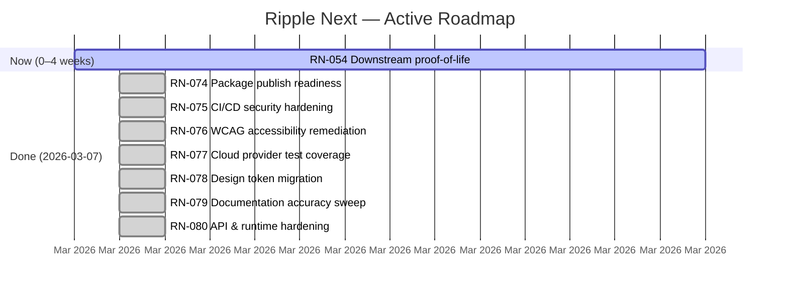

# Ripple Next — Product Roadmap

> v10.1.0 | 2026-03-07
>
> **Harden and publish.** The audit revealed strong foundations but critical gaps
> in publish-readiness, accessibility, and test coverage. Every item moves toward
> "safe for downstream adoption" — the prerequisite for production-proven maturity.
>
> 87 items completed (all archived in **[ARCHIVE.md](./ARCHIVE.md)**).
> 1 item active. 0 items parked.

---

## Roadmap Timeline


```mermaid
gantt
    title Ripple Next — Active Roadmap
    dateFormat YYYY-MM-DD
    axisFormat %b %Y

    section Now (0–4 weeks)
    RN-054 Downstream proof-of-life        :active, rn054, 2026-03-06, 14d

    section Done (2026-03-07)
    RN-074 Package publish readiness        :done, rn074, 2026-03-07, 1d
    RN-075 CI/CD security hardening         :done, rn075, 2026-03-07, 1d
    RN-076 WCAG accessibility remediation   :done, rn076, 2026-03-07, 1d
    RN-077 Cloud provider test coverage     :done, rn077, 2026-03-07, 1d
    RN-078 Design token migration           :done, rn078, 2026-03-07, 1d
    RN-079 Documentation accuracy sweep     :done, rn079, 2026-03-07, 1d
    RN-080 API & runtime hardening          :done, rn080, 2026-03-07, 1d
```

## Agent-Friction Scorecard

> **Status:** Interim self-assessment (35/40). Scores will be validated by
> RN-054 shipping evidence — a real downstream consumer exercising the platform
> is more credible than automated self-measurement.

| Dimension | Score | Notes | Known gaps |
|-----------|-------|-------|------------|
| Setup determinism | 5/5 | Pinned pnpm, lockfile, `.env.example` + Zod env validation, devcontainer. `.nvmrc` and `engines.node` exact match enforced by `pnpm doctor` | — |
| One-command workflows | 5/5 | `pnpm bootstrap` — zero-to-ready, non-interactive | — |
| Local dev parity with CI | 4/5 | Shared tooling, dockerized deps, devcontainer. CI gates classified as blocking or advisory in [`docs/ci-gates.md`](../ci-gates.md) | 3 advisory gates remain (a11y, perf, gate summary artifact) |
| Test reliability | 3/5 | Quarantine policy, unified `test:ci`, mock providers | No multi-contributor validation; no production evidence |
| Dependency + toolchain pinning | 5/5 | Exact Node (.nvmrc = engines.node = 22.22.0) + pnpm (packageManager) with doctor guards | — |
| Observability of failures | 5/5 | JUnit XML, Playwright traces, SBOM, JSON diagnostics | — |
| Automated remediation | 3/5 | `pnpm doctor --json`, conformance CLI, error taxonomy | `conform --fix` not implemented (parked); fleet sync untested |
| Agent workflow integration | 5/5 | Runbooks, generators, error taxonomy ([ADR-018](../adr/018-ai-first-workflow-strategy.md)) | — |

**Overall: 35/40** (interim; validated when [RN-054](#rn-054-downstream-proof-of-life--first-consumer-deployment) ships)

---

## North Star

Ripple Next is the **AI-augmented golden-path for government digital platforms**.
Downstream teams ship faster, safer, and more accessibly because the golden path
eliminates undifferentiated work and AI agents operate as first-class contributors
across the fleet.

**Platform status:** 18/18 subsystems with `maturity` field in
[`readiness.json`](../readiness.json). Distribution:
3 integration-tested (auth, database, CMS), 8 conformance-tested (queue, storage,
email, events, UI, API, testing-infra, secrets), 7 interface-defined
(infrastructure, CI, publishing, navigation, agent-tooling, fleet-governance, cli).
0 production-proven. See [`readiness.json`](../readiness.json) for
per-subsystem detail.

## Themes

1. **Harden and publish** — Fix critical downstream blockers (type declarations, peer deps, testing package), harden CI security, and achieve "safe for adoption" (RN-074, RN-075)
2. **Accessibility compliance** — Government platform must meet WCAG 2.1 AA. Fix focus traps, reduced-motion, semantic markup (RN-076)
3. **Test depth** — Close coverage gaps in cloud providers, auth-critical repos, and shared utilities (RN-077)
4. **Ship it** — Downstream proof-of-life remains the north star validation (RN-054)

---

## Now (0–4 weeks)

> Unblock downstream adoption and harden CI security.

### RN-054: Downstream Proof-of-Life — First Consumer Deployment

**Priority:** Critical | **Impact:** Very High | **Effort:** High | **Risk:** High
**Source:** Critique 3 — "the project is a promising skeleton with exceptional documentation — but a skeleton nonetheless"
**AI-first benefit:** Validates that agents can scaffold, configure, test, and deploy a downstream repo end-to-end using platform tooling.
**Status:** In Progress
**Dependencies:** [RN-074](#rn-074-package-publish-readiness--downstream-unblock) (audit revealed blockers)

The single most important item on the roadmap. Creates one downstream repo using
`pnpm generate:scaffold`, publishes @ripple-next/* packages, consumes them, and
deploys to staging. Validates or invalidates Critique 3's central finding.

#### Definition of Done

- [x] Downstream repo created via `pnpm generate:scaffold`
- [x] At least 3 @ripple-next/* packages consumed from registry (auth, db, ui)
- [ ] Downstream CI passes using golden-path reusable workflows
- [x] Fleet drift detection runs against downstream repo
- [ ] Downstream deployed to staging environment (SST)
- [x] `pnpm conform -- --target=../downstream-repo` scores ≥ 70 (scored 100/100)

#### Verification

- `npm view @ripple-next/auth versions` returns ≥ 1 published version
- Downstream repo CI green with artifact uploads
- `pnpm conform -- --json --target=../downstream-repo` → score ≥ 70
- Fleet drift report shows compliance status

**Links:** [Critique 3](../critique-evaluation.md), `scripts/generate/scaffold.mjs`, `docs/downstream-workflows.md`

---

### RN-074: Package Publish Readiness — Downstream Unblock

**Priority:** Critical | **Impact:** Very High | **Effort:** Medium | **Risk:** Low
**Source:** Audit findings DOWNSTREAM-001, 002, 003, 007, 008, 010, 012, 013, 014, 016, 019, 020
**AI-first benefit:** Agents can consume @ripple-next/* packages with full type safety, tree-shaking, and correct dependency resolution.
**Status:** Done (2026-03-07)
**Dependencies:** None

The audit found that @ripple-next/ui and @ripple-next/testing **cannot be consumed**
by downstream repos. This item bundles all critical and high downstream blockers
into a single publish-readiness sprint.

#### Definition of Done

- [ ] @ripple-next/ui generates .d.ts type declarations (`declaration: true` or vite-plugin-dts)
- [ ] `publishConfig.exports` includes `types` conditions for all entry points
- [ ] `vue` moved to `peerDependencies` in @ripple-next/ui
- [ ] `@nuxt/kit` moved to `peerDependencies` (optional) in @ripple-next/ui
- [ ] `"sideEffects": false` added to all 14 packages
- [ ] `"files": ["dist", "README.md"]` added to packages missing it
- [ ] @ripple-next/testing has build step, exports map, publishConfig
- [ ] `secretsConformance` exported from testing/conformance/index.ts
- [ ] `export *` replaced with explicit named exports in @ripple-next/db and @ripple-next/shared
- [ ] Consumer guide .npmrc scope fixed (`@ripple-next:` not `@ripple:`)
- [ ] All documented import paths in package READMEs resolve
- [ ] `pnpm verify` passes

#### Verification

- `pnpm pack` in packages/ui produces tarball with .d.ts files, no test/story files
- Consumer TypeScript project resolves all @ripple-next/ui types
- `pnpm ls vue` in consumer project shows single instance
- `import { queueConformance } from '@ripple-next/testing/conformance'` resolves

**Links:** [Audit: Downstream Risk Assessment](../audit/downstream-risk-assessment.md), [RB-001 through RB-003, RB-015, RB-019, RB-020, RB-023, RB-028, RB-032](../audit/remediation-backlog.md)

---

### RN-075: CI/CD Security Hardening

**Priority:** High | **Impact:** High | **Effort:** Small | **Risk:** Low
**Source:** Audit findings INFRA-001, INFRA-010, INFRA-002
**AI-first benefit:** Agents can trust that CI pipelines are supply-chain hardened. Least-privilege IAM reduces blast radius of any CI compromise.
**Status:** Done (2026-03-07)
**Dependencies:** None

All GitHub Actions are pinned to mutable tags (supply chain risk). The deploy
role uses PowerUserAccess (near-admin). S3 CORS allows all origins.

#### Definition of Done

- [x] All GitHub Actions `uses:` directives pinned to full SHA hashes with tag version in comment
- [x] Deploy IAM role uses custom least-privilege policy (no PowerUserAccess)
- [x] S3 CORS `allowOrigins` restricted to actual domains
- [x] Hardcoded ARN patterns in `infra/github-oidc.ts` parameterised
- [x] `pnpm verify` passes

#### Verification

- `grep -r '@v[0-9]' .github/workflows/` returns zero matches
- IAM policy has no `*` actions; `Resource: '*'` minimised with region-lock conditions
- `sst.config.ts` CORS origins are explicit domains
- `infra/github-oidc.ts` accepts `appName` and `region` as parameters (not hardcoded)

**Links:** [Audit: Infrastructure & Security](../audit/full-audit-report.md#5-infrastructure--security), [RB-013, RB-014, RB-048](../audit/remediation-backlog.md)

---

## Next (6–12 weeks)

> Accessibility compliance and test coverage depth.

### RN-076: WCAG Accessibility Remediation

**Priority:** High | **Impact:** Very High | **Effort:** Medium | **Risk:** Low
**Source:** Audit findings A11Y-001 through A11Y-020 (23 findings, 2 CRITICAL, 5 HIGH)
**AI-first benefit:** Agents building government pages can trust that all components meet WCAG 2.1 AA without manual a11y review.
**Status:** Done (2026-03-07)
**Dependencies:** None

The audit found 2 CRITICAL a11y issues (missing focus traps in RplMediaEmbed and
RplMediaGallery), 5 form components with broken focus indicators, and 20 components
ignoring prefers-reduced-motion. Government platform — a11y is non-negotiable.

#### Definition of Done

- [ ] RplMediaEmbed fullscreen uses `.showModal()` with focus trap + Escape handling
- [ ] RplMediaGallery lightbox has focus trap matching RplMediaFullscreen pattern
- [ ] 5 form components: `:focus { outline: none }` → `:focus-visible { ... }`
- [ ] RplButton, RplCard, RplNavigationList have `:focus-visible` styles
- [ ] Global or per-component `prefers-reduced-motion: reduce` suppresses animations (20 components)
- [ ] 9 form components add `:aria-required="required"`
- [ ] RplAccordion panel has `aria-labelledby`
- [ ] RplForm fieldset has `<legend>`
- [ ] RplKeyDates and RplTimeline use semantic list elements
- [ ] RplTextarea counter has `role="status"` and `aria-live="polite"`
- [ ] `pnpm verify` passes

#### Verification

- Tab through RplMediaEmbed fullscreen — focus stays trapped
- Enable prefers-reduced-motion — no CSS transitions fire
- axe DevTools scan on Storybook shows zero violations for fixed components

**Links:** [Audit: Accessibility Compliance](../audit/full-audit-report.md#4-accessibility-compliance), [RB-004, RB-005, RB-016, RB-017, RB-018, RB-031, RB-033, RB-042–RB-046](../audit/remediation-backlog.md)

---

### RN-077: Cloud Provider Test Coverage

**Priority:** High | **Impact:** High | **Effort:** Medium | **Risk:** Low
**Source:** Audit findings TEST-001, TEST-004 through TEST-014 (7 CRITICAL, 14 HIGH)
**AI-first benefit:** Agents can refactor provider implementations with confidence that mocked conformance tests catch regressions.
**Status:** Done (2026-03-07)
**Dependencies:** None

7 cloud provider implementations have zero tests (SQS, BullMQ, SES, S3, MinIO,
AWS Secrets, Chain Secrets). The queue consumer, session repository, and shared
utilities are also untested. All are Tier 1 or Tier 2 packages.

#### Definition of Done

- [ ] `packages/queue/tests/consumer.test.ts` — retry, DLQ, error handling
- [ ] `packages/queue/tests/sqs.test.ts` — mocked AWS SDK
- [ ] `packages/queue/tests/bullmq.test.ts` — mocked BullMQ
- [ ] `packages/email/tests/ses.test.ts` — mocked AWS SDK
- [ ] `packages/storage/tests/s3.test.ts` — mocked AWS SDK
- [ ] `packages/storage/tests/minio.test.ts` — mocked MinIO
- [ ] `packages/secrets/tests/aws.test.ts`, `env.test.ts`, `chain.test.ts`
- [ ] `packages/db/tests/integration/session.repository.integration.test.ts`
- [ ] `packages/shared/tests/utils.test.ts` — all utility functions
- [ ] shared, config, cli, secrets added to `vitest.workspace.ts` with tier-appropriate thresholds
- [ ] 4 service handler test files (cleanup, reports, user-created, websocket)
- [ ] 3 app composable tests (useAuth, useCms, useNavigation) + auth middleware test
- [ ] `pnpm verify` passes

#### Verification

- `pnpm test` runs tests for all 4 newly-added workspace entries
- Coverage thresholds enforced per CLAUDE.md tiers
- All new tests pass in CI

**Links:** [Audit: Test Integrity](../audit/full-audit-report.md#2-test-integrity--coverage), [RB-006 through RB-012, RB-024, RB-025, RB-029, RB-030](../audit/remediation-backlog.md)

---

### RN-078: Design Token Migration

**Priority:** Medium | **Impact:** Medium | **Effort:** Medium | **Risk:** Low
**Source:** Audit findings CODE-038 through CODE-053 (54 hardcoded hex colours, ~130 px values, ~30 font sizes)
**AI-first benefit:** Agents can theme and customise components by changing token values instead of hunting for hardcoded strings.
**Status:** Done (2026-03-07)
**Dependencies:** None

54 hardcoded hex colours across 16 components, ~130 hardcoded px values, and ~30
raw font-size values. Some components already use `var(--rpl-*)` tokens correctly,
showing the pattern exists — it just wasn't applied consistently.

#### Definition of Done

- [ ] All hardcoded hex colours replaced with `var(--rpl-clr-*)` CSS custom properties
- [ ] Common px values (border-radius, max-width, breakpoints) tokenised as `var(--rpl-*)`
- [ ] Raw font-size values replaced with `var(--rpl-type-size-*)`
- [ ] Token definitions documented or added to tokens file
- [ ] Zero grep hits for hardcoded hex in component `.vue` `<style>` blocks
- [ ] `pnpm verify` passes

#### Verification

- `grep -rn '#[0-9a-fA-F]\{3,6\}' packages/ui/components/` returns zero matches
- Storybook visual regression spot-check shows no regressions

**Links:** [Audit: Code Quality](../audit/full-audit-report.md#1-code-quality--type-safety), [RB-026, RB-034, RB-035](../audit/remediation-backlog.md)

---

## Later (Quarter+)

> Clean up docs and harden API layer. Execute after publish readiness and a11y fixes.

### RN-079: Documentation Accuracy Sweep

**Priority:** Low | **Impact:** Medium | **Effort:** Small | **Risk:** Low
**Source:** Audit findings DOC-001 through DOC-023 (20 findings)
**AI-first benefit:** Agents reading docs get accurate counts, correct commands, and current ADR statuses — reducing hallucinated assumptions.
**Status:** Done (2026-03-07)
**Dependencies:** None

Stale numbers and minor inaccuracies found across docs. All factual — no
structural changes needed.

#### Definition of Done

- [ ] platform-capabilities.md: error count 68+ → 94, CMS maturity updated, generator command `generate:api-endpoint` → `generate:endpoint`
- [ ] error-taxonomy.json: self-description 85 → 94 codes
- [ ] README.md: structure section includes packages/config, secrets, cli
- [ ] architecture.md: ADR count 26 → 28
- [ ] ADRs 024, 025, 026 status updated from "Proposed" to "Accepted"
- [ ] `pnpm verify` passes

#### Verification

- `grep -c 'RPL-' docs/error-taxonomy.json` matches documented count
- All doc cross-references valid

**Links:** [Audit: Documentation Accuracy](../audit/full-audit-report.md#6-documentation-accuracy), [RB-022, RB-038 through RB-041, RB-055](../audit/remediation-backlog.md)

---

### RN-080: API & Runtime Hardening

**Priority:** Low | **Impact:** Medium | **Effort:** Small | **Risk:** Low
**Source:** Audit findings CODE-005, CODE-009, CODE-013, CODE-025 through CODE-029
**AI-first benefit:** Agents can trust runtime safety — no silent crashes from null dereferences or unvalidated API inputs.
**Status:** Done (2026-03-07)
**Dependencies:** None

5 non-null assertions in production code risk runtime crashes. 3 API routes cast
query params without Zod validation. Console violations in non-exempt files.

#### Definition of Done

- [ ] 5 non-null assertions replaced with explicit null guards + error throws
- [ ] CMS API routes validate query params with Zod before passing to providers
- [ ] Unvalidated JSON casts in CMS/CLI replaced with schema validation
- [ ] `console.error` in queue/consumer.ts either exempted in lint config or replaced with logger
- [ ] Stub handlers (cleanup, reports, user-created) annotated with TODO ticket references
- [ ] `pnpm verify` passes

#### Verification

- `grep -rn '!\.' packages/*/src/ apps/*/server/` returns only justified assertions
- All API routes validate inputs at the boundary

**Links:** [Audit: Code Quality](../audit/full-audit-report.md#1-code-quality--type-safety), [RB-021, RB-036, RB-049, RB-050, RB-057](../audit/remediation-backlog.md)

---

## Parked / Not Doing

| Item | Reason | Unpark trigger |
|------|--------|----------------|
| RN-057: Scorecard evidence generation | Meta-work. Scorecard credibility comes from shipping (RN-054), not automation | After RN-054 ships and downstream consumer validates claims |
| RN-060: Conformance auto-remediation | No downstream fleet exists to remediate | After ≥ 2 downstream repos exist |
| Visual regression (Chromatic/Percy) | Not justified by current UI churn | UI library has ≥ 3 downstream consumers |
| Portal publication infrastructure | No external integrators | External integrators onboarded |
| SDK generation from OpenAPI spec | No consumer demand | Consumer demand exists |
| Testcontainers router integration tests | Contract tests sufficient | API complexity warrants router-level DB tests |
| Conform as optional verify gate | No downstream repos use conform | Downstream repos use conform regularly |

---

## Risks & Unknowns

| Risk | Mitigation |
|------|------------|
| **@ripple-next/ui and @ripple-next/testing blocked for downstream adoption** | [RN-074](#rn-074-package-publish-readiness--downstream-unblock) (Now) — critical priority |
| No downstream consumer exists | [RN-054](#rn-054-downstream-proof-of-life--first-consumer-deployment) (Now) |
| Every package still v0.1.0 | First publish in [RN-054](#rn-054-downstream-proof-of-life--first-consumer-deployment) once [RN-074](#rn-074-package-publish-readiness--downstream-unblock) unblocks |
| 7 cloud providers completely untested | [RN-077](#rn-077-cloud-provider-test-coverage) (Next) |
| 2 CRITICAL + 5 HIGH WCAG violations | [RN-076](#rn-076-wcag-accessibility-remediation) (Next) — government a11y requirement |
| GitHub Actions supply chain risk (mutable tags) | [RN-075](#rn-075-cicd-security-hardening) (Now) |
| PowerUserAccess on deploy role | [RN-075](#rn-075-cicd-security-hardening) (Now) |
| ~~PolyForm Noncommercial blocks government procurement~~ | ~~Resolved — [ADR-027](../adr/027-licensing-government-procurement.md)~~ |
| ~~No live CMS integration~~ | ~~Resolved — [RN-017](./ARCHIVE.md) Docker Tide fixture~~ |
| ~~Secrets untyped / no structured management~~ | ~~Resolved — [RN-068](./ARCHIVE.md) typed secrets schema~~ |
| ~~OIDC IAM setup not codified as IaC~~ | ~~Resolved — [RN-070](./ARCHIVE.md)~~ |

---

## Suggestion Triage Log (v10.0.0)

### Adopted

| Suggestion | Source | Action |
|-----------|--------|--------|
| Bundle audit findings into 7 roadmap items | Codebase audit (RN-073) | RN-074 through RN-080 created, prioritised by downstream impact |
| Archive 7 completed items + audit | PM review | RN-058, RN-071, RN-017, RN-059, RN-068, RN-069, RN-070, RN-073 → ARCHIVE.md |
| Update themes from "Ship it" to "Harden and publish" | Audit showed publish-readiness is the gating concern | Themes rewritten |
| Update risks table — resolve completed, add audit-discovered | PM review | 4 risks resolved, 4 new risks added |
| Complete upstream component port to 46/46 | Critique 3/4 + tech lead review | [RN-067](./ARCHIVE.md#rn-067-complete-upstream-component-port--full-ripple-v2-parity) — completed 2026-03-02 |
| Promote RN-058 + RN-054 to Now | Critique 3/4 — production credibility is the #1 gap | Promoted from Next to Now |
| Park RN-057 (scorecard evidence) | Critique 4 — meta-work about meta-work | Moved to Parked |
| Park RN-060 (auto-remediation) | Critique 4 — fleet governance for fleet of zero | Moved to Parked |
| Remove "Honesty & trust" theme | RN-053/055/056 completed — theme is done | Replaced with "Ship it" |
| Remove "Fleet automation" theme | No fleet exists to automate | Removed entirely |

### Rejected

| Suggestion | Source | Rationale |
|-----------|--------|-----------|
| Add application feature depth item | AI agent analysis | User clarified: only port upstream Ripple components, no new inventions. RN-067 covered this (now complete). |
| Add meta-layer reduction item | AI agent analysis | Would be meta-work about reducing meta-work. Instead, enforce as principle: no new governance items until docs-to-code ratio ≤ 1:1 |

---

## AI Agent Suggestions

> AI agents propose new items here using the template below. Suggestions are
> triaged during periodic reviews. **Do not self-triage into active sections.**

### Template

```markdown
#### RN-XXX: Short Descriptive Title

**Category:** `[New Item]` | `[Priority Change]` | `[Risk Flag]` | `[Removal]`
**Source:** Agent type and analysis context
**Date:** YYYY-MM-DD
**Impact:** Low | Medium | High | Very High
**Effort:** Low | Medium | High
**Risk:** Low | Medium | High
**AI-first benefit:** One sentence explaining how this helps AI agent workflows

Description with rationale and evidence.

**Affected items:** RN-XXX, RN-YYY (if applicable)
**Proposed action:** What should happen

Checklist (if `[New Item]`):
- [ ] Task 1
- [ ] Task 2
```

### Open AI Suggestions

_No open suggestions. All suggestions triaged in v10.0.0 (see Triage Log above)._

---

## Tech Lead Suggestions

> Human tech leads propose changes here. AI agents MUST read but MUST NOT modify.

### Open Suggestions

_No open suggestions._

---

## Archive (Done)

73 items completed (RN-001 through RN-073, excluding RN-054, RN-057, RN-060).
All archived in **[ARCHIVE.md](./ARCHIVE.md)**.

Cross-references: [ADR index](../adr/README.md) | [Readiness](../readiness.json) | [Architecture](../architecture.md) | [Critique](../critique-evaluation.md) | [Adoption Guide](../downstream-adoption-guide.md) | [Consumer App Guide](../consumer-app-guide.md) | [Platform Capabilities](../platform-capabilities.md) | [Audit](../audit/)
