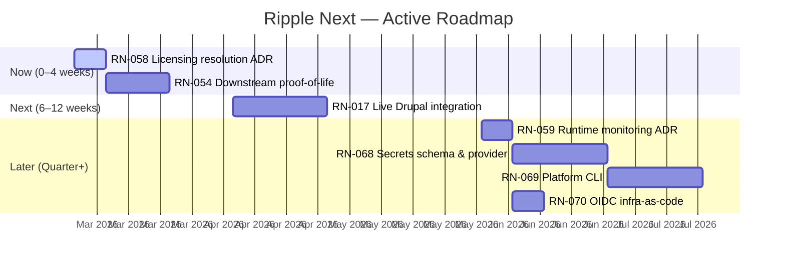

# Ripple Next — Product Roadmap

> v8.0.0 | 2026-03-02
>
> **Ship it.** The roadmap is focused on production credibility: resolve licensing,
> publish packages, deploy a downstream consumer. Meta-work is parked until the
> platform proves itself. Every item moves toward "production-proven" maturity.
>
> 57 items completed (all archived in **[ARCHIVE.md](./ARCHIVE.md)**).
> 7 items active. 7 items parked.

---

## Roadmap Timeline


```mermaid
gantt
    title Ripple Next — Active Roadmap
    dateFormat YYYY-MM-DD
    axisFormat %b %Y

    section Now (0–4 weeks)
    RN-058 Licensing resolution ADR        :active, rn058, 2026-03-03, 7d
    RN-054 Downstream proof-of-life        :rn054, 2026-03-10, 14d

    section Next (6–12 weeks)
    RN-017 Live Drupal integration         :rn017, 2026-04-07, 21d

    section Later (Quarter+)
    RN-059 Runtime monitoring ADR          :rn059, 2026-06-01, 7d
    RN-068 Secrets schema & provider       :rn068, 2026-06-08, 21d
    RN-069 Platform CLI                    :rn069, after rn068, 21d
    RN-070 OIDC infra-as-code              :rn070, 2026-06-08, 7d
```

## Agent-Friction Scorecard

> **Status:** Interim self-assessment (35/40). Scores will be validated by
> RN-054 shipping evidence — a real downstream consumer exercising the platform
> is more credible than automated self-measurement.

| Dimension | Score | Notes | Known gaps |
|-----------|-------|-------|------------|
| Setup determinism | 5/5 | Pinned pnpm, lockfile, `.env.example` + Zod env validation, devcontainer. `.nvmrc` and `engines.node` exact match enforced by `pnpm doctor` | — |
| One-command workflows | 5/5 | `pnpm bootstrap` — zero-to-ready, non-interactive | — |
| Local dev parity with CI | 4/5 | Shared tooling, dockerized deps, devcontainer. CI gates classified as blocking or advisory in [`docs/ci-gates.md`](../ci-gates.md) | 3 advisory gates remain (a11y, perf, gate summary artifact) |
| Test reliability | 3/5 | Quarantine policy, unified `test:ci`, mock providers | No multi-contributor validation; no production evidence |
| Dependency + toolchain pinning | 5/5 | Exact Node (.nvmrc = engines.node = 22.22.0) + pnpm (packageManager) with doctor guards | — |
| Observability of failures | 5/5 | JUnit XML, Playwright traces, SBOM, JSON diagnostics | — |
| Automated remediation | 3/5 | `pnpm doctor --json`, conformance CLI, error taxonomy | `conform --fix` not implemented (parked); fleet sync untested |
| Agent workflow integration | 5/5 | Runbooks, generators, error taxonomy ([ADR-018](../adr/018-ai-first-workflow-strategy.md)) | — |

**Overall: 35/40** (interim; validated when [RN-054](#rn-054-downstream-proof-of-life--first-consumer-deployment) ships)

---

## North Star

Ripple Next is the **AI-augmented golden-path for government digital platforms**.
Downstream teams ship faster, safer, and more accessibly because the golden path
eliminates undifferentiated work and AI agents operate as first-class contributors
across the fleet.

**Platform status:** 16/16 subsystems with `maturity` field in
[`readiness.json`](../readiness.json). Distribution:
2 integration-tested (auth, database), 8 conformance-tested (queue, storage,
email, events, CMS, UI, API, testing-infra), 6 interface-defined
(infrastructure, CI, publishing, navigation, agent-tooling, fleet-governance).
0 production-proven. See [`readiness.json`](../readiness.json) for
per-subsystem detail.

## Themes

1. **Ship it** — Resolve licensing, publish packages, deploy first downstream consumer (RN-058, RN-054). Stop describing; start proving.
2. **Production credibility** — Live CMS validation (RN-017); component library complete (RN-067 done)
3. **Quality depth** — Runtime monitoring, once there's something deployed to monitor (RN-059)

---

## Now (0–4 weeks)

> Resolve the two blockers preventing production credibility.

### RN-058: Licensing Resolution ADR — Government Procurement Compatibility

**Priority:** Critical | **Impact:** Very High | **Effort:** Medium | **Risk:** High
**Source:** Critique 3 — "Non-commercial licensing for government software is unusual and potentially incompatible with government procurement"
**AI-first benefit:** License ambiguity blocks automated publishing gates; clear licensing enables deterministic npm publish decisions.
**Status:** Planned
**Dependencies:** None

PolyForm Noncommercial 1.0.0 may conflict with government contractor usage and
standard procurement frameworks. [RN-049](./ARCHIVE.md#rn-049-licensing-clarity-guardrail-spdx--dual-license-model)
added SPDX metadata but did not resolve the underlying licensing question.

#### Definition of Done

- [ ] ADR evaluating license options (PolyForm Noncommercial, Apache 2.0, MIT, dual-license, AGPL)
- [ ] Government procurement compatibility analysis included
- [ ] Decision documented with explicit rationale
- [ ] All `package.json` license fields updated if license changes
- [ ] LICENSE file updated if license changes

#### Verification

- ADR exists in `docs/adr/`
- `jq '.license' package.json` returns chosen SPDX identifier
- License compatible with identified government procurement frameworks

**Links:** [Critique 3](../critique-evaluation.md), [RN-049](./ARCHIVE.md#rn-049-licensing-clarity-guardrail-spdx--dual-license-model), LICENSE

---

### RN-054: Downstream Proof-of-Life — First Consumer Deployment

**Priority:** Critical | **Impact:** Very High | **Effort:** High | **Risk:** High
**Source:** Critique 3 — "the project is a promising skeleton with exceptional documentation — but a skeleton nonetheless"
**AI-first benefit:** Validates that agents can scaffold, configure, test, and deploy a downstream repo end-to-end using platform tooling.
**Status:** Planned
**Dependencies:** [RN-058](#rn-058-licensing-resolution-adr--government-procurement-compatibility)

The single most important item on the roadmap. Creates one downstream repo using
`pnpm generate:scaffold`, publishes @ripple-next/* packages, consumes them, and
deploys to staging. Validates or invalidates Critique 3's central finding.

#### Definition of Done

- [ ] Downstream repo created via `pnpm generate:scaffold`
- [ ] At least 3 @ripple-next/* packages consumed from registry (auth, db, ui)
- [ ] Downstream CI passes using golden-path reusable workflows
- [ ] Fleet drift detection runs against downstream repo
- [ ] Downstream deployed to staging environment (SST)
- [ ] `pnpm conform -- --target=../downstream-repo` scores ≥ 70

#### Verification

- `npm view @ripple-next/auth versions` returns ≥ 1 published version
- Downstream repo CI green with artifact uploads
- `pnpm conform -- --json --target=../downstream-repo` → score ≥ 70
- Fleet drift report shows compliance status

**Links:** [Critique 3](../critique-evaluation.md), `scripts/generate/scaffold.mjs`, `docs/downstream-workflows.md`

---

## Next (6–12 weeks)

> Complete the component library and validate the CMS integration.

### RN-017: Live Drupal Integration Testing

**Priority:** Medium | **Impact:** Medium | **Effort:** Medium | **Risk:** Medium
**Source:** CMS integration gap — continues [RN-004](./ARCHIVE.md#rn-004-drupaltide-cms-integration-ripplecms)
**AI-first benefit:** Validates CMS provider against real Drupal, giving agents confidence in content-layer operations.
**Status:** Blocked → activating Docker fallback (Q2 2026 deadline reached)
**Dependencies:** None

Integration test with a real Drupal/Tide instance to validate DrupalCmsProvider.
Original plan awaited live URLs from content team. Q2 2026 Docker fallback now active.

#### Definition of Done

- [ ] Docker-based Tide fixture (Drupal + Tide modules) in `docker-compose.test.yml` or Testcontainer
- [ ] Integration test suite exercising all CMS provider methods against real Drupal
- [ ] CI job runs integration tests on schedule (not every PR)
- [ ] `readiness.json` CMS blocker removed

#### Verification

- `docker compose -f docker-compose.test.yml up drupal` starts Tide instance
- `pnpm test:integration -- --filter=cms` passes against Docker Drupal
- `jq '.subsystems.cms.blockers' docs/readiness.json` returns `[]`

**Links:** [RN-004](./ARCHIVE.md#rn-004-drupaltide-cms-integration-ripplecms), `packages/cms/`

---

## Later (Quarter+)

> Strategic items. Execute after downstream proof-of-life validates the platform.

### RN-059: Runtime Monitoring ADR — Observability for Lambda-First Architecture

**Priority:** Medium | **Impact:** High | **Effort:** Medium | **Risk:** Medium
**Source:** Risks table (ongoing) — "No runtime monitoring/alerting"
**AI-first benefit:** Structured monitoring enables agents to diagnose production issues using machine-readable telemetry.
**Status:** Planned
**Dependencies:** [RN-054](#rn-054-downstream-proof-of-life--first-consumer-deployment) (needs production-like deployment)

#### Definition of Done

- [ ] ADR evaluating CloudWatch, Datadog, OpenTelemetry for Lambda + Nuxt SSR
- [ ] Cost model for each option at 3 scale tiers
- [ ] Structured alert schema for agent-parseable alerts
- [ ] Error taxonomy integration plan (RPL-MONITOR-* codes)

#### Verification

- ADR exists in `docs/adr/`
- Decision rationale includes Lambda cold-start and SSR considerations
- Cost estimates provided for 3 scale tiers

**Links:** Risks table, `sst.config.ts`

---

### RN-068: Declarative Secrets Schema & Provider

**Priority:** Medium | **Impact:** High | **Effort:** High | **Risk:** Medium
**Source:** Agent friction — agents cannot programmatically discover which secrets are required, which stages they apply to, or which services consume them
**AI-first benefit:** Agents can discover all required secrets for a stage via structured output, set secrets without knowing the underlying store, and validate environments before deployment.
**Status:** Planned
**Dependencies:** [RN-054](#rn-054-downstream-proof-of-life--first-consumer-deployment)

Secrets are currently untyped — `.env.example` is a flat list with comments.
Agents cannot determine required vs optional, secret vs config, or which stages
need which values. Paired credentials (OAuth client ID + secret + token URL) are
stored as unrelated env vars with no structured representation.

Introduces a typed secrets schema (`@ripple-next/config`) and provider-pattern
secrets management (`@ripple-next/secrets`) with memory, env, AWS, and chain
providers. Boot-time validation catches misconfiguration before traffic arrives.

#### Definition of Done

- [ ] `packages/config/src/secrets.schema.ts` with `defineSecrets()` helper and typed `SecretsSchema`
- [ ] `packages/secrets/` with `SecretsProvider` interface and 4 implementations (Memory, Env, AWS, Chain)
- [ ] Zod validation for each secret format type (`postgres-uri`, `redis-uri`, `url`, `random-bytes-32`)
- [ ] `MemorySecretsProvider` passes conformance suite in `packages/testing/conformance/`
- [ ] `RPL-SEC-*` error codes in `docs/error-taxonomy.json` (done — added in this PR)
- [ ] `pnpm verify` passes all quality gates

#### Verification

- `pnpm test --filter @ripple-next/secrets` passes with Tier 1 coverage thresholds
- `pnpm test --filter @ripple-next/config` passes
- `jq '.errors[] | select(.code | startswith("RPL-SEC"))' docs/error-taxonomy.json` returns 5 entries

**Links:** [ADR-024](../adr/024-declarative-secrets-schema.md), [ADR-003](../adr/003-provider-pattern.md), [ADR-012](../adr/012-env-schema-validation.md)

---

### RN-069: Platform CLI — Unified Agent Interface

**Priority:** Medium | **Impact:** High | **Effort:** High | **Risk:** Medium
**Source:** Agent friction — agents must call a mix of `sst`, `drizzle-kit`, `pnpm` scripts, and AWS CLI with different output formats
**AI-first benefit:** Agents interact with one tool, one output format, one error taxonomy. Every failure includes actionable next steps as CLI commands.
**Status:** Planned
**Dependencies:** [RN-068](#rn-068-declarative-secrets-schema--provider)

Creates `@ripple-next/cli` providing `pnpm rip` — a unified CLI that wraps all
platform operations behind a universal `CommandResult` JSON contract. Wraps
secrets management, environment validation, deployment, health checks, database
operations, and dependency auditing.

Does not replace existing `pnpm` scripts — advanced users can still call `sst`
or `drizzle-kit` directly. The CLI is a dev dependency, not a runtime dependency.

#### Definition of Done

- [ ] `packages/cli/` with commander.js or citty
- [ ] `rip secrets` subcommands (list, get, set, required, audit)
- [ ] `rip env` subcommands (validate, diff)
- [ ] `rip deploy` wrapping `sst deploy` with pre/post validation
- [ ] `rip status` for health checks
- [ ] `rip db` wrapping drizzle-kit with safety checks
- [ ] Every command supports `--json` returning `CommandResult` shape
- [ ] `RPL-CLI-*` error codes in `docs/error-taxonomy.json` (done — added in this PR)
- [ ] `pnpm verify` passes all quality gates

#### Verification

- `pnpm rip --help` lists all subcommands
- `pnpm rip secrets required --stage dev --json` returns valid `CommandResult` JSON
- `pnpm test --filter @ripple-next/cli` passes

**Links:** [ADR-025](../adr/025-platform-cli-structured-output.md), [ADR-018](../adr/018-ai-first-workflow-strategy.md)

---

### RN-070: GitHub OIDC Federation — Codified Infrastructure

**Priority:** Low | **Impact:** Medium | **Effort:** Low | **Risk:** Low
**Source:** Infrastructure gap — OIDC federation is already used in deploy workflows but the IAM setup is not codified as infrastructure-as-code
**AI-first benefit:** Reproducible OIDC setup for downstream fleet repos. Agents can inspect and audit the trust policy without AWS console access.
**Status:** Planned
**Dependencies:** [RN-054](#rn-054-downstream-proof-of-life--first-consumer-deployment)

The existing `deploy-staging.yml` and `deploy-production.yml` already use OIDC
via `aws-actions/configure-aws-credentials@v4`. This item codifies the IAM OIDC
provider and deploy role as an SST/Pulumi component in `infra/github-oidc.ts`,
making the setup reproducible and auditable.

Also establishes the `infra/` directory convention for infrastructure components
that are separate from the main SST app definition in `sst.config.ts`.

#### Definition of Done

- [ ] `infra/github-oidc.ts` with `createGitHubOIDC()` function (done — added in this PR)
- [ ] Trust policy scoped to repo + branch + environment
- [ ] Secrets access policy scoped to `ripple-next/*` namespace
- [ ] `RPL-DEP-*` error codes in `docs/error-taxonomy.json` (done — added in this PR)
- [ ] Runbook for common OIDC trust policy debugging
- [ ] `pnpm verify` passes all quality gates

#### Verification

- `infra/github-oidc.ts` compiles without errors
- Trust policy includes `StringLike` conditions for repo, branch, and environment
- Secrets policy is scoped to `arn:aws:ssm:*:*:parameter/ripple-next/*` and `arn:aws:secretsmanager:*:*:secret:ripple-next/*`

**Links:** [ADR-026](../adr/026-github-oidc-zero-secrets-ci.md), [ADR-004](../adr/004-sst-over-cdk.md), `.github/workflows/deploy-staging.yml`

---

## Parked / Not Doing

| Item | Reason | Unpark trigger |
|------|--------|----------------|
| RN-057: Scorecard evidence generation | Meta-work. Scorecard credibility comes from shipping (RN-054), not automation | After RN-054 ships and downstream consumer validates claims |
| RN-060: Conformance auto-remediation | No downstream fleet exists to remediate | After ≥ 2 downstream repos exist |
| Visual regression (Chromatic/Percy) | Not justified by current UI churn | UI library has ≥ 3 downstream consumers |
| Portal publication infrastructure | No external integrators | External integrators onboarded |
| SDK generation from OpenAPI spec | No consumer demand | Consumer demand exists |
| Testcontainers router integration tests | Contract tests sufficient | API complexity warrants router-level DB tests |
| Conform as optional verify gate | No downstream repos use conform | Downstream repos use conform regularly |

---

## Risks & Unknowns

| Risk | Mitigation |
|------|------------|
| PolyForm Noncommercial blocks government procurement | [RN-058](#rn-058-licensing-resolution-adr--government-procurement-compatibility) (Now) |
| No downstream consumer exists | [RN-054](#rn-054-downstream-proof-of-life--first-consumer-deployment) (Now) |
| Every package still v0.1.0 | Blocked by [RN-058](#rn-058-licensing-resolution-adr--government-procurement-compatibility); first publish in [RN-054](#rn-054-downstream-proof-of-life--first-consumer-deployment) |
| Docs-to-code ratio | RN-067 completed — 47 components added code weight; no new governance items until ratio ≤ 1:1 |
| No live CMS integration | [RN-017](#rn-017-live-drupal-integration-testing) (Next) — Docker Tide fixture fallback activated |
| No runtime monitoring/alerting | [RN-059](#rn-059-runtime-monitoring-adr--observability-for-lambda-first-architecture) (Later) — acceptable until production deployment exists |
| Secrets untyped / no structured management | [RN-068](#rn-068-declarative-secrets-schema--provider) (Later) — `.env.example` is flat; agents cannot discover requirements programmatically |
| OIDC IAM setup not codified as IaC | [RN-070](#rn-070-github-oidc-federation--codified-infrastructure) (Later) — OIDC works but setup is not reproducible from code |

---

## Suggestion Triage Log (v8.0.0)

### Adopted

| Suggestion | Source | Action |
|-----------|--------|--------|
| Complete upstream component port to 46/46 | Critique 3/4 + tech lead review | [RN-067](./ARCHIVE.md#rn-067-complete-upstream-component-port--full-ripple-v2-parity) — completed 2026-03-02 |
| Promote RN-058 + RN-054 to Now | Critique 3/4 — production credibility is the #1 gap | Promoted from Next to Now |
| Park RN-057 (scorecard evidence) | Critique 4 — meta-work about meta-work | Moved to Parked |
| Park RN-060 (auto-remediation) | Critique 4 — fleet governance for fleet of zero | Moved to Parked |
| Remove "Honesty & trust" theme | RN-053/055/056 completed — theme is done | Replaced with "Ship it" |
| Remove "Fleet automation" theme | No fleet exists to automate | Removed entirely |

### Rejected

| Suggestion | Source | Rationale |
|-----------|--------|-----------|
| Add application feature depth item | AI agent analysis | User clarified: only port upstream Ripple components, no new inventions. RN-067 covered this (now complete). |
| Add meta-layer reduction item | AI agent analysis | Would be meta-work about reducing meta-work. Instead, enforce as principle: no new governance items until docs-to-code ratio ≤ 1:1 |

---

## AI Agent Suggestions

> AI agents propose new items here using the template below. Suggestions are
> triaged during periodic reviews. **Do not self-triage into active sections.**

### Template

```markdown
#### RN-XXX: Short Descriptive Title

**Category:** `[New Item]` | `[Priority Change]` | `[Risk Flag]` | `[Removal]`
**Source:** Agent type and analysis context
**Date:** YYYY-MM-DD
**Impact:** Low | Medium | High | Very High
**Effort:** Low | Medium | High
**Risk:** Low | Medium | High
**AI-first benefit:** One sentence explaining how this helps AI agent workflows

Description with rationale and evidence.

**Affected items:** RN-XXX, RN-YYY (if applicable)
**Proposed action:** What should happen

Checklist (if `[New Item]`):
- [ ] Task 1
- [ ] Task 2
```

### Open AI Suggestions

_No open suggestions. All suggestions triaged in v8.0.0 (see Triage Log above)._

---

## Tech Lead Suggestions

> Human tech leads propose changes here. AI agents MUST read but MUST NOT modify.

### Open Suggestions

_No open suggestions._

---

## Archive (Done)

57 items completed (RN-001 through RN-067, excluding RN-017, RN-054, RN-057–RN-060).
All archived in **[ARCHIVE.md](./ARCHIVE.md)**.

Cross-references: [ADR index](../adr/README.md) | [Readiness](../readiness.json) | [Architecture](../architecture.md) | [Critique](../critique-evaluation.md) | [Adoption Guide](../downstream-adoption-guide.md) | [Consumer App Guide](../consumer-app-guide.md) | [Platform Capabilities](../platform-capabilities.md)
