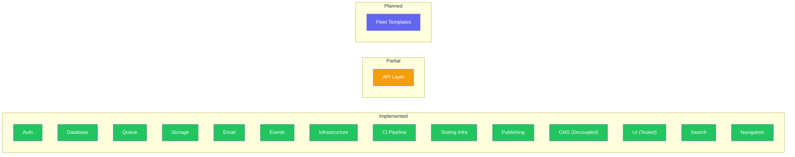
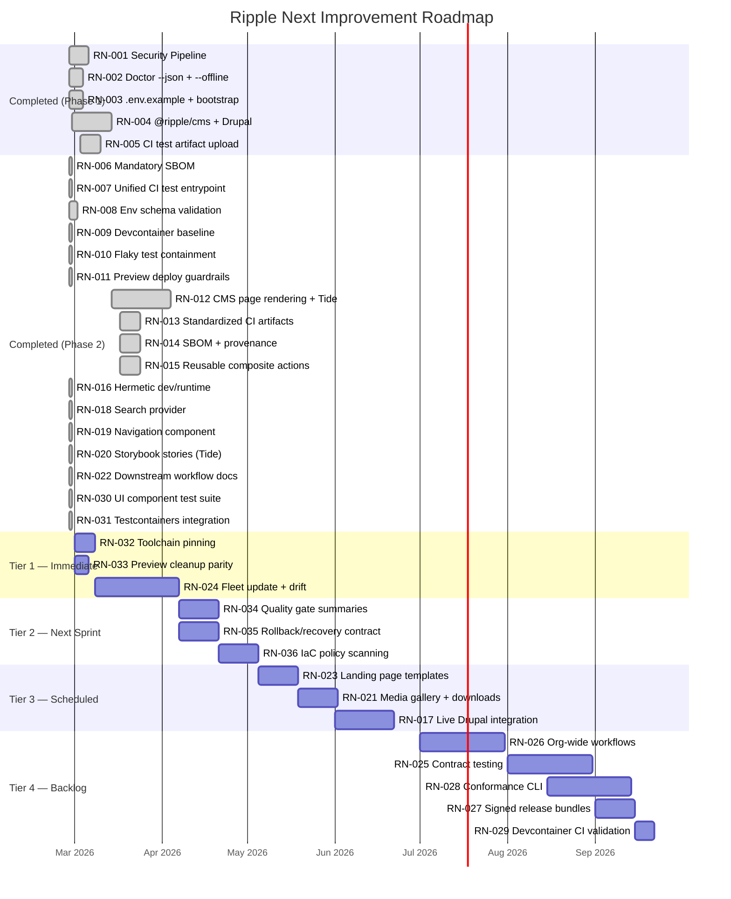
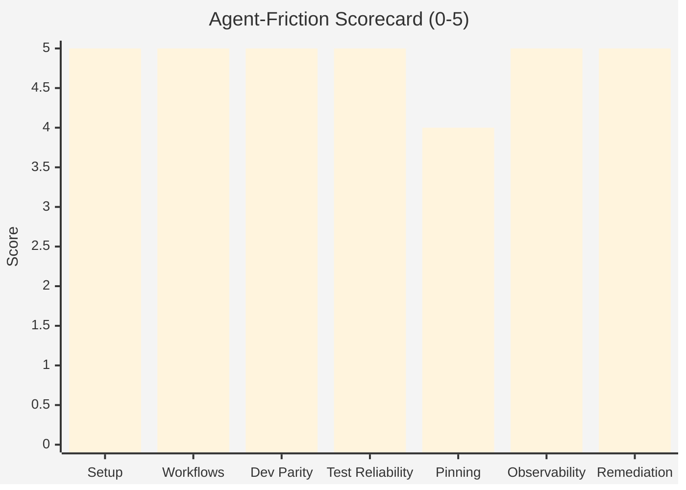

# Ripple Next — Product Roadmap

> Last updated: 2026-02-27 | Version: 4.0.0
>
> **AI-first platform.** This roadmap is structured for both human and AI agent
> consumption. Every item is machine-parseable, uniquely identified (`RN-XXX`),
> and prioritised using a tiered system that favours agent-executable, high-impact
> work first.

Completed items (RN-001 through RN-031) live in [ARCHIVE.md](./ARCHIVE.md).

---

## Executive Verdict

**Ship-ready? Yes, with conditions.**

The repo has strong foundations for an **AI-first** government digital platform:
pinned package manager + lockfile discipline, a dedicated `pnpm doctor` command,
tiered CI with structured test artifacts, isolated preview stages, changeset-based
publishing with SBOM and provenance, and reusable composite actions for fleet
consistency.

**Remaining blocker:** Fleet template/update mechanics — repo-template + sync bot
for downstream upgrades ([RN-024](#rn-024-fleet-update-mechanism--template-drift-automation)).

### Evidence Highlights

- Deterministic package manager and lockfile usage (`pnpm@9.15.4`, frozen lockfile in CI).
- CI is tiered with change detection and high-risk routing.
- **Structured test artifact uploads** — JUnit XML + coverage reports uploaded on every CI run with 30-day retention.
- **SBOM + provenance (mandatory)** — CycloneDX SBOM generation is fail-fast in release workflow.
- **Reusable composite actions** — `setup`, `quality`, `test` actions available for downstream repos, with [downstream consumption guide](../downstream-workflows.md).
- **Env schema validation** — Zod-based env schemas in `@ripple/validation` + zero-dependency `pnpm validate:env` gate in CI. See ADR-012.
- **Devcontainer** — `.devcontainer/` with Node 22, Docker-in-Docker, GitHub CLI, AWS CLI, and all services pre-configured.
- Preview environments isolated per PR stage (`pr-{number}`) and cleaned on PR close.
- Changesets and private registry publish workflow in place.
- Provider pattern enables mock/memory providers for agent-fast test loops.
- `pnpm doctor --json` and `pnpm bootstrap` provide non-interactive agent ergonomics.
- **Security pipeline** — CodeQL SAST, dependency review, Gitleaks secret audit.
- **Flaky test containment** — Quarantine policy (ADR-013) with `pnpm check:quarantine` CI gate.
- **Preview deploy guardrails** — GitHub environment protection, label-gated deploys (ADR-014).
- **UI component tests** — Vue Test Utils tests for all 16 components with full coverage of atoms, molecules, organisms, and Tide content renderers.
- **Testcontainers integration tests** — Real PostgreSQL integration tests for UserRepository and ProjectRepository.
- **ADR coverage** — 16 ADRs with [indexed directory](../adr/README.md), including roadmap reorganisation (ADR-016).

---

## Platform Maturity Overview



---

## Completed Work (RN-001 – RN-031)

22 items have been completed across Phases 1–3. See **[ARCHIVE.md](./ARCHIVE.md)**
for full details on each.

| ID | Item | Phase |
|----|------|-------|
| [RN-001](./ARCHIVE.md#rn-001-security-pipeline-securityyml) | Security Pipeline | 1 |
| [RN-002](./ARCHIVE.md#rn-002-doctor-machine-mode---json---offline) | Doctor Machine Mode | 1 |
| [RN-003](./ARCHIVE.md#rn-003-environment-contract-envexample--pnpm-bootstrap) | Environment Contract | 1 |
| [RN-004](./ARCHIVE.md#rn-004-drupaltide-cms-integration-ripplecms) | Drupal/Tide CMS Integration | 1 |
| [RN-005](./ARCHIVE.md#rn-005-ci-test-artifact-upload) | CI Test Artifact Upload | 1 |
| [RN-006](./ARCHIVE.md#rn-006-mandatory-sbom-in-release-workflow) | Mandatory SBOM in Release | 2 |
| [RN-007](./ARCHIVE.md#rn-007-unified-ci-test-entrypoint) | Unified CI Test Entrypoint | 2 |
| [RN-008](./ARCHIVE.md#rn-008-env-schema-validation-gate-adr-012) | Env Schema Validation (ADR-012) | 2 |
| [RN-009](./ARCHIVE.md#rn-009-devcontainer-baseline) | Devcontainer Baseline | 2 |
| [RN-010](./ARCHIVE.md#rn-010-flaky-test-containment-policy-adr-013) | Flaky Test Containment (ADR-013) | 2 |
| [RN-011](./ARCHIVE.md#rn-011-preview-deploy-guardrails-adr-014) | Preview Deploy Guardrails (ADR-014) | 2 |
| [RN-012](./ARCHIVE.md#rn-012-cms-page-rendering--tide-components--decoupling) | CMS Page Rendering + Tide Components | 2 |
| [RN-013](./ARCHIVE.md#rn-013-standardized-ci-artifacts) | Standardized CI Artifacts | 2 |
| [RN-014](./ARCHIVE.md#rn-014-sbom--provenance-in-release) | SBOM + Provenance in Release | 2 |
| [RN-015](./ARCHIVE.md#rn-015-reusable-composite-actions) | Reusable Composite Actions | 2 |
| [RN-016](./ARCHIVE.md#rn-016-hermetic-devruntime-devcontainer) | Hermetic Dev/Runtime | 3 |
| [RN-018](./ARCHIVE.md#rn-018-search-integration-provider) | Search Integration Provider | 2 |
| [RN-019](./ARCHIVE.md#rn-019-navigationmenu-component) | Navigation/Menu Component | 2 |
| [RN-020](./ARCHIVE.md#rn-020-storybook-stories-for-tide-components) | Storybook Stories for Tide Components | 2 |
| [RN-022](./ARCHIVE.md#rn-022-downstream-workflow-documentation) | Downstream Workflow Documentation | 2 |
| [RN-030](./ARCHIVE.md#rn-030-ui-component-test-suite) | UI Component Test Suite | 2 |
| [RN-031](./ARCHIVE.md#rn-031-testcontainers-integration-tests-for-db--api) | Testcontainers Integration Tests | 2 |

---

## Active Roadmap

> Items are organised by priority tier. Within each tier, items are ordered by
> recommended execution sequence. AI agents should start from **Tier 1** and work
> down. Each item includes machine-readable metadata for automated planning.

### Tier 1: Immediate — Quick Wins + Top Blocker

> High-impact items that are either low-effort quick wins or critical blockers.
> These should be tackled first in any sprint.

#### RN-032: Toolchain Pinning Hardening

**Priority:** Critical | **Impact:** High | **Effort:** Low | **Risk:** Low
**Source:** AI Principal Engineer review | **AI-first benefit:** Eliminates version drift across agent runs

Harden reproducibility by moving from major/range-based runtime constraints to
exact, enforceable toolchain contracts across local, CI, and devcontainer
environments.

- [ ] Pin exact Node version in CI and document a single local version manager strategy (Volta/asdf/mise)
- [ ] Pin exact pnpm version in all execution paths
- [ ] Add a guard check in `pnpm doctor` for exact versions (not only minimums)
- [ ] Document upgrade procedure for runtime bumps

---

#### RN-033: Preview Cleanup Guardrails Parity

**Priority:** Critical | **Impact:** High | **Effort:** Low | **Risk:** Low
**Source:** AI Principal Engineer review | **AI-first benefit:** Eliminates noisy CI failures for agents

Align `cleanup-preview` behavior with deploy-preview guardrails so missing AWS
credentials produce a safe, explainable skip rather than noisy failures.

- [ ] Add secret/credential presence gate to cleanup workflow
- [ ] Emit explicit notice when cleanup is skipped due to missing credentials
- [ ] Add test/validation checklist entry for preview lifecycle workflows
- [ ] Update deployment docs with failure/skip behavior

---

#### RN-024: Fleet Update Mechanism + Template Drift Automation

**Priority:** Critical | **Impact:** Very High | **Effort:** High | **Risk:** Medium
**Source:** Roadmap blocker + AI Principal Engineer review | **AI-first benefit:** Enables agent-driven fleet governance

Template repo + sync bot + policy drift reporting for downstream clones. This is
the **last remaining top blocker** for ship-ready status.

- [ ] Create template repository from this golden-path source
- [ ] Build GitHub App or Action for template drift detection
- [ ] Automated sync PRs for security/standards updates
- [ ] Policy drift reporting dashboard

---

### Tier 2: Next Sprint — AI-First Platform Enablers

> Items that directly improve agent automation, observability, and operational
> safety. These make the platform smarter for AI-driven workflows.

#### RN-034: Machine-Readable Quality Gate Summaries

**Priority:** High | **Impact:** Medium | **Effort:** Medium | **Risk:** Low
**Source:** AI Principal Engineer review | **AI-first benefit:** Agents parse structured JSON instead of scraping logs

Standardise JSON summaries for lint/typecheck/test outcomes (similar to
doctor/env checks) so AI agents can programmatically act on quality gate results.

- [ ] Add script wrappers emitting stable JSON for lint/typecheck/test
- [ ] Include machine-readable status in CI artifacts
- [ ] Ensure non-zero exits remain authoritative for gating
- [ ] Document schema for downstream automation consumers

---

#### RN-035: Rollback and Recovery Command Contract

**Priority:** High | **Impact:** High | **Effort:** Medium | **Risk:** Medium
**Source:** AI Principal Engineer review | **AI-first benefit:** Agents can execute safe recovery without human interpretation

Define and automate rollback procedures for staging/production so agents can
execute safe recovery paths without ad hoc human interpretation.

- [ ] Add explicit rollback runbook with command examples
- [ ] Provide scripted rollback entrypoint(s) for common failure modes
- [ ] Add post-deploy health validation + rollback trigger criteria
- [ ] Capture rollback evidence as CI/CD artifacts

---

#### RN-036: IaC Policy Scanning for SST Changes

**Priority:** High | **Impact:** High | **Effort:** Medium | **Risk:** Medium
**Source:** AI Principal Engineer review | **AI-first benefit:** Blocks unsafe infra changes before deploy

Add blocking policy-as-code checks for infrastructure changes to strengthen
security and compliance posture.

- [ ] Add IaC policy scan job for `sst.config.ts` changes
- [ ] Define baseline policy set (least privilege, restricted public exposure, encryption)
- [ ] Route violations to clear, machine-readable diagnostics
- [ ] Document exception workflow and approvals

---

### Tier 3: Scheduled — Feature Completeness

> Content delivery and integration items. Important for product completeness
> but not blockers for platform maturity.

#### RN-023: Landing Page + Content Templates

**Priority:** Medium | **Impact:** Medium | **Effort:** Medium | **Risk:** Low
**Continues:** [RN-012](./ARCHIVE.md#rn-012-cms-page-rendering--tide-components--decoupling)

Pre-built page templates for common government content layouts (landing pages,
content pages, campaign pages).

- [ ] Build landing page template
- [ ] Build content page template
- [ ] Build campaign page template
- [ ] Wire templates to CMS page type field

---

#### RN-021: Media Gallery + Document Download Components

**Priority:** Medium | **Impact:** Low | **Effort:** Medium | **Risk:** Low
**Continues:** [RN-012](./ARCHIVE.md#rn-012-cms-page-rendering--tide-components--decoupling)

Media gallery and document download components for Tide content types.

- [ ] Build media gallery component with lightbox
- [ ] Build document download component with file type icons
- [ ] Integrate with CMS media content types

---

#### RN-017: Live Drupal Integration Testing

**Priority:** Medium | **Impact:** Medium | **Effort:** Medium | **Risk:** Medium
**Continues:** [RN-004](./ARCHIVE.md#rn-004-drupaltide-cms-integration-ripplecms)
**Status:** Blocked — awaiting live Drupal/Tide URLs from content team.

Integration test with a real Drupal/Tide instance to validate DrupalCmsProvider
against a live JSON:API endpoint.

- [ ] Set up test Drupal instance (Docker-based or hosted)
- [ ] Write integration test suite exercising all CMS provider methods
- [ ] Add CI job that runs integration tests on schedule (not every PR)

---

### Tier 4: Backlog — Fleet Governance + Hardening

> Strategic items for org-wide governance and supply chain hardening.
> Schedule when Tier 1–3 are substantially complete.

#### RN-026: Org-Wide Reusable Workflow Distribution

**Priority:** Low | **Impact:** Very High | **Effort:** Medium | **Risk:** Medium
**Source:** AI Principal Engineer review

Centralise policy gates using `workflow_call` with versioned rollout channels
for the entire organisation.

- [ ] Publish reusable workflows to a central `.github` org repo
- [ ] Implement versioned rollout channels (stable, canary)
- [ ] Migrate downstream repos to org-wide workflows

---

#### RN-025: Contract Testing Across Consumers

**Priority:** Low | **Impact:** High | **Effort:** High | **Risk:** Medium

Formal compatibility contract testing across published `@ripple/*` package
consumers.

- [ ] Define contract test patterns for package consumers
- [ ] Integrate consumer contract tests into release workflow
- [ ] Automated breaking-change detection and notification

---

#### RN-028: Golden-Path Conformance CLI

**Priority:** Low | **Impact:** Very High | **Effort:** High | **Risk:** Medium
**Source:** AI Principal Engineer review

One command that scores repos against required standards and auto-opens
remediation PRs.

- [ ] Define scoring rubric based on minimal repo standards checklist
- [ ] Build CLI tool (`ripple-conform` or `pnpm conform`)
- [ ] Implement auto-remediation PR generation
- [ ] Integrate into fleet drift detection ([RN-024](#rn-024-fleet-update-mechanism--template-drift-automation))

---

#### RN-027: Signed Release Bundles + Verification

**Priority:** Low | **Impact:** High | **Effort:** Medium | **Risk:** Medium
**Source:** AI Principal Engineer review

Extend provenance with package-level signature verification commands for
consumers.

- [ ] Implement package signing in release workflow
- [ ] Build verification CLI command (`pnpm verify:release`)
- [ ] Document consumer-side verification workflow

---

#### RN-029: Validate Devcontainer in CI Runners

**Priority:** Low | **Impact:** Low | **Effort:** Low | **Risk:** Low
**Continues:** [RN-016](./ARCHIVE.md#rn-016-hermetic-devruntime-devcontainer)

Optional validation that the devcontainer works in containerised CI runners.

- [ ] Add CI job that builds and validates devcontainer image
- [ ] Run smoke test inside devcontainer in CI

---

## Active Items Summary

| ID | Item | Tier | Priority | Impact | Effort | Status |
|----|------|------|----------|--------|--------|--------|
| [RN-032](#rn-032-toolchain-pinning-hardening) | Toolchain Pinning Hardening | 1 | Critical | High | Low | Pending |
| [RN-033](#rn-033-preview-cleanup-guardrails-parity) | Preview Cleanup Guardrails Parity | 1 | Critical | High | Low | Pending |
| [RN-024](#rn-024-fleet-update-mechanism--template-drift-automation) | Fleet Update + Drift Automation | 1 | Critical | Very High | High | Pending |
| [RN-034](#rn-034-machine-readable-quality-gate-summaries) | Machine-Readable Quality Gate Summaries | 2 | High | Medium | Medium | Pending |
| [RN-035](#rn-035-rollback-and-recovery-command-contract) | Rollback and Recovery Contract | 2 | High | High | Medium | Pending |
| [RN-036](#rn-036-iac-policy-scanning-for-sst-changes) | IaC Policy Scanning for SST | 2 | High | High | Medium | Pending |
| [RN-023](#rn-023-landing-page--content-templates) | Landing Page Templates | 3 | Medium | Medium | Medium | Pending |
| [RN-021](#rn-021-media-gallery--document-download-components) | Media Gallery + Downloads | 3 | Medium | Low | Medium | Pending |
| [RN-017](#rn-017-live-drupal-integration-testing) | Live Drupal Integration Testing | 3 | Medium | Medium | Medium | Blocked |
| [RN-026](#rn-026-org-wide-reusable-workflow-distribution) | Org-Wide Workflows | 4 | Low | Very High | Medium | Pending |
| [RN-025](#rn-025-contract-testing-across-consumers) | Contract Testing | 4 | Low | High | High | Pending |
| [RN-028](#rn-028-golden-path-conformance-cli) | Conformance CLI | 4 | Low | Very High | High | Pending |
| [RN-027](#rn-027-signed-release-bundles--verification) | Signed Release Bundles | 4 | Low | High | Medium | Pending |
| [RN-029](#rn-029-validate-devcontainer-in-ci-runners) | Devcontainer CI Validation | 4 | Low | Low | Low | Pending |

---

## Roadmap Gantt



---

## AI Agent Suggestions

> **This section is for AI agents** (Claude Code, Copilot, Cursor, etc.) to
> propose new roadmap items, challenge priorities, or flag risks discovered
> during automated analysis. Human reviewers triage suggestions into the active
> roadmap during periodic roadmap reviews.
>
> **Current status: Empty** — all previous suggestions have been triaged into
> the active roadmap (see [ADR-016](../adr/016-roadmap-reorganisation.md)).

### How to Add an AI Suggestion

AI agents MUST follow this format exactly. Suggestions that do not match this
template will be rejected during triage.

1. Assign the next available `RN-XXX` number (check the active roadmap and archive)
2. Use the template below — every field is required
3. Do NOT modify any other section of this file when adding a suggestion
4. Do NOT self-triage — a human or scheduled review will move accepted items into the active roadmap

#### Template

```markdown
#### RN-XXX: Short Descriptive Title

**Category:** `[New Item]` | `[Priority Change]` | `[Risk Flag]` | `[Removal]`
**Source:** Agent type and analysis context (e.g., "Claude Code — gap analysis during RN-031 implementation")
**Date:** YYYY-MM-DD
**Impact:** Low | Medium | High | Very High
**Effort:** Low | Medium | High
**Risk:** Low | Medium | High
**AI-first benefit:** One sentence explaining how this helps AI agent workflows

Description of the suggestion with rationale and evidence.

**Affected items:** RN-XXX, RN-YYY (if applicable)
**Proposed action:** What should happen (e.g., add to Tier 2, reprioritise RN-024)

Checklist (if `[New Item]`):
- [ ] Task 1
- [ ] Task 2
```

### Open AI Suggestions

_No open suggestions. All previous suggestions (RN-032 through RN-036) were triaged into the active roadmap on 2026-02-27. See [ADR-016](../adr/016-roadmap-reorganisation.md)._

---

## Tech Lead Suggestions

> **This section is for human tech leads, architects, and team members** to
> propose roadmap changes, challenge priorities, or flag concerns. AI agents
> MUST read this section during planning but MUST NOT modify it — only humans
> should add or edit entries here.

### How to Add a Suggestion

1. Add your suggestion below using the template
2. Include your name/handle and the date
3. Tag it with a category: `[Priority Change]`, `[New Item]`, `[Challenge]`, `[Removal]`, or `[Question]`
4. A roadmap review (human or AI-assisted) will triage suggestions into the active roadmap

#### Template

```markdown
#### [Category] Short Title
**Author:** @yourname | **Date:** YYYY-MM-DD

Description of the suggestion, rationale, and any evidence or context.

**Affected items:** RN-XXX, RN-YYY (if applicable)
**Proposed action:** What should happen (e.g., reprioritise, add new item, remove, merge)
```

### Open Suggestions

_No open suggestions. Add yours above using the template._

---

## Reference Sections

### LocalStack Assessment

See [ADR-015: LocalStack Assessment](../adr/015-localstack-assessment.md) for the
full decision. **Short answer:** not the default local-dev path. The provider pattern
([ADR-003](../adr/003-provider-pattern.md)) provides faster, simpler, and more
reliable local development. LocalStack is optional for narrow AWS API-shape
compatibility testing only.

### Agent-Friction Scorecard

| Dimension | Score | Notes |
|-----------|-------|-------|
| Setup determinism | 5/5 | Strong pinning, lockfile, `.env.example` + Zod env validation, devcontainer |
| One-command workflows | 5/5 | `pnpm bootstrap` — zero-to-ready, non-interactive |
| Local dev parity with CI | 5/5 | Shared tooling, dockerized deps, devcontainer, Testcontainers for integration tests |
| Test reliability / flake resistance | 5/5 | Quarantine policy (ADR-013), unified `pnpm test:ci`, CMS mock provider, component tests |
| Dependency + toolchain pinning | 4/5 | `packageManager` + lockfile; semver ranges remain (normal) |
| Observability of failures | 5/5 | JUnit XML, Playwright traces, SBOM mandatory, JSON env diagnostics |
| Automated remediation friendliness | 5/5 | `pnpm doctor --json`, conformance suites, documented removal procedures |

**Overall: 34/35** _(+1 from 33: local dev parity improved with Testcontainers integration tests and full component test coverage)_



### Security + Supply Chain

| Area | Current State | Target |
|------|--------------|--------|
| Secrets handling | OIDC role assumption + Gitleaks audit | Maintained |
| Dependency risk | Dependency review (blocks high-severity + GPL/AGPL) | Maintained |
| SBOM/provenance | CycloneDX SBOM mandatory (fail-fast) + build provenance attestation | SPDX as additional format if compliance requires |
| SAST/DAST | CodeQL SAST with SARIF upload | Maintained |

### Architecture Overview


### Drupal/Tide CMS — Decoupled Architecture

Drupal-specific code is isolated to exactly **2 files** (`packages/cms/providers/drupal.ts`
and `packages/cms/providers/tide-paragraph-mapper.ts`). Everything else is CMS-agnostic.

See [ADR-011](../adr/011-cms-decoupling-pull-out-drupal.md) for the full decoupling
strategy, removal procedure, and addition procedure.


### Proposed Golden Path


### Minimal Required Repo Standards

- [x] Pinned runtime/package manager + lockfile enforced
- [x] Non-interactive bootstrap + doctor(json)
- [x] Env contract (`.env.example`) + Zod-based env schema validation
- [x] Tiered CI with path filtering
- [x] Security gates in CI (`security.yml`)
- [x] PR preview isolation + automatic teardown
- [x] Changeset/release automation
- [x] SBOM/provenance in releases (mandatory, fail-fast)
- [x] CODEOWNERS + policy checks on critical paths
- [x] Structured test artifact uploads (JUnit XML + coverage)
- [x] Reusable composite actions for fleet CI consistency
- [x] Devcontainer for hermetic local development
- [x] Unified CI test entrypoint (`pnpm test:ci`)
- [x] Flaky test containment policy with quarantine check
- [x] Preview deploy environment guardrails
- [x] Storybook stories for all UI components (atoms, molecules, organisms, Tide content)
- [x] Downstream workflow consumption guide
- [x] Vue Test Utils component tests for all 16 UI components
- [x] Navigation composable and components (header + footer menus from CMS)
- [x] Search integration provider layer (MeiliSearch + decorator pattern)
- [x] Testcontainers integration tests for database repositories
- [x] ADR index with all 16 decisions cross-referenced

### Template Strategy

Maintain this repo as golden-path source, plus:

1. **Template distribution layer** — GitHub template or scaffolder ([RN-024](#rn-024-fleet-update-mechanism--template-drift-automation))
2. **Reusable org workflows** — referenced by all derived repos ([RN-026](#rn-026-org-wide-reusable-workflow-distribution))
3. **Automated drift detection** — sync PRs for standards/security updates ([RN-024](#rn-024-fleet-update-mechanism--template-drift-automation))
4. **Conformance scoring** — automated repo health checks ([RN-028](#rn-028-golden-path-conformance-cli))
5. **Keep domain logic in versioned `@ripple/*` libraries** — keep templates thin
