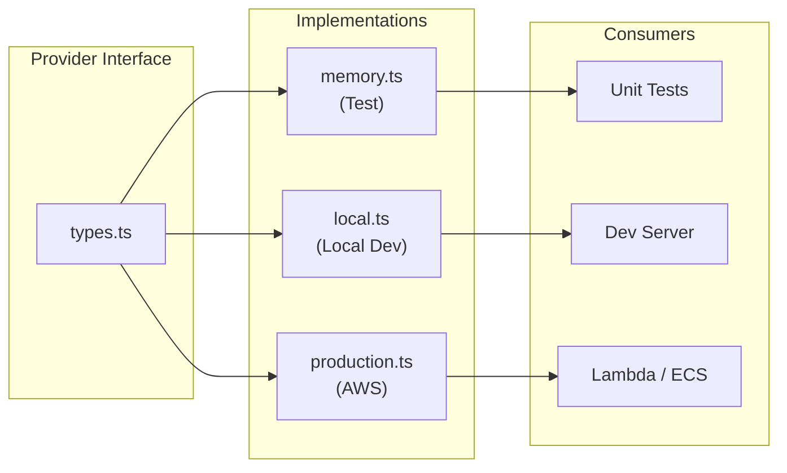

# Provider Pattern

## Overview

The provider pattern is the core architecture pattern of this project. Every
infrastructure concern (queue, auth, storage, email, events) gets an interface,
and each interface has multiple implementations for different environments.

See [ADR-003](./adr/003-provider-pattern.md) for the rationale behind this decision.



## Why

1. **Tests run in <100ms** with memory providers (no network, no containers)
2. **Agents iterate fast** — 50 tests in the time of 5 real-service tests
3. **Zero cloud dependencies** in tests
4. **Swap providers** via environment config — no code changes

## Structure

```
packages/{concern}/
├── types.ts              # Provider interface
├── providers/
│   ├── memory.ts         # Test: in-memory, zero deps
│   ├── {local}.ts        # Local dev: real-ish (BullMQ, MinIO, Mailpit)
│   └── {production}.ts   # Production: AWS service (SQS, S3, SES)
├── tests/
│   └── *.test.ts         # Tests using memory provider
└── index.ts              # Re-exports
```

## Available Providers

| Concern | Test                      | Local Dev                   | Production          |
| ------- | ------------------------- | --------------------------- | ------------------- |
| Queue   | MemoryQueueProvider       | BullMQQueueProvider         | SqsQueueProvider    |
| Auth    | MockAuthProvider          | LuciaAuthProvider           | CognitoAuthProvider |
| Storage | FilesystemStorageProvider | MinioStorageProvider        | S3StorageProvider   |
| Email   | MemoryEmailProvider       | SmtpEmailProvider (Mailpit) | SesEmailProvider    |
| Events  | MemoryEventBus            | MemoryEventBus              | EventBridgeBus      |

## Usage in Tests

```typescript
import { createMockProviders } from '@ripple/testing'

const providers = createMockProviders()
// providers.queue, providers.auth, providers.storage, etc.
```

See the [Testing Guide](./testing-guide.md) for more examples of using mock providers in tests.

## Related Documentation

- [Architecture](./architecture.md) — system overview
- [Testing Guide](./testing-guide.md) — testing with mock providers
- [ADR-003: Provider Pattern](./adr/003-provider-pattern.md) — decision rationale
