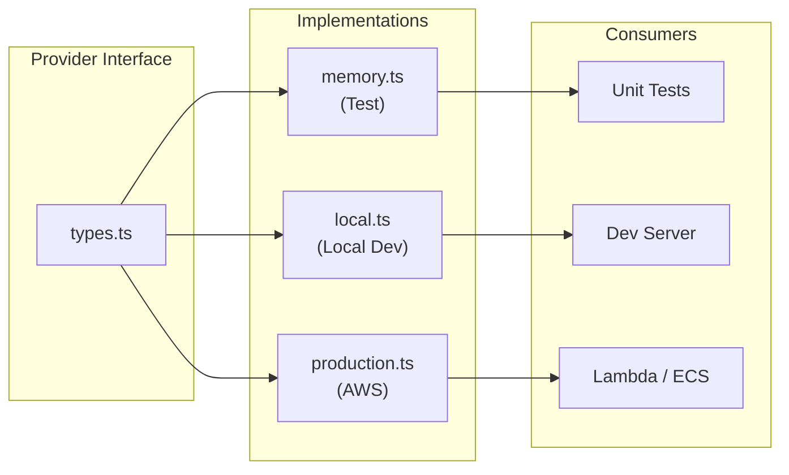

# Provider Pattern

## Overview

The provider pattern is the core architecture pattern of this project. Every
infrastructure concern (queue, auth, storage, email, events, CMS) gets an interface,
and each interface has multiple implementations for different environments.

See [ADR-003](./adr/003-provider-pattern.md) for the rationale behind this decision.



## Why

1. **Tests run in <100ms** with memory providers (no network, no containers)
2. **Agents iterate fast** — 50 tests in the time of 5 real-service tests
3. **Zero cloud dependencies** in tests
4. **Swap providers** via environment config — no code changes

## Structure

```
packages/{concern}/
├── types.ts              # Provider interface
├── providers/
│   ├── memory.ts         # Test: in-memory, zero deps
│   ├── {local}.ts        # Local dev: real-ish (BullMQ, MinIO, Mailpit)
│   └── {production}.ts   # Production: AWS service (SQS, S3, SES)
├── tests/
│   └── *.test.ts         # Tests using memory provider
└── index.ts              # Re-exports
```

## Available Providers

| Concern | Test                      | Local Dev                   | Production        |
| ------- | ------------------------- | --------------------------- | ----------------- |
| Queue   | MemoryQueueProvider       | BullMQQueueProvider         | SqsQueueProvider  |
| Auth    | MockAuthProvider          | OidcAuthProvider            | OidcAuthProvider  |
| Storage | FilesystemStorageProvider | MinioStorageProvider        | S3StorageProvider |
| Email   | MemoryEmailProvider       | SmtpEmailProvider (Mailpit) | SesEmailProvider  |
| Events  | MemoryEventBus            | MemoryEventBus              | EventBridgeBus    |
| CMS     | MockCmsProvider           | MockCmsProvider             | DrupalCmsProvider |

## CMS Provider (Decoupled Drupal)

The CMS provider has an explicit **decoupling architecture** that isolates all
Drupal-specific code to exactly 2 files. This makes Drupal removable without
affecting any other code. See [ADR-011](./adr/011-cms-decoupling-pull-out-drupal.md).

```
packages/cms/
├── types.ts                          # CMS-agnostic provider interface
├── factory.ts                        # Provider factory (dynamic imports)
├── providers/
│   ├── mock.ts                       # Test: in-memory, zero deps
│   ├── drupal.ts                     # Production: Drupal/Tide JSON:API
│   └── tide-paragraph-mapper.ts      # Tide paragraph → PageSection mapping
├── tests/
│   ├── mock.test.ts                  # MockCmsProvider unit tests
│   ├── drupal.test.ts                # DrupalCmsProvider unit tests (with fixtures)
│   ├── factory.test.ts               # Provider factory tests
│   └── conformance.test.ts           # Conformance suite validation
└── index.ts
```

### Provider factory

```typescript
import { createCmsProvider } from '@ripple/cms'

// Test/local — no Drupal needed
const cms = await createCmsProvider({ type: 'mock' })

// Production — connects to Drupal/Tide
const cms = await createCmsProvider({
  type: 'drupal',
  baseUrl: 'https://content-api.example.com',
  siteId: '4',
  auth: { username: 'api', password: 'secret' }
})
```

### Adding a new CMS backend

1. Create `packages/cms/providers/{cms-name}.ts` implementing `CmsProvider`
2. Add the new type to `packages/cms/factory.ts`
3. Run conformance suite — all 18 tests must pass
4. No changes to UI, composables, API routes, or existing tests

## Usage in Tests

```typescript
import { createMockProviders } from '@ripple/testing'

const providers = createMockProviders()
// providers.queue, providers.auth, providers.storage, providers.cms, etc.
```

See the [Testing Guide](./testing-guide.md) for more examples of using mock providers in tests.

## Related Documentation

- [Developer Guide](./developer-guide.md) — full setup and provider usage guide
- [Architecture](./architecture.md) — system overview
- [Testing Guide](./testing-guide.md) — testing with mock providers
- [ADR-003: Provider Pattern](./adr/003-provider-pattern.md) — decision rationale
- [ADR-009: CMS Provider for Drupal](./adr/009-cms-provider-drupal.md) — CMS integration
- [ADR-011: CMS Decoupling](./adr/011-cms-decoupling-pull-out-drupal.md) — pull-out-Drupal strategy
