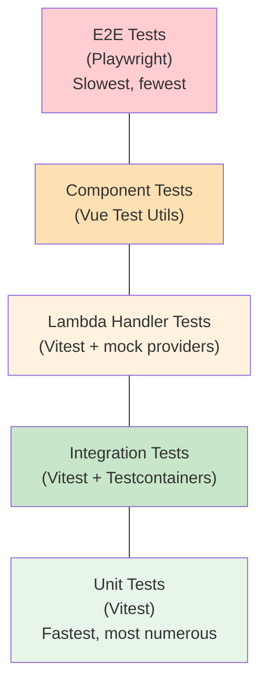

# Testing Guide

## Test Pyramid



1. **Unit tests** (fastest, most numerous) — Vitest
2. **Integration tests** (real DB) — Vitest + Testcontainers
3. **Component tests** — Vue Test Utils
4. **Lambda handler tests** — Vitest + mock providers
5. **E2E tests** (slowest) — Playwright

## Running Tests

```bash
pnpm test          # All unit + integration tests
pnpm test:e2e      # Playwright E2E tests
pnpm test:ui       # Storybook component tests
```

## Writing Tests

### Unit Tests

```typescript
import { describe, it, expect } from 'vitest'
import { createMockProviders } from '@ripple-next/testing'

describe('MyFeature', () => {
  it('does the thing', () => {
    const providers = createMockProviders()
    // test with providers.queue, providers.auth, etc.
  })
})
```

### Integration Tests (Real DB)

```typescript
import { setupTestDb, teardownTestDb } from '@ripple-next/testing'

describe('UserRepository', () => {
  let db: TestDb

  beforeAll(async () => {
    db = await setupTestDb() // Testcontainers Postgres
  })

  afterAll(() => teardownTestDb(db))

  it('creates a user', async () => {
    // test with real database
  })
})
```

### Component Tests

```typescript
import { mount } from '@vue/test-utils'
import RplButton from '../RplButton.vue'

describe('RplButton', () => {
  it('renders', () => {
    const wrapper = mount(RplButton, { slots: { default: 'Click' } })
    expect(wrapper.text()).toBe('Click')
  })
})
```

## Test Data

Use factories from `packages/testing/factories/`:

```typescript
import { userFactory, projectFactory } from '@ripple-next/testing'

const user = userFactory.build()
const users = userFactory.buildList(5)
```

## Mock Providers

All mock providers are available from `packages/testing/mocks/providers.ts`.
Tests use the [Provider Pattern](./provider-pattern.md) with in-memory implementations for speed.

```typescript
import { createMockProviders } from '@ripple-next/testing'

const { queue, auth, storage, email, events, cms } = createMockProviders()
```

## Flaky Test Containment (ADR-013)

When a test becomes flaky, follow the quarantine policy:

### Quarantining a test

```typescript
// Vitest — annotate with .skip and mandatory metadata
describe.skip('flaky: MyFeature #123', () => {
  // QUARANTINED: https://github.com/org/ripple-next/issues/123
  // QUARANTINE_DATE: 2026-02-27
  // REASON: Intermittent timeout on CI due to race condition
})

// Playwright — same convention
test.skip('flaky: user login flow #124', async ({ page }) => {
  // QUARANTINED: https://github.com/org/ripple-next/issues/124
  // QUARANTINE_DATE: 2026-02-27
})
```

### Quarantine rules

- **Maximum duration**: 14 days — fix or permanently remove with justification
- **Mandatory issue link**: Every quarantined test must reference a GitHub issue labeled `flaky-test`
- **Budget cap**: No more than 5% of total tests may be quarantined at any time
- **Tier 1 protection**: Tests in `packages/auth`, `packages/db`, `packages/queue` may NOT be quarantined — fix immediately or revert the PR

### Checking quarantine health

```bash
pnpm check:quarantine            # human-readable output
pnpm check:quarantine -- --json  # machine-readable JSON for agents
```

This check runs in CI as part of the quality composite action.

## Storybook Stories

All 24 UI components have Storybook stories with `autodocs` enabled:

- **Atoms**: RplButton, RplFormInput, RplIcon, RplCheckbox, RplRadio, RplDropdown, RplDateInput, RplTextarea, RplFileUpload, RplFormAlert, RplOptionButton
- **Molecules**: RplCard, RplHeroHeader, RplNavigation
- **Organisms**: RplHeader, RplFooter
- **Tide Content**: RplAccordion, RplCardCollection, RplTimeline, RplCallToAction, RplKeyDates, RplContentImage, RplEmbeddedVideo, RplContentWysiwyg

Run Storybook locally:

```bash
pnpm storybook   # Start Storybook dev server
```

## Related Documentation

- [Developer Guide](./developer-guide.md) — full setup and quality gate reference
- [Architecture](./architecture.md) — system overview
- [Provider Pattern](./provider-pattern.md) — how mock providers work
- [Data Model](./data-model.md) — schema reference for integration tests
- [ADR-003: Provider Pattern](./adr/003-provider-pattern.md) — why memory providers
- [ADR-013: Flaky Test Containment](./adr/013-flaky-test-containment.md) — quarantine policy
